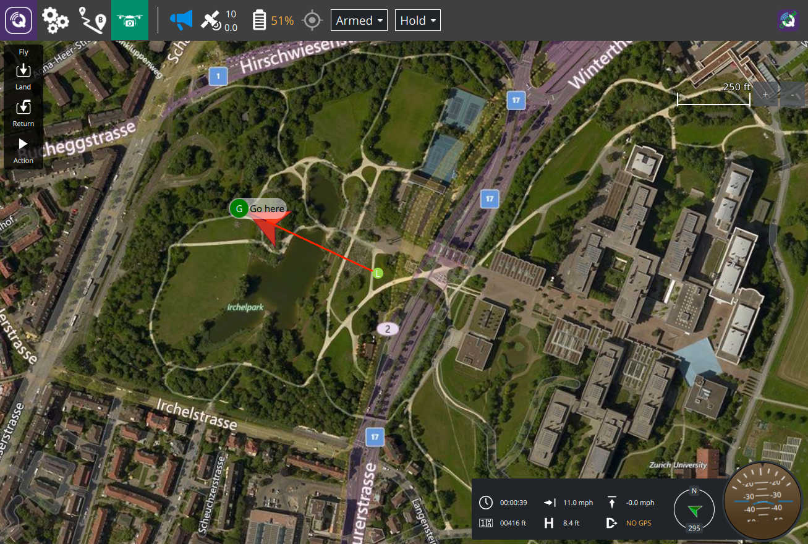

# QGroundControl Ground Control Station

## Custom Build Example

To build this sample custom version:

- Clean you build directory of any previous build
- Rename the directory from `custom-example` to `custom`
- Change to the `custom` directory
- Build QGC

More details on what a custom build is and how to create your own can be found in the [QGC Dev Guide](https://dev.qgroundcontrol.com/en/custom_build/custom_build.html).

The main features of this example:

- Assumes an "Off The Shelf" purchased commercial vehicle. This means most vehicle setup is hidden from the user since they should mostly never need to adjust those things. They would be set up correctly by the vehicle producing company prior to sale.
- The above assumption cause the QGC UI to adjust and not show various things. Providing an even simpler experience to the user.
- The full experience continues to be available in "Advanced Mode".
- Brands the build with various custom images and custom color palette which matches corporate branding of the theoretical commercial company this build is for.
- Customizes portions of the interface such as you can see in the above screenshot which shows a custom instrument widget replacing the standard QGC ui.
- It also overrides various QGC Application settings to hide some settings the users shouldn't modify as well as adjusting defaults for others.
- The source code is fully commented to explain what and why it is doing things.
