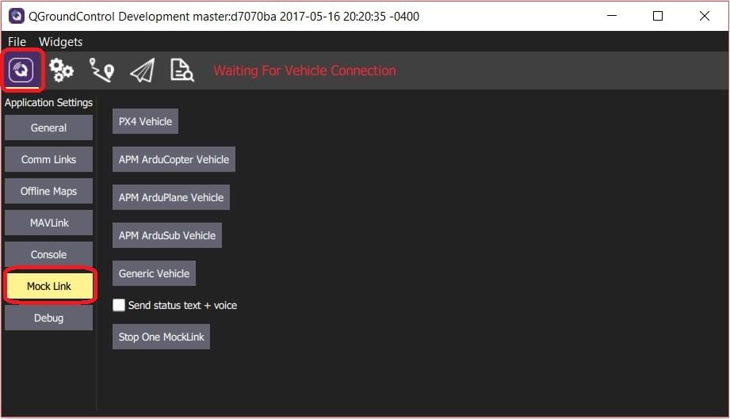
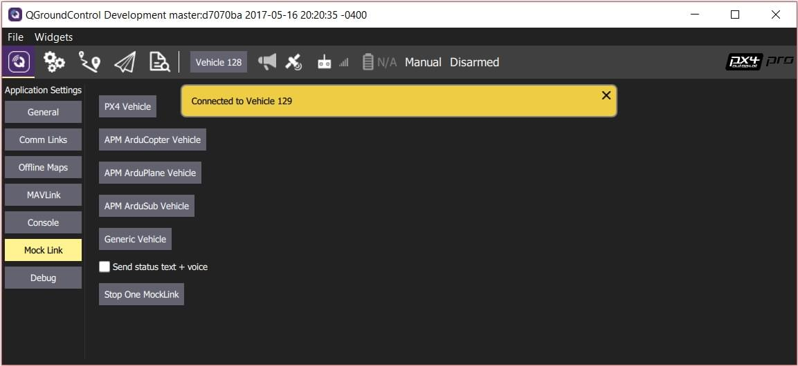

# Mock Link

_Mock Link_ allows you to create and stop links to multiple simulated (mock) vehicles in _QGroundControl_ debug builds.

The simulation does not support flight, but does allow easy testing of:

- Mission upload/download
- Viewing and changing parameters
- Testing most setup pages
- Multiple vehicle UIs

It is particularly useful for unit testing error cases for mission upload/download.

## Using Mock Link

To use _Mock Link_:

1. Create a debug build by [building the source](https://github.com/mavlink/qgroundcontrol#supported-builds).
1. Access _Mock Link_ by selecting the _Application Settings_ icon in the top toolbar and then **Mock Link** in the sidebar:

   

1. The buttons in the panel can be clicked to create a vehicle link of the associated type.

   - Each time you click a button a new connection will be created.
   - When there is more than one connection the multiple-vehicle UI will appear.

   

1. Click the **Stop one Mock Link** to stop the currently active vehicle.

Using _Mock Link_ is then more or less the same as using any other vehicle, except that the simulation does not allow flight.
