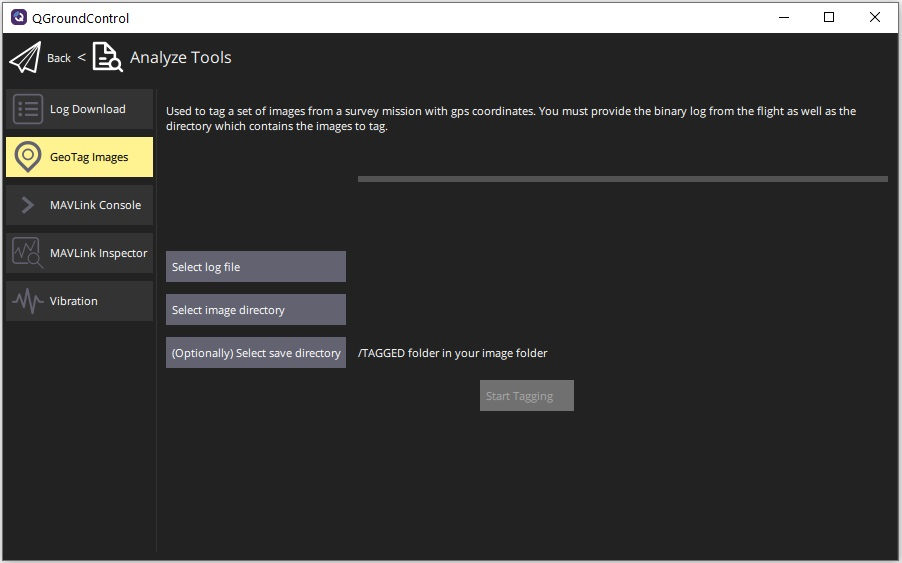

# GeoTag Images (Analyze View)

The _GeoTag Images_ screen (**Analyze > GeoTag Images**) allows you to geotag images from a survey mission using information in the flight log.

::: info
This feature only works with _PX4_ flight stack logs.
ArduPilot is not supported.
:::

Select the log file, image directory and (optionally) output directory for geotagged images using the buttons provided.
Click **Start Tagging** to generate the geotagged images.
