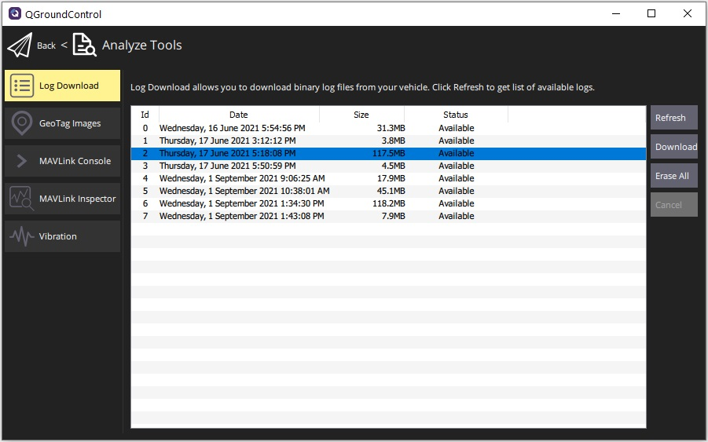

# Log Download (Analyze View)

The _Log Download_ screen (**Analyze > Log Download**) is used to list (_Refresh_),
_Download_ and _Erase All_ log files from the connected vehicle.

The page also supports:

- Selecting all available logs in one action.
- Inverting current selection.
- Sorting logs by timestamp (newest-first or oldest-first).

