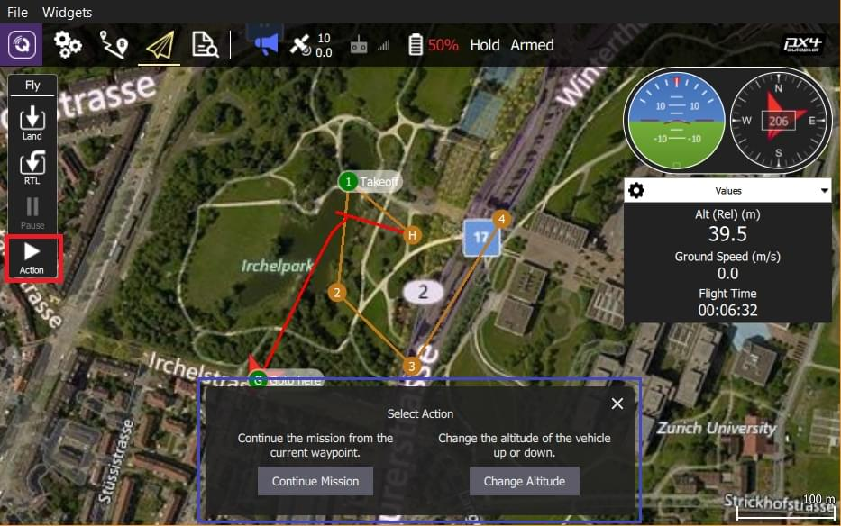

# Fly View

The Fly View is used to command and monitor the vehicle.

## Overview

- **[Toolbar](fly_view_toolbar.md):** The toolbar is at the top of the screen. It provides controls to select views, show flight status and mode as well as the status of the main components of the vehicle.
- **[Vehicle Actions](fly_tools.md):** Allows you command the vehicle to take a specific action.
- **[Instrument Panel](instrument_panel.md):** A widget that displays vehicle telemetry.
- **[Attitude/Compass](hud.md):** A widget that provides virtual horizon and heading information.
- **[Camera Tools](camera_tools.md)**: A widget for switching between still and video modes, starting/stopping capture, and controlling camera settings.
- **[Video](video.md):** Display the video from the vehicle. Allows you to toggle between video or map as the main display.
- **Map:** Displays the positions of all connected vehicles and the mission for the current vehicle.
  - You can drag the map to move it around (the map automatically re-centres on the vehicle after a certain amount of time).
  - You can zoom the map in and out using the zoom buttons, mouse wheel, track pad or pinch on a tablet.
  - Once flying, you can click on the map to set a [Go to](#goto) or [Orbit at](#orbit) location.

There are a number of other elements that are not displayed by default and are only displayed in certain conditions or for certain vehicle types.

## Actions/Tasks

The following sections describe how to perform common operations/tasks in the Fly View.

::: info
Many of the available options depend on both the vehicle type and its current state.
:::

### Actions associated with a map position (#map_actions)

There are a number of actions which can be taken which are associated with a specific position on the map. To use these actions:

1. Click on the map at a specific position
2. A popup will display showing you the list of available actions
3. Select the action you want
4. Confirm the action

Examples of map position actions are Go To Location, Orbit and so forth.

### Pause

You can pause most operations, including taking off, landing, RTL, mission execution, orbit at location. The vehicle behaviour when paused depends on the vehicle type; typically a multicopter will hover, and a fixed wing vehicle will circle.

::: info
You cannot pause a _Goto location_ operation.
:::

To pause:

1. Press the **Pause** button in the _Fly Tools_.
1. Optionally set a new altitude using the right-side vertical slider.
1. Confirm the pause using the slider.

### Missions

#### Start Mission {#start_mission}

You can start a mission when the vehicle is landed (the start mission confirmation slider is often displayed by default).

To start a mission from landed:

1. Press the **Action** button on the _Fly Tools_
1. Select the _Start Mission_ action from the dialog.

   

   (to display the confirmation slider)

1. When the confirmation slider appears, drag it to start the mission.

   

#### Continue Mission {#continue_mission}

You can _continue_ mission from the _next_ waypoint when you're flying (the _Continue Mission_ confirmation slider is often displayed by default after you takeoff).

::: info
Continue and [Resume mission](#resume_mission) are different!
Continue is used to restart a mission that has been paused, or where you have taken off, so you've already missed a takeoff mission command.
Resume mission is used when you've used a RTL or landed midway through a mission (e.g. for a battery change) and then wish to continue the next mission item (i.e. it takes you to where you were up to in the mission, rather than continuing from your place in the mission).
:::

You can continue the current mission while (unless already in a mission!):

1. Press the **Action** button on the _Fly Tools_
1. Select the _Continue Mission_ action from the dialog.

   

1. Drag the confirmation slider to continue the mission.

   

#### Resume Mission {#resume_mission}

_Resume Mission_ is used to resume a mission after performing an [RTL/Return](#rtl) or [Land](#land) from within a mission (in order, for example, to perform a battery change).

::: info
If you are performing a battery change, **do not** disconnect QGC from the vehicle after disconnecting the battery.
After you insert the new battery _QGroundControl_ will detect the vehicle again and automatically restore the connection.
:::

After landing you will be prompted with a _Flight Plan complete_ dialog, which gives you the option to remove the plan from the vehicle, leave it on the vehicle, or to resume the mission from the last waypoint that was traveled through.

If you select to resume the mission, then _QGroundControl_ will rebuild the mission and upload it to the vehicle.
Then use the _Start Mission_ slider to continue the mission.

The image below shows the mission that was rebuilt after the Return shown above.

::: info
A mission cannot simply resume from the last mission item that the vehicle executed, because there may be multiple items at the last waypoint that affect the next stage of the mission (e.g. speed commands or camera control commands).
Instead _QGroundControl_ rebuilds the mission, starting from the last mission item flown, and automatically prepending any relevant commands to the front of the mission.
:::

#### Remove Mission Prompt After Landing {#resume_mission_prompt}

You will be prompted to remove the mission from the vehicle after the mission completes and the vehicle lands and disarms.
This is meant to prevent issues where stale missions are unknowingly left on a vehicle, potentially resulting in unexpected behavior.

### Display Video {#video_switcher}

When video streaming is enabled, _QGroundControl_ will display the video stream for the currently selected vehicle in the "video switcher window" at the bottom left of the map.
You can press the switcher anywhere to toggle _Video_ and _Map_ to foreground (in the image below, the video is shown in the foreground).

::: info
Video streaming is configured/enabled in [Application Settings > General tab > Video](../settings_view/general.md#video).
:::

You can further configure video display using controls on the switcher:

- Resize the switcher by dragging the icon in the top right corner.
- Hide the switcher by pressing the toggle icon in the lower left.
- Detach the video switcher window by pressing on the icon in its top left corner
  (once detached, you can move and resize the window just like any other in your OS).
  If you close the detached window the switcher will re-lock to the QGC Fly view.

### Record Video

If supported by the camera and vehicle, _QGroundControl_ can start and stop video recording on the camera itself. _QGroundControl_ can also record the video stream and save it locally.

:::tip
Video stored on the camera may be of much higher quality, but it is likely that your ground station will have a much larger recording capacity.
:::

#### Record Video Stream (on GCS)

Video stream recording is controlled on the [video stream instrument page](#video_instrument_page).
Press the red circle to start recording a new video (a new video file is created each time the circle is pressed); the circle will change into a red square while recording is in progress.

Video stream recording is configured in the [Application Settings > General tab](../settings_view/general.md):

- [Video Recording](../settings_view/general.md#video-recording) - specifies the recording file format and storage limits.

  ::: info
  Videos are saved in Matroska format (.mkv) by default.
  This format is relatively robust against corruption in case of errors.
  :::

- [Miscellaneous](../settings_view/general.md#miscellaneous) - Streamed video is saved under the **Application Load/Save Path**.

::: tip
The stored video includes just the video stream itself.
To record video with QGroundControl application elements displayed, you should use separate screen recording software.
:::

#### Record Video on Camera

Start/stop video recording _on the camera itself_ using the [camera instrument page](#camera_instrument_page).
First toggle to video mode, then select the red button to start recording.

