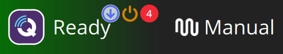
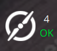
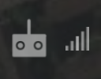
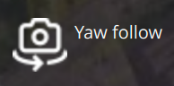
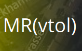
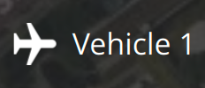
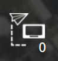

# Fly View Toolbar

## Views

The "Q" icon on the left of the toolbar allows you to select between additional top level views:

- **[Plan Flight](../plan_view/plan_view.md):** Used to create missions, geo-fences and rally points
- **Analyze Tools:** A set of tools for things like log download, geo-tagging images, or viewing telemetry.
- **Vehicle Configuration:** The various options for the initial configuration of a new vehicle.
- **Application Settings:** Settings for the QGroundControl application itself.

When a newer stable version of QGroundControl is available, a blue update badge is shown at the top right of the "Q" icon, and the views dropdown shows an **Update** button which opens the download page. A message about the new version is shown once per new version. The check only runs in stable builds.

## Toolbar Indicators

Next are multiple toolbar indicators for vehicle status. The dropdowns for each toolbar indicator provide additional detail on status. You can also expand the indicators to show additional application and vehicle settings associated with the indicator. Press the ">" button to expand.

### Flight Status 

The Flight Status indicator shows you whether the vehicle is ready to fly or not. It can be in one of the following states:

- **Ready To Fly** (_green background_) - Vehicle is ready to fly
- **Ready To Fly** (_yellow background_) - Vehicle is ready to fly in the current flight mode. But there are warnings which may cause problems.
- **Not Ready** - Vehicle is not ready to fly and will not takeoff.
- **Armed** - Vehicle is armed and ready to Takeoff.
- **Flying** - Vehicle is in the air and flying.
- **Landing** - Vehicle is in the process of landing.
- **Communication Lost** - QGroundControl has lost communication with the vehicle.

The Flight Status indicator dropdown fills the window and also gives you access to:

- **Arm** - Arming a vehicle starts the motors in preparation for takeoff. You will only be able to arm the vehicle if it is safe and ready to fly. Generally you do not need to manually arm the vehicle. You can simply takeoff or start a mission and the vehicle will arm itself.
- **Disarm** - Disarming a vehicle stops the motors. For aircraft it is only available when the vehicle is on the ground. Generally you do not need to explicitly disarm as vehicles will disarm automatically after landing, or shortly after arming if you do not take off.
- **Emergency Stop** - Replaces **Disarm** while an aircraft is flying. It is a red button which you must press and hold to confirm. It stops the motors while in the air. For emergency use only, your vehicle will crash! Ground vehicles and submarines keep the normal **Disarm** button.
- **Force Arm** - Arms the vehicle while bypassing pre-arm checks. Only shown when **Allow Force Arm** is enabled in [Fly View Settings](../settings_view/fly_view.md).
- **Reboot Vehicle** - Shown at the right when the vehicle needs a reboot (see [Vehicle Reboot Required](#vehicle-reboot-required)).
- **Firmware update available** - Shown when the vehicle is not running the latest stable firmware (see [Firmware Update Available](#firmware-update-available)).
- **Vehicle Messages** - The messages sent by the vehicle. Use the trash button to clear them.

In the cases of warnings or not ready state you can click the indicator to display the dropdown which will show the reason(s) why. The toggle on the right expands each error with additional information and possible solutions.

Once each issue is resolved it will disappear from the UI. When all issues blocking arming have been removed you should now be ready to fly.

### Flight Mode 

The Flight Mode indicator shows you the current flight mode. The dropdown allows you to switch between flight modes. The expanded page allows you to:

- Configure vehicle land settings
- Set global geo-fence settings
- Add/Remove flight modes from the displayed list

### Flight Status Badges

Small badges can appear at the top right of the Flight Status indicator: a blue update icon when newer stable vehicle firmware is available, an orange power icon when the vehicle needs a reboot, and a red badge with the count of critical vehicle messages. Click the indicator to open the dropdown and act on them.

#### Vehicle Messages

When the vehicle sends critical messages (error severity or worse) a red badge is shown at the top right of the Flight Status indicator. The badge shows the number of critical messages, or `!` if there are more than 9. Opening the dropdown does not clear the badge, only clearing the message list with the trash button does.

In the dropdown message list, critical messages are shown in red and warnings and notices in orange.

Critical messages are also shown in a **Vehicle Alert** popup below the toolbar. Up to 5 messages are shown at once, fewer if the window is too short to fit them. If more arrive the popup title changes to **Vehicle Alert - Click to see more**, clicking it opens the Flight Status dropdown. The popup closes automatically after 10 seconds, or when you click it.

#### Vehicle Reboot Required

Some parameter changes and sensor calibrations only take effect after the vehicle reboots. When you make such a change an orange power icon is shown next to the message badge, and stays there until the vehicle is rebooted. You can make several changes and reboot once at the end.

When a parameter change needs a reboot, a message also reminds you that the change will not take effect until the vehicle is rebooted. The message is not repeated for further changes made within 2 minutes.

To reboot, open the Flight Status dropdown and press and hold **Reboot Vehicle** on the right. The vehicle can only be rebooted while disarmed. If it is armed, the button is replaced by a reminder to disarm first.

#### Firmware Update Available

When the vehicle connects, QGroundControl checks whether it is running the latest stable firmware release. The check only applies to official (non-development) firmware. If a newer stable release is available a blue update icon is shown at the top right of the Flight Status indicator, and the dropdown shows the current and latest stable versions.

A message about the out of date firmware is shown once for each new stable release. Press **Acknowledge and Hide** in the dropdown to hide the update icon. It stays hidden, across reconnects and restarts, until a newer stable release is available. The dropdown still shows the version information.

To update the firmware use [Vehicle Configuration > Firmware](../setup_view/firmware.md).

### GPS / RTK GPS 

The GPS/RTK GPS indicator shows satellite and GNSS status in the toolbar, and the dropdown provides additional GPS details.

With an active vehicle, the indicator shows vehicle GPS information (for example, satellite count and HDOP), and the expanded page provides access to RTK-related settings.

When there is no active vehicle but RTK is connected, the indicator switches to RTK status so you can still monitor the correction link.

### GPS Resilience

The GPS Resilience indicator appears when the vehicle reports GPS resilience telemetry (authentication, spoofing, or jamming state). The dropdown provides summary status and per-GPS details when available.

### Battery 

The Battery indicator shows you a configurable colored battery icon for remaining charge. It can also be configured to show percent remaining, voltage or both. The expanded page allows you to:

- Set what value(s) you want displayed in the battery icon
- Configure the icon coloring
- Set up the low battery failsafe

### Remote ID 

The Remote ID indicator appears when Remote ID is available on the active vehicle. Its color indicates overall Remote ID health, and the dropdown shows Remote ID status details.

### ESC 

The ESC indicator appears when ESC telemetry is available from the vehicle. It shows overall ESC health and online motor count, and opens a detailed ESC status page.

### Joystick 

The Joystick indicator appears when a joystick/gamepad is detected. The dropdown shows device status and connection details.

### Telemetry RSSI 

The Telemetry RSSI indicator appears when telemetry signal information is available. It provides local/remote RSSI and additional radio link quality details.

### RC RSSI 

The RC RSSI indicator appears when RC signal information is available. It shows current RC link strength and opens a page with RC RSSI details.

### Gimbal 

The Gimbal indicator is shown when the vehicle supports the [MAVLink Gimbal Protocol](https://mavlink.io/en/services/gimbal_v2.html). It displays active gimbal status and provides access to gimbal controls and settings.

### VTOL Transitions 

For VTOL vehicles, a VTOL transition status indicator is shown when applicable. It indicates the current VTOL mode/state and provides transition-related status information.

### MAVLink Signing

The MAVLink Signing indicator appears when signing keys have been configured (see [MAVLink 2 Signing](../settings_view/telemetry.md#signing)).
It shows a lock icon that indicates whether MAVLink 2 message signing is active on the current vehicle connection:

- **Locked (green):** Signing is active — the vehicle's incoming packets matched a stored key, or a key was manually enabled.
- **Unlocked:** Signing is not active on the current connection.

The dropdown shows the signing status, the name of the active key (if any), and the number of saved keys.
Expanding the indicator provides full key management: you can enable a key on the vehicle, disable the active key, delete unused keys, or add new keys.

### Multi-Vehicle Selector 

The Multi-Vehicle selector appears when more than one vehicle is connected. It allows you to quickly switch the active vehicle from the toolbar.

### APM Support Forwarding 

On ArduPilot, an APM Support Forwarding indicator appears when MAVLink traffic forwarding to a support server is enabled.
