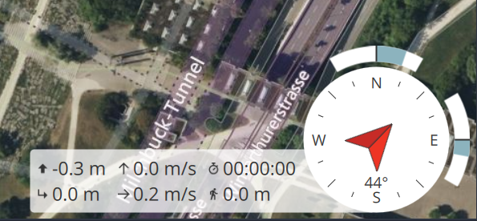

# Attitude / Compass

The attitude and compass widget is displayed in the Fly View and provides a real-time heads-up display of the vehicle's orientation.

## Attitude Indicator

The attitude indicator (artificial horizon) shows the vehicle's pitch and roll relative to the horizon:

- **Horizon line** — tilts and shifts to reflect the vehicle's current attitude
- **Pitch ladder** — graduated marks above and below the horizon showing pitch angle in degrees
- **Roll pointer** — arc along the top indicating the current roll angle

::: warning
The pitch display direction was corrected in V5.1: pitching nose-down now moves the pitch indicator down, matching the roll convention.
V5.0 displayed pitch in the opposite (incorrect) direction.
:::

The image below shows the integrated compass/attitude display for a vehicle rolling right and pitching down:

## Compass

The compass ring surrounds the attitude indicator and shows the vehicle's heading:

- **Heading value** — displayed at the top of the compass, showing the current heading in degrees
- **Cardinal directions** — N, S, E, W markers around the ring
- **Course indicator** — shows the direction of travel relative to heading

## Changing the Display

You can choose from different attitude/compass display styles. Right-click (desktop) or touch-and-hold (tablet/phone) the widget to select an alternative.
