# Fly View

The Fly View is used to command and monitor the vehicle when flying.

You can use it to:

- Run an automated [pre-flight checklist](#preflight_checklist).
- Arm the vehicle (or check why it won't arm).
- Control missions: [start](#start_mission), [continue](#continue_mission), [pause](#pause), and [resume](#resume_mission).
- Guide the vehicle to [arm](#arm)/[disarm](#disarm)/[emergency stop](#emergency_stop), [takeoff](#takeoff)/[land](#land), [change altitude](#change_altitude), [go to](#map_actions) or [orbit](#map_actions) a particular location, and [return/RTL](#rtl).
- Switch between a map view and a video view (if available)
- Display video, mission, telemetry, and other information for the current vehicle, and also switch between connected vehicles.

## UI Overview

The screenshot above shows the main elements of the fly view:

- **[Fly Toolbar](fly_view_toolbar.md):** Key status information for vehicle components (GPS, battery, RC control), and vehicle state (Flight mode, Armed/Disarmed status).
  - Select the [toolbar indicator](#toolbar_indicator) to view more detail.
  - Press the _Flight mode_ text (e.g. "Hold") to select a new mode.
    Not every mode may be available.
  - The text next to the **Q** icon indicates the flight readiness using text: "Not Ready", "Ready to Fly", "Flying", and status using colour: "green" (all good!), amber (a warning), red (serious problem). You can also select the text to reach a button to arm/disarm/emergency-stop the vehicle.
- **[Fly tools](fly_tools.md):** You can use these to:
  - Select the [preflight checklist](#preflight_checklist) (tool option disabled by default).
  - Toggle between takeoff/land.
  - Pause/restart the current operation (e.g. landing, or the mission).
  - Safety return (also known as RTL or Return).
  - The _Actions_ button offers other appropriate options for the current state. Actions include changing the altitude or continuing a mission.
- **Map:** Displays the positions of all connected vehicles and the mission for the current vehicle.
  - You can drag the map to move it around (the map automatically re-centres on the vehicle after a certain amount of time).
  - You can zoom the map in and out using the zoom buttons, mouse wheel, track pad or pinch on a tablet.
  - Once flying, you can click on the map to set a [Go to](#goto) or [Orbit at](#orbit) location.
- **[Instrument Panel](instrument_panel.md):** A widget that displays vehicle telemetry.
- **[Attitude/Compass](hud.md):** A widget that provides virtual horizon and heading information.
- **Camera Tools**: A widget for switching between still and video modes, starting/stopping capture, and controlling camera settings.
- **[Video/Switcher](#video_switcher):** Toggle between video or map in a window.
  - Press the element to switch _Video_ and _Map_ to foreground.
  - _QGroundControl_ supports RTP and RTSP video streaming over your vehicles UDP connection.
    It also supports directly connected UVC devices.
    QGC video support is further discussed in the [Video README](https://github.com/mavlink/qgroundcontrol/blob/master/src/VideoStreaming/README.md).
  - A [Telemetry Overlay](../fly_view/video_overlay.md) is automatically generated as a subtitle file
- **Confirmation Slider:** Context sensitive slider to confirm requested actions. Slide to confirm operation. You can also hold the spacebar to confirm. Press **X** to cancel.

There are a number of other elements that are not displayed by default/are only displayed in certain conditions.
For example, the multi-vehicle selector is only displayed if you have multiple vehicles, and the preflight checklist tool button is only displayed if the appropriate setting is enabled.

## Fly Toolbar {#toolbar}

### View Selector

The "Q" icon on the left of the toolbar allows you to select between additional top level views:

- **[Plan Flight](../plan_view/plan_view.md):** Used to create missions, geo-fences and rally points
- **Analyze Tools:** A set of tools for things like log download, geo-tagging images, or viewing telemetry.
- **Vehicle Configuration:** The various options for the initial configuration of a new vehicle.
- **Application Settings:** Settings for the QGroundControl application itself.

### Toolbar Indicators {#toolbar_indicators}

Next are a toolbar indicators for vehicle status. The dropdowns for each toolbar indicator provide additional detail on status. You can also expand the indicators to show additional application and vehicle settings associated with the indicator. Press the ">" button to expand.

Here is an example expanded toolbar indicator for flight modes on a vehicle running PX4 firmware. The settings in this indicator provide access to things which may be relevant to change from flight to flight.

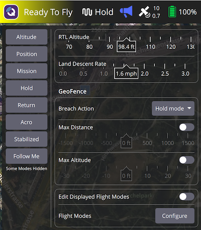

They also provide access to the Vehicle Configuration associated with the indicator. In this example: _Flight Modes_ - _Configure_.

### Ready/Not Ready Indicator

Next in the toolbar is the indicator which shows you whether the vehicle is ready to fly or not.

It can be in one of the following states:

- **Ready To Fly** (_green background_) - Vehicle is ready to fly
- **Ready To Fly** (_yellow background_) - Vehicle is ready to fly in the current flight mode. But there are warnings which may cause problems.
- **Not Ready** - Vehicle is not ready to fly and will not takeoff.
- **Armed** - Vehicle is armed and ready to Takeoff.
- **Flying** - Vehicle is in the air and flying.
- **Landing** - Vehicle is in the process of landing.
- **Communication Lost** - QGroundControl has lost communication with the vehicle.

The Ready Indicator dropdown also gives you acess to:

- **Arming** - Arming a vehicle starts the motors in preparation for takeoff. You will only be able to arm the vehicle if it is safe and ready to fly. Generally you do not need to manually arm the vehicle. You can simply takeoff or start a mission and the vehicle will arm itself.
- **Disarm** - Disarming a vehicle is only availble when the vehicle is on the ground. It will stop the motors. Generally you do not need to explicitly disarm as vehicles will disarm automatically after landing, or shortly after arming if you do not take off.
- **Emergency Stop** - Emergency stop is effectively the same as disarming the vehicle while it is flying. For emergency use only, your vehicle will crash!

In the cases of warnings or not ready state you can click the indicator to display the dropdown which will show the reason(s) why. The toggle on the right expands each error with additional information and possible solutions.

Once each issue is resolved it will disappear from the UI.
When all issues blocking arming have been removed you should now be ready to fly.

### Flight Mode Indicator

The Flight Mode Indicator dropdown allows you to switch between flight modes. The expanded page allows you to:

- Configure vehicle land settings
- Set global geo-fence settings
- Add/Remove flight modes from the displayed list

### Vehicle Messages Indicator

The Vehicle Messages Indicator dropdown shows you messages which come from the vehicle. The indicator will turn red if there are important messages available.

### GPS Indicator

The GPS Indicator shows you the satellite count and the HDOP in the toolbar icon. The dropdown shows you additional GPS status. The expanded page give you access to RTK settings. 
### Battery Indicator

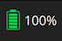

The Battery Indicator shows you a configurable colored battery icon for remaining charge. It can also be configured to show percent remaining, voltage or both. The expanded page allows you to:

- Set what value(s) you want displayed in the battery icon
- Configure the icon coloring
- Set up the low battery failsafe

## Fly Tools {#fly_tools}

### Pre Flight Checklist {#preflight_checklist}

An automated preflight checklist can be used to run through standard checks that the vehicle is configured correctly and it is safe to fly.

To view the checklist, first enable the tool by navigating to [Application Settings > General > Fly View](../settings_view/general.md) and selecting the **Use preflight checklist** checkbox.
The tool will then be added to the _Flight Tools_.
Press it to open the checklist:

Once you have performed each test, select it on the UI to mark it as complete.

### Takeoff {#takeoff}

:::tip
If you are starting a mission for a multicopter, _QGroundControl_ will automatically perform the takeoff step.
:::

To takeoff (when landed):

1. Press the **Takeoff** button in the _Fly Tools_ (this will toggle to a **Land** button after taking off).
1. Optionally set the takeoff altitude in the right-side vertical slider.
  - You can slide up/down to change the altitude
  - You can also click on the specified altitude (10 ft in example) and then type in a specific altitude.
1. Confirm takeoff using the slider.

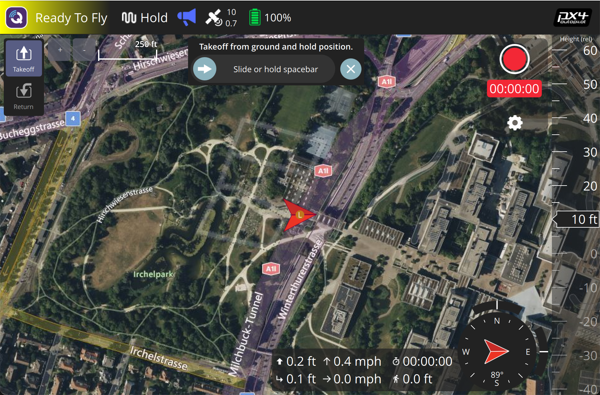

### Land {#land}

You can land at the current position at any time while flying:

1. Press the **Land** button in the _Fly Tools_ (this will toggle to a **Takeoff** button when landed).
1. Confirm landing using the slider.

### RTL/Return

Return to a "safe point" at any time while flying:

1. Press the **RTL** button in the _Fly Tools_.
1. Confirm RTL using the slider.

::: info
Vehicles commonly return to the "home" (takeoff) location and land.
This behaviour depends on the vehicle type and configuration.
For example, rally points or mission landings may be used as alternative return targets.
:::

### Change Altitude {#change_altitude}

You can change altitude while flying, except when in a mission:

1. Press the **Actions** button on the _Fly Tools_
1. Select the _Change Altitude_ button
2. Select the new altitude from the vertical slider
3. Confirm the action

## Instrument Panel (Telemetry) {#instrument_panel}

The instrument panel displays telemetry information about the current vehicle.

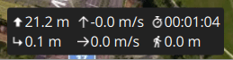

The default values include altitude (relative to the home location), horizontal and vertical speed, total flight time, and distance between vehicle and ground station.

You can configure where the information is displayed by:

* Tablets: Press and hold over control
* Desktop: Right click control
* Click to Lock icon to close and save changes

You configure what information is display by selecting the edit/pencil icon.
The grid will then display "+" and "-" icons that you can use to add or remove rows and columns (and the pencil icon is replaced by a "lock" icon that you can use to save the settings).

Select a value to launch its "Value Display" editor.
This allows you to change the icon, text, size, units and so on of the current telemetry value.

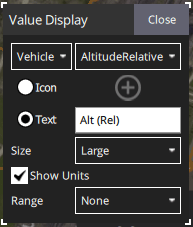

The selection list on the top left is used to change the source of the telemetry.
By default this is the vehicle, but you can use the selector to choose a particular sensor type.

The selection list on the top right is used to select a particular telemetry value for the vehicle or sensor.

## Attitude /Compass {#hud}

You can select from multiple types of instruments by:

* Tablets: Press and hold over control
* Desktop: Right click over control
* Click the Lock icon to close and save changes

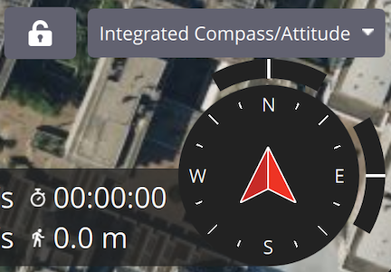

### Camera {#camera_instrument_page}

The camera panel is used to capture still images and video, and to configure the camera.

The camera capture and configuration options depend on the connected camera.
The configuration options are selected using the panel gear icon.
The configuration for a simple autopilot-connected camera are shown below.

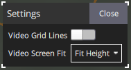

When connected to camera that supports the [MAVLink Camera Protocol](https://mavlink.io/en/services/camera.html) you can additionally configure and use other camera services that it makes available.
For example, if your camera supports video mode you will be able to switch between still image capture and video mode, and start/stop recording.

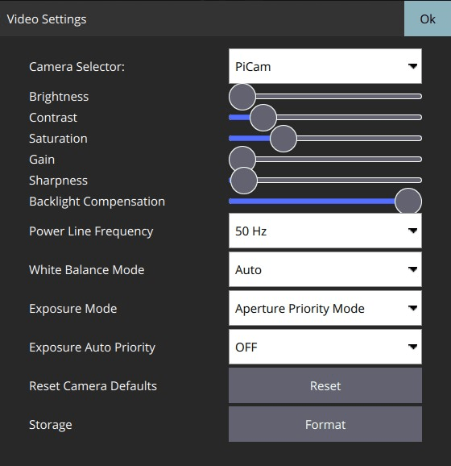

::: info
Most of the settings that are displayed depend on the camera (they are defined in its [MAVLink Camera Definition File](https://mavlink.io/en/services/camera_def.html)).

> A few common settings at the end are hard-coded: Photo Mode (Single/Time Lapse), Photo Interval (if Time Lapse), Reset Camera Defaults (sends a reset command to the camera), Format (storage)
> :::

### Video Stream {#video_instrument_page}

The video page is used to enable/disable video streaming.
When enabled, you can start/stop the video stream, enable a grid overlay, change how the image fits the screen, and record the video locally with QGC.

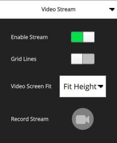

## Actions/Tasks

The following sections describe how to perform common operations/tasks in the Fly View.

::: info
Many of the available options depend on both the vehicle type and its current state.
:::

### Actions associated with a map position (#map_actions)

There are a number of actions which can be taken which are associated with a specific position on the map. To use these actions:

1. Click on the map at a specific position
2. A popup will display showing you the list of available actions
3. Select the action you want
4. Confirm the action

Examples of map position actions are Go To Location, Orbit and so forth.

### Pause

You can pause most operations, including taking off, landing, RTL, mission execution, orbit at location. The vehicle behaviour when paused depends on the vehicle type; typically a multicopter will hover, and a fixed wing vehicle will circle.

::: info
You cannot pause a _Goto location_ operation.
:::

To pause:

1. Press the **Pause** button in the _Fly Tools_.
1. Optionally set a new altitude using the right-side vertical slider.
1. Confirm the pause using the slider.

### Missions

#### Start Mission {#start_mission}

You can start a mission when the vehicle is landed (the start mission confirmation slider is often displayed by default).

To start a mission from landed:

1. Press the **Action** button on the _Fly Tools_
1. Select the _Start Mission_ action from the dialog.

   

   (to display the confirmation slider)

1. When the confirmation slider appears, drag it to start the mission.

   

#### Continue Mission {#continue_mission}

You can _continue_ mission from the _next_ waypoint when you're flying (the _Continue Mission_ confirmation slider is often displayed by default after you takeoff).

::: info
Continue and [Resume mission](#resume_mission) are different!
Continue is used to restart a mission that has been paused, or where you have taken off, so you've already missed a takeoff mission command.
Resume mission is used when you've used a RTL or landed midway through a mission (e.g. for a battery change) and then wish to continue the next mission item (i.e. it takes you to where you were up to in the mission, rather than continuing from your place in the mission).
:::

You can continue the current mission while (unless already in a mission!):

1. Press the **Action** button on the _Fly Tools_
1. Select the _Continue Mission_ action from the dialog.

   

1. Drag the confirmation slider to continue the mission.

   

#### Resume Mission {#resume_mission}

_Resume Mission_ is used to resume a mission after performing an [RTL/Return](#rtl) or [Land](#land) from within a mission (in order, for example, to perform a battery change).

::: info
If you are performing a battery change, **do not** disconnect QGC from the vehicle after disconnecting the battery.
After you insert the new battery _QGroundControl_ will detect the vehicle again and automatically restore the connection.
:::

After landing you will be prompted with a _Flight Plan complete_ dialog, which gives you the option to remove the plan from the vehicle, leave it on the vehicle, or to resume the mission from the last waypoint that was traveled through.

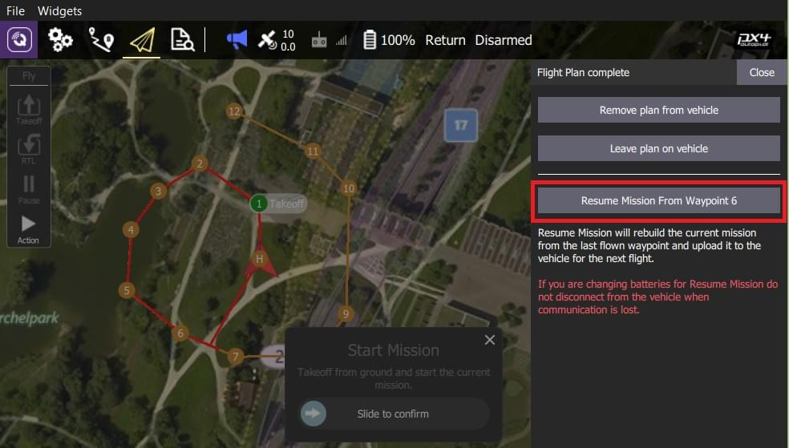

If you select to resume the mission, then _QGroundControl_ will rebuild the mission and upload it to the vehicle.
Then use the _Start Mission_ slider to continue the mission.

The image below shows the mission that was rebuilt after the Return shown above.

::: info
A mission cannot simply resume from the last mission item that the vehicle executed, because there may be multiple items at the last waypoint that affect the next stage of the mission (e.g. speed commands or camera control commands).
Instead _QGroundControl_ rebuilds the mission, starting from the last mission item flown, and automatically prepending any relevant commands to the front of the mission.
:::

#### Remove Mission Prompt After Landing {#resume_mission_prompt}

You will be prompted to remove the mission from the vehicle after the mission completes and the vehicle lands and disarms.
This is meant to prevent issues where stale missions are unknowingly left on a vehicle, potentially resulting in unexpected behavior.

### Display Video {#video_switcher}

When video streaming is enabled, _QGroundControl_ will display the video stream for the currently selected vehicle in the "video switcher window" at the bottom left of the map.
You can press the switcher anywhere to toggle _Video_ and _Map_ to foreground (in the image below, the video is shown in the foreground).

::: info
Video streaming is configured/enabled in [Application Settings > General tab > Video](../settings_view/general.md#video).
:::

You can further configure video display using controls on the switcher:

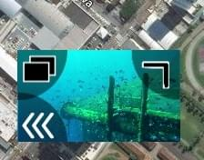

- Resize the switcher by dragging the icon in the top right corner.
- Hide the switcher by pressing the toggle icon in the lower left.
- Detach the video switcher window by pressing on the icon in its top left corner
  (once detached, you can move and resize the window just like any other in your OS).
  If you close the detached window the switcher will re-lock to the QGC Fly view.

### Record Video

If supported by the camera and vehicle, _QGroundControl_ can start and stop video recording on the camera itself. _QGroundControl_ can also record the video stream and save it locally.

:::tip
Video stored on the camera may be of much higher quality, but it is likely that your ground station will have a much larger recording capacity.
:::

#### Record Video Stream (on GCS)

Video stream recording is controlled on the [video stream instrument page](#video_instrument_page).
Press the red circle to start recording a new video (a new video file is created each time the circle is pressed); the circle will change into a red square while recording is in progress.

Video stream recording is configured in the [Application Settings > General tab](../settings_view/general.md):

- [Video Recording](../settings_view/general.md#video-recording) - specifies the recording file format and storage limits.

  ::: info
  Videos are saved in Matroska format (.mkv) by default.
  This format is relatively robust against corruption in case of errors.
  :::

- [Miscellaneous](../settings_view/general.md#miscellaneous) - Streamed video is saved under the **Application Load/Save Path**.

::: tip
The stored video includes just the video stream itself.
To record video with QGroundControl application elements displayed, you should use separate screen recording software.
:::

#### Record Video on Camera

Start/stop video recording _on the camera itself_ using the [camera instrument page](#camera_instrument_page).
First toggle to video mode, then select the red button to start recording.

