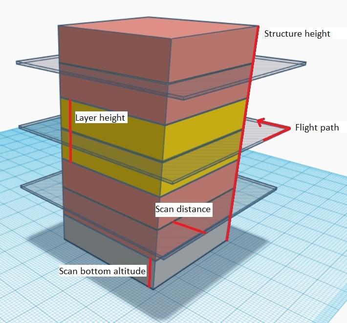

# Structure Scan (Plan Pattern)

A _Structure Scan_ allows you to create a grid flight pattern that captures images over _vertical surfaces_ (e.g. walls) around a structure with an arbitrary polygonal (or circular) ground footprint.
Structure Scans are typically used for the visual inspection or creating 3D models of structures.

_Structure Scans_ may be inserted into a mission using the Plan view **Pattern > Structure Scan** tool.

::: info
The new version of _Structure Scan_ can't read older _Structure Scan_ plans. They will need to be recreated.
:::

::: warning
This feature is not yet supported by ArduPilot firmware.
It is supported in PX4.
:::

## Overview

The image below shows a screenshot of structure scan.
The green polygon is used to mark out the ground footprint of the structure, while the white line around it indicates the vehicle flight path.
The green numbered circle on the flight path is the scan entry/exit point (where the scan starts).

The scan divides the structure evenly into layers; the vehicle flies all the way around the structure at a particular altitude and _scan distance_ from the structure, then repeats the process at each layer until the whole surface has been scanned.

Users can set the _scan bottom altitude_ to avoid obstacles at the bottom of the structure, and the _extrance/exit altitude_ to avoid obstacles as the vehicle travels to/from the scan.

## Creating a Scan

To create a scan:

1. In the **Plan View** select **Pattern tool > Structure Scan**.

1. This will create a simple square structure scan on the map.

   

   The region shown in green must be modified so that it surrounds the structure.

   - Drag the opaque vertices on the map to the edge of the structure (example circled in mauve above).
   - If the structure footprint is more than a simple square you can click the semi-transparent circles between the vertices to create a new vertix.

1. You can also change to a circular footprint by clicking on the central "vertix" (marked in red) and selecting _Circle_ in the popup menu.

   .

   - From the popup menu you can switch back to a polygon footprint and change the radius and/or position of the scan.
   - Drag the central vertix to position the centre of the circle.

1. The rest of the configuration is handled using the _Structure Scan_ editor on the right hand side of the view.
   First select whether you want to perform a manual scan, a scan using a particular camera, or a scan using a custom camera definition.

   ::: info
   The main difference between the modes is that predefined cameras are already set up to correctly calculate an effective layer height and trigger distance.
   :::

   Options for the different modes are shown below.

   

The user can always configure the following settings:

- **Start scan from top/bottom:** The direction in which layers are scanned.
- **Structure height:** The height of the object being scanned.
- **Scan distance:** Distance from the structure to the flight path.
- **Entrance/Exit Alt:** Use this setting to avoid obstacles between the last/next waypoint and the structure to be scanned.
  - The vehicle will fly to the _Entrance/Exit_ point at this altitude and then descend to the initial layer to start the scan.
  - The vehicle will ascend to this altitude after completing the scan and then move to the next waypoint.
- **Scan Bottom Alt:** Use this setting to avoid obstacles around the base of the structure.
  This adjust the bottom of the structure to be above the ground, and hence the altitude of the first scan
  (the height of the lowest layer flight path is shown in the scan statistics as _Bottom Layer Alt_.
- **Rotate Entry Point:** Move the start/finish point to the next vertix/position on the flight path.

The remaining settings depend on the _camera mode_:

- _Manual Mode_ allows you to specify:
  - **Layer height:** The height of each layer.
  - **Trigger Distance:** The distance between each camera trigger.
    The camera is only triggered while flying the layer path.
    It does not trigger images while transitioning from one layer to the next.
  - **Gimbal Pitch** - Gimbal pitch you want to use for the scan.
- _Known/pre-defined cameras_ automatically calculates layer heights and image triggering from required image overlap, and allows you to trade off scan distance and require image resolution.
  It also ensures that the camera is pointed directly at the surface when it is capturing images (i.e. at a right angle rather than some tangent).
  The settings are:

  - **Camera Orientation:** Portrait or Landscape
  - _Overlap_:
    - **Front Lap:** Image overlap from top to bottom (increasing shrinks layer height and increases layer count).
    - **Side Lap:** Image overlap at sides (increasing takes more images in each lap/layer scan).
  - **Scan distance:** Distance from the structure to the flight path.
  - **Ground Res:** Required image resolution/sample quality of surface.

- _Custom camera_ selection allows you to enter your own camera characteristics, but otherwise behaves the same as a predefined camera.
