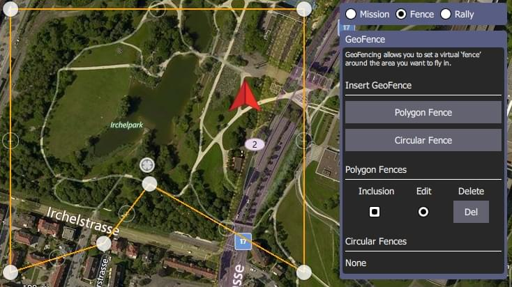

# Plan View - GeoFence

GeoFences allow you to create virtual regions within which the vehicle can fly, or in which it is _not allowed_ to fly.
You can also configure the action taken if you fly outside permitted areas.

::: info
**ArduPilot users:** GeoFence support is only supported by Rover 3.6 and Copter 3.7 or higher. It also requires usage of a Daily build or Stable 3.6 (once available).
_QGroundControl_ will not display the GeoFence options if they are not supported by the connected vehicle.
:::

## Create a Geofence

To create a GeoFence:

1. Navigate to the Plan View
1. Select the _Geofence_ radio button above the Mission Command List

   

1. Insert a circular or polygon region by pressing the **Circular Fence** or **Polygon Fence** button, respectively.
   A new region will be added to the map and to the associated list of fences below the buttons.

:::tip
You can create multiple regions by pressing the buttons multiple times, allowing complex geofence definitions to be created.
:::

- Circular region:

  

  - Move the region by dragging the central dot on the map
  - Resize the circle by dragging the dot on the edge of the circle (or you can change the radius value in the fence panel).

- Polygon region:

  

  - Move the vertices by dragging the filled dots
  - Create new vertices by clicking the "unfilled" dots on the lines between the filled vertices.

1. By default new regions are created as _inclusion_ zones (vehicles must stay within the region).
   Change them to exclusion zones (where the vehicle can't travel) by unchecking the associated _Inclusion_ checkbox in the fence panel.

## Edit/Delete a GeoFence

You can select a geofence region to edit by selecting its _Edit_ radio button in the GeoFence panel.
You can then edit the region on the map as described in the previous section.

Regions can be deleted by pressing the associated **Del** button.

## Upload a GeoFence

The GeoFence is uploaded in the same way as a mission, using **File** in the [Plan tools](../plan_view/plan_view.md).

## Remaining tools

The rest of the tools work exactly as they do while editing a Mission.
