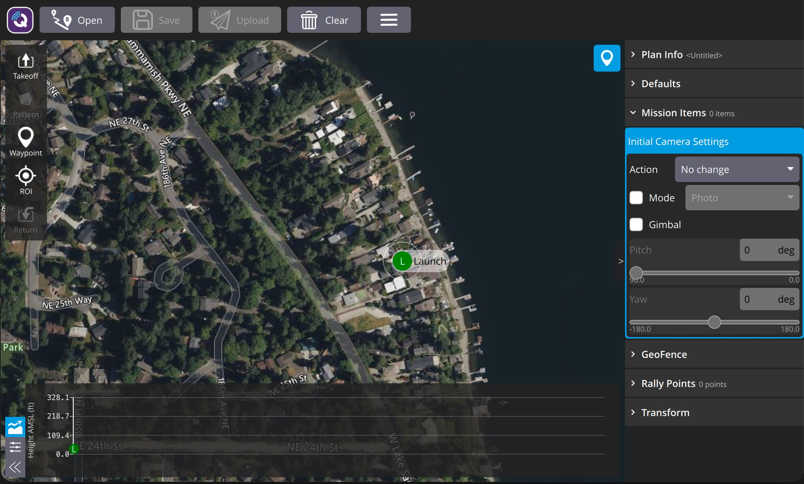

# Plan View

The _Plan View_ is used to plan _autonomous missions_ for your vehicle, and upload them to the vehicle. Once the mission is [planned](#plan_mission) and sent to the vehicle, you switch to the [Fly View](../fly_view/fly_view.md) to fly the mission.

It is also used to configure the [GeoFence](plan_geofence.md) and [Rally Points](plan_rally_points.md) if these are supported by the firmware.

## UI Overview {#ui_overview}

The [screenshot above](#plan_screenshot) shows the Plan View with an empty mission.
The map is centered on the [Planned Home](#planned_home) position (H).

The main elements of the UI are:

- **Map:** Displays the numbered indicators for the current mission, including the [Planned Home](#planned_home).
  Click on the indicators to select them (for editing) or drag them around to reposition them.
  Flight path lines and direction arrows show the planned route between waypoints.
- **Plan Toolbar:** Located at the top of the view with buttons for **Open**, **Save**, **Upload**, and **Clear**.
  A hamburger menu (☰) provides additional options such as _Save as KML_ and _Download_ (load plan from vehicle).
  The **Save** and **Upload** buttons are highlighted when there are unsaved or un-uploaded changes.
- **[Plan Tools](#plan_tools):** A vertical tool strip on the left side of the map used to add mission items (Takeoff, Waypoint, Pattern, ROI, Return/Land) and toggle the stats panel.
- **[Plan Editor Panel](#plan_editor_panel):** A collapsible tree view on the right side containing the plan file info, mission items, GeoFence, and rally point editors.
- **Layer Switcher:** Buttons in the top-right area for switching between **Mission**, **Geo-Fence**, and **Rally Point** editing layers.
- **Mission Stats / Terrain Panel:** A panel at the bottom of the map that can toggle between a terrain altitude profile chart (height AMSL vs. distance) and mission statistics (selected waypoint info, total distance, max telemetry distance, estimated flight time, and battery info).

## Planning a Mission {#plan_mission}

At a very high level, the steps to create a mission are:

1. Change to _Plan View_.
2. Add waypoints or commands to the mission and edit as needed.
3. Upload the mission to the vehicle.
4. Change to _Fly View_ and fly the mission.

The following sections explain some of the details in the view.

## Planned Home Position {#planned_home}

The _Planned Home_ shown in _Plan View_ is used to set the approximate start point when planning a mission (i.e. when a vehicle may not even be connected to QGC).
It is used by QGC to estimate mission times and to draw waypoint lines.

You should move/drag the planned home position to roughly the location where you plan to takeoff.
The altitude for the planned home position is determined automatically from terrain data.

:::tip
The Fly View displays the _actual_ home position set by the vehicle firmware when it arms (this is where the vehicle will return in Return/RTL mode).
:::

## Plan Tools {#plan_tools}

The plan tools are a vertical tool strip on the left side of the map, used for adding mission items. The tools are only visible when editing the Mission layer. The main tools (top to bottom) are described below.

### Takeoff

Inserts a takeoff command into the mission. This tool is available for all vehicle types except rovers.

### Pattern

The [Pattern](pattern.md) tool simplifies the creation of missions for flying complex geometries, including [surveys](../plan_view/pattern_survey.md) and [structure scans](../plan_view/pattern_structure_scan_v2.md).
If multiple pattern types are available for the vehicle, clicking the button opens a dropdown to select from Survey, Corridor Scan, Structure Scan, and landing patterns.

### Waypoint

Click the **Waypoint** tool to toggle waypoint-on-click mode. While active, clicking on the map will add a new mission waypoint at the clicked location.
The tool stays active until you click it again to deactivate.
Once you have added a waypoint, you can select it and drag it around to reposition it.

### ROI

Toggles Region of Interest mode. When active, clicking on the map sets an ROI location.
This tool is only visible if the vehicle firmware supports ROI mode.

### Return / Land

Adds a return or land command to the mission. The label varies by vehicle type:
- **Multicopters:** _Return_
- **Fixed-wing:** _Land_ (or _Alt Land_ if a land item already exists in the mission)

### Stats

Toggles the [Mission Stats / Terrain panel](#stats_terrain) at the bottom of the map. Only visible when that panel is currently hidden.

## File Operations {#file}

File operations are located in the **Plan Toolbar** at the top of the view:

- **Open** — Load a plan from a file.
- **Save** — Save the current plan to a file. Highlighted when there are unsaved changes.
- **Upload** — Upload the plan to the vehicle. Highlighted when the plan has un-uploaded changes.
- **Clear** — Remove all mission items, geofence, and rally points. If connected to a vehicle, also clears them from the vehicle.
- **Hamburger menu** (☰) — Additional options:
  - _Save as KML_ — Export the plan as a KML file.
  - _Download_ — Download the current plan from the vehicle (only available when connected).

::: info
Before you fly a mission you must upload it to the vehicle.
:::

## Plan Editor Panel {#plan_editor_panel}

The Plan Editor Panel is a collapsible tree view on the right side of the view.
The panel can be collapsed or expanded using the toggle button on its left edge.
It is organized into the following collapsible sections: **Plan Info**, **Defaults**, **Mission**, **GeoFence**, **Rally Points**, and **Transform**.

### Layer Switcher {#layer_switcher}

Buttons in the top-right area of the map allow switching between the **Mission**, **Geo-Fence**, and **Rally Point** editing layers.
The active layer button is always visible; the other layer buttons slide in briefly when toggled and auto-hide after a few seconds.

### Plan Info {#plan_info}

The Plan Info section contains general plan-level settings:

- **Plan File** — An editable name for the plan file.
- **Vehicle Info** — Firmware and vehicle type selectors. When connected to a vehicle these are determined automatically; when planning offline you must set them before adding any mission items so that the correct mission commands are available.
- **Expected Home Position** — The altitude (AMSL) for the planned home position is determined automatically from terrain data. A **Move To Map Center** button repositions the home marker to the center of the map. This is only the _planned_ home position for estimating mission times and drawing waypoint lines — the actual home position is set by the vehicle when it arms.

### Defaults {#mission_settings}

The Defaults section sets plan-wide values that apply to new mission items:

- **Altitude Frame** — Select the altitude reference frame for waypoints.
- **Waypoints Altitude** — The default altitude for the first mission item added (subsequent items take their initial altitude from the previous item). Changing this value when items already exist will prompt to update all items to the new altitude.
- **Flight Speed** — Set a flight speed that differs from the default mission speed.
- **Vehicle Speeds** — Cruise speed (fixed-wing) and/or hover speed (multi-rotor/VTOL), used for estimating mission time.

### Mission Items {#mission_items}

The Mission section lists all mission items (waypoints, commands, patterns, etc.) in order.
Each item can be expanded to edit its parameters.

- Click an item to select it on the map and expand its editor.
- Click the **command name** dropdown to change the item type. A dialog shows "Basic Commands" by default; use the **Category** dropdown to see all available commands.
- Each item has a **hamburger menu** (☰) with options such as _Show all values_, _Move to vehicle position_, _Move to previous item position_, and _Edit position_.
- A **delete button** (trash icon) removes the item.
- Items that are incomplete or missing required values show a **?** status indicator.

::: info
The list of available commands depends on firmware and vehicle type.
Examples include: Waypoint, Start image capture, Jump to item (to repeat mission), and other commands.
:::

#### Initial Camera Settings

This allows you to set camera options before any mission items take place.
This includes camera actions (take photos by time/distance, start/stop video recording) and gimbal control.

### GeoFence {#geofence}

The GeoFence section allows you to define geofence boundaries:

- **Polygon Fences** — Add inclusion or exclusion polygon fences. Each polygon can be toggled between inclusion/exclusion, edited, or deleted.
- **Circular Fences** — Add inclusion or exclusion circular fences with a configurable radius.
- **Breach Return Point** — Optionally set a return point (with altitude) that the vehicle will fly to if it breaches the geofence.

### Rally Points {#rally_points}

The Rally Points section displays and manages rally points. When a rally point is selected, its position fields are shown for editing.

### Transform {#transform}

The Transform section provides tools to adjust the entire mission after it has been created:

- **Offset Mission** — Shift the mission by a specified distance in the East, North, and Up directions. Optionally include takeoff and/or landing items in the offset.
- **Reposition Mission** — Move the mission to a new location specified by geographic coordinates (Lat/Lon), UTM, MGRS, or the current vehicle position.
- **Rotate Mission** — Rotate the mission clockwise by a specified number of degrees. Optionally include takeoff and/or landing items in the rotation.

## Mission Stats / Terrain Panel {#stats_terrain}

A panel at the bottom of the map provides two toggleable views:

- **Terrain Profile** — A chart showing height AMSL vs. distance from start across the mission.
- **Mission Statistics** — Displays details for the selected waypoint (altitude difference, azimuth, distance to previous waypoint, gradient, heading) and for the total mission (distance, max telemetry distance, estimated flight time). Battery information (batteries required and change point) is also shown when available.

Toggle buttons on the left side of the panel let you switch between the terrain profile and mission statistics views, or collapse the panel entirely.

## Troubleshooting

### Mission (Plan) Upload/Download Failures {#plan_transfer_fail}

Plan uploading and downloading can fail over a noisy communication link (affecting missions, GeoFence, and rally points).
If a failure occurs you should see a status message in the QGC UI similar to:

> Mission transfer failed. Retry transfer. Error: Mission write mission count failed, maximum retries exceeded.

The loss rate for your link can be viewed in [App Settings > Telemetry](../settings_view/telemetry.md).
The loss rate should be in the low single digits (i.e. maximum of 2 or 3):

- A loss rate in the high single digits can lead to intermittent failures.
- Higher loss rates often lead to 100% failure.

There is a much smaller possibility that issues are caused by bugs in either flight stack or QGC.
To analyze this possibility you can turn on [Console Logging](../settings_view/console_logging.md) for Plan upload/download and review the protocol message traffic.

## Further Info

- New Plan View features for [QGC release v3.2](../releases/release_note_stable_v3.md#plan_view)
- New Plan View features for [QGC release v3.3](../releases/release_note_stable_v3.md#plan-view-1)
