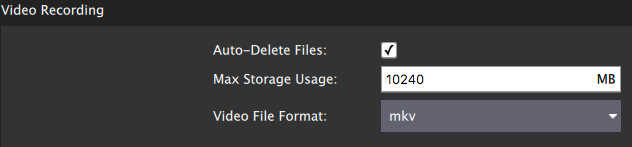
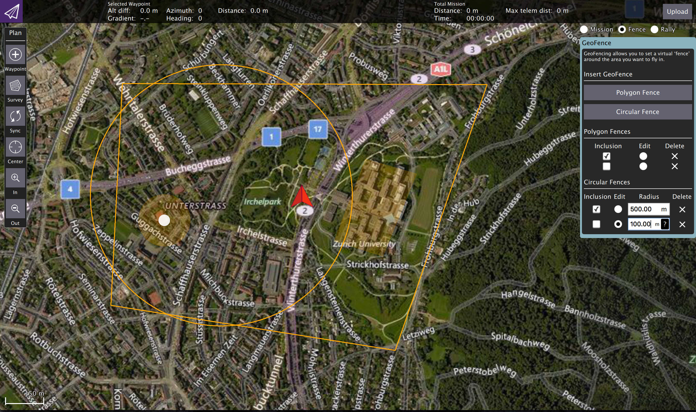
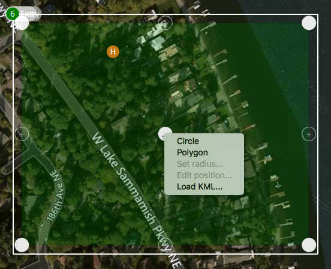
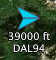
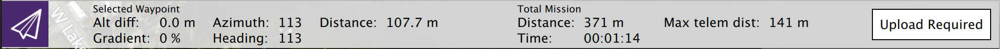
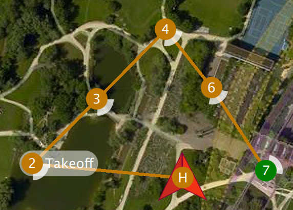
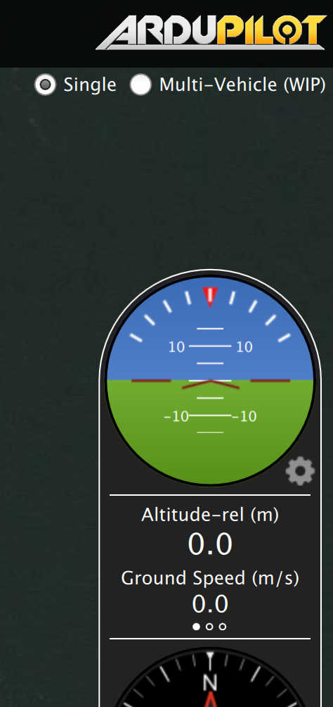

# QGC v3 Release Notes

This topic contains the cumulative release notes for _QGroundControl v3.x_.

## Stable Version 3.5

This section contains a high level and _non-exhaustive_ list of new features added to _QGroundControl_ in version 3.5.

- **Overall**
  - Added Airmap integration to QGC. OSX build only.
  - Bumped settings version (now 8).
    This will cause all settings to be reset to defaults.
  - Added Chinese and Turkish localization and partial German localization.
  - Added support for the Taisync 2.4GHz ViUlinx digital HD wireless link.
  - Fix loading of parameters from multiple components.
    This especially affected WiFi connections.
  - **ArduPilot** Support for ChibiOS firmware connect and flash.
- **Settings**
  - **RTK** Add support for specifying fixed RTK based station location in Settings/General.
  - **GCS Location**
    - Added UDP Port option for NMEA GPS Device.
    - GCS heading shown if available
- **Plan**
  - **Polygons** Support loading polygons from SHP files.
  - **Fixed Wing Landing Pattern** Add stop photo/video support.
    Defaults to on such that doing an RTL will stop camera.
  - **Edit Position dialog** Available on polygon vertices.
- **Fly**
  - **Camera Page** Updated support for new MAVLInk camera messages.
    Camera select, camera mode, start/stop photo/video, storage mangement...
  - **Orbit** Support for changing rotation direction.
  - **Instrument Panel**
    - Added ESTIMATOR_STATUS values to new estimatorStatus Vehicle FactGroup.
      These are now available to display in instrument panel.
    - Make Distance to GCS available for display from instrument panel.
    - Make Heading to Home available for display from instrument panel.

## Stable Version 3.4

This section contains a high level and _non-exhaustive_ list of new features added to _QGroundControl_ in version 3.4. Not to mention the large number of bug fixes in each stable release.

- **Settings**
  - **Offline Maps**
    - Center Tool allows you to specify a map location in lat/lon or UTM coordinates. Making it easier to get to the location you want to create an offline map for.
    - Ability to pre-download terrain heights for offline use.
  - **Help** Provides links to QGC user guide and forums.
- **Setup**
  - **Firmware** Ability to flash either PX4 or ArduPilot Flow firmware.
  - PX4 Pro Firmware
    - **Flight Modes** Specify channels for all available transmitter switches.
    - **Tuning: Advanced** Initial implementation of vehicle PID tuning support. Note that this is a work in progress that will improve in 3.5 daily builds.
  - ArduPilot Firmware
    - **Power/Safety** Support for new multi-battery setup.
    - **Trad Heli** New setup page.
- **Plan**

  - **File Load/Save** New model for Plan file loading which matches a standard File Load/Save/Save As user model.
  - **Load KML** Ability to load a KML file directly from the Sync menu. You will be prompted for what type of Pattern you want to create from the KML if needed.
  - **Survey** Better support for irregular shaped polygons.
  - **[Corridor Scan](../plan_view/pattern_corridor_scan.md)** - Create a flight pattern which follows a poly-line. For example can be used to survey a road.
  - **[Fixed Wing Landing Pattern](../plan_view/pattern_fixed_wing_landing.md)**
    - Landing area visually represented in Plan.
    - Landing position/heading can be copied from Vehicle position/heading.
  - **Terrain**

    - Height of mission items can be specified as height above terrain.
    - Survey and Corridor Scan can generate flight plans which follow terrain.

      ::: info
      This feature does not support [ArduPilot terrain following](http://ardupilot.org/copter/docs/common-terrain-following.html).
      :::

  - **Edit Position** Set item position from vehicle position.

- **Fly**
  - **Pre-Flight Checklist** You can turn this on from Settings. It provides a generic checklist to follow prior to flight. Expect more feature to appear for this in 3.5 daily builds.
  - **Instrument Panel**
    - Many new values available for display.
    - New Camera page which provides full camera control. Requires a camera which support new MavLink camera specification.
  - **ArduPlane** Much better support for guided commands including QuadPlane support.
  - **High Latency Links** Support for high latency links such as satellite connections.
    Limits the traffic from QGC up to Vehicle on these links to reduce cost.
    Supports HIGH_LATENCY MavLink message.
    Supports failover back/forth from high latency to normal link with dual link setup.

## Stable Version 3.3 (Summary)

:::tip
More detailed release notes for version 3.3 can be found in the next section.
:::

This section contains a high level and _non-exhaustive_ list of new features added to _QGroundControl_ in version 3.3. Not to mention the large number of bug fixes of this release.

- **Settings**
  - Local NMEA GPS device support.
  - Video Recording save settings.
- **Setup**
  - **Parameter Editor** - Searching updates as you type characters for near immediate response to searches.
  - **Joystick** - Android joystick support.
- **Plan**
  - **NEW - Structure Scan Pattern** - Create a multi-layered flight pattern that captures images over vertical surfaces (polygonal or circular). Used for 3d model generation or vertical surface inspection.
  - **Fixed Wing Landing Pattern** - You can now adjust the distance from the loiter to land point by either distance or glide slope fall rate.
  - PX4 GeoFence and Rally Point support.
  - Terrain height display in lower Mission Item altitude display
- **Fly**
  - Start/Stop video recording.
  - Better display of vehicle icons when connected to multiple vehicles.
  - Multi-Vehicle View supports commands which apply to all vehicles.
  - Displays vehicles reported from ADS-B sensor.
- **Analyze**
  - **Mavlink console** - New support for communicating with Mavlink console.
  - **Log Download** - Moved from Menu to Analyze view.

## Stable Version 3.3 (Detailed)

### Settings View

#### NMEA GPS Device support

You can specify a connection to one of these devices on the General page.
The GPS information will then be used for ground station location and in turn follow me support.

For more information see [Settings > General (AutoConnect to the following devices)](../settings_view/general.md#auto_connect).

#### Video Recording

Videos will be saved to the Video directory of your QGC file save path.
You can also specify the maximum amount of space you want video files to consume.
After that size if exceeded the oldest video files will be removed.
Video Recording is turned on/off from the Video widget in the Fly View.

For more information see [Settings > General (Video / Video Recording)](../settings_view/general.md#video).

### Plan View

#### Structure Scan

A Structure Scan allows you to create a grid flight pattern that captures images over vertical surfaces (polygonal or circular).
These are typically used for the visual inspection or creation of 3d models of structures.

Details [here](../plan_view/pattern_structure_scan_v2.md).

#### New MAVLink GeoFence, Rally Point support

QGC supports the new MAVLink GeoFence and Rally Point specification/protocol. This new system supports multiple polygonal and/or circular fences which can be specified as an exclusion or an inclusion fence.

The fence which is currently selected by the "Edit" radio button will show the on screen editing controls such as the drag points for polygon editing.

**Note** Only PX4 Pro firmware supports the new specification. ArduPilot does not yet support the new spec. Support for GeoFence/Rally is temporarily disabled in QGC until QGC ArduPilot code is reworked to the new architecture.

#### Edit Position Dialog

The Edit Position Dialog allows you to specify a detailed position for an item in either Geographic or UTM coordinate systems. It is available from the Polygon Tools menu as well as the hamburger menu of any mission item which specifies a coordinate:

#### Polygon Tools

You can now also click on the polygon center drag handle to bring up a set of polygon manipulation tools. The tools are available anywhere polygon editing is supported: Survey, Structure Scan, GeoFence, ...

- Circle - Converts the polygon to a circular polygon.
- Polygon - Changes a circular polygon back to a rectangular polygon.
- Set radius - Set radius for circular polygons.
- Edit position - Displays the edit position dialog to specify a detailed position for the circular center.
- Load KML - Set polygon to polygon loaded from KML file.

Circular polygon example:

### Fly View

#### Start/Stop Video Recording

This is now a video record button in the video window. Settings for saved videos are available from General Page of Setup view.

#### Multi-Vehicle vehicle indicators

When you are connected to multiple vehicles the vehicle id will be shown below the vehicle icon. The active vehicle will be opaque and the inactive vehicles will be semi-transparent.

#### Multi-Vehicle View supports batch commands

The multi-vehicle list now supports commands which apply to all vehicles.

The current list of available commands are Pause and Start Mission but that will be exapanded upon with further development.

#### ADS-B sensor vehicle display

Vehicle reported by ADS-B sensor on vehicle are shown on map as smaller blue icons with altitude and callsign below the icon.

## Stable Version 3.2 (Summary)

:::tip
More detailed release notes for version 3.2 can be found in the next section.
:::

This section contains a high level and _non-exhaustive_ list of new features added to _QGroundControl_ in version 3.2.

- **Settings**

  - **File Save path** - Specify a save path for all files used by QGC.
  - **Telemetry log auto-save** - Telemetry logs are now automatically saved without prompting.
  - **AutoLoad Plans** - Used to automatically load a Plan onto a vehicle when it first connects.
  - **RTK GPS** - Specify the Survey in accuracy and Minimum observation duration.

- **Setup**

  - ArduPilot only
    - **Pre-Flight Barometer and Airspeed calibration** - Now supported
    - **Copy RC Trims** - Now supported

- **Plan View**

  - **Plan files** - Missions are now saved as .plan files which include the mission, geo-fence and rally points.
  - **Plan Toolbar** - New toolbar which shows you mission statistics and Upload button.
  - **Mission Start** - Allows you to specify values such as flight speed and camera settings to start the mission with.
  - **New Waypoint features** - Adjust heading and flight speed for each waypoint as well as camera settings.
  - **Visual Gimbal direction** - Gimbal direction is shown on waypoint indicators.
  - **Pattern tool** - Allows you to add complex patterns to a mission.
    - Fixed Wing Landing (new)
    - Survey (many new features)
  - **Fixed Wing Landing Pattern** - Adds a landing pattern for fixed wings to your mission.
  - **Survey** - New features
    - **Take Images in Turnarounds** - Specify whether to take images through entire survey or just within each transect segment.
    - **Hover and Capture** - Stop vehicle at each image location and take photo.
    - **Refly at 90 degree offset** - Add additional pattern at 90 degree offset to original so get better image coverage.
    - **Entry location** - Specify entry point for survey.
    - **Polygon editing** - Simple on screen mechanism to drag, resize, add/remove points. Much better touch support.

- **Fly View**

  - **Arm/Disarm** - Available from toolbar.
  - **Guided Actions** - New action toolbar on the left. Supports:
    - Takeoff
    - Land
    - RTL
    - Pause
    - Start Mission
    - Resume Mission - after battery change
    - Change Altitude
    - Land Abort
    - Set Waypoint
    - Goto Location
  - **Remove mission after vehicle lands** - Prompt to remove mission from vehicle after landing.
  - **Flight Time** - Flight time is shown in instrument panel.
  - **Multi-Vehicle View** - Better control of multiple vehicles.

- **Analyze View** - New

  - **Log Download** - Moved to Analyze view from menu
  - **Mavlink Console** - NSH shell access

- **Support for third-party customized QGroundControl**
  - Standard QGC supports multiple firmware types and multiple vehicle types. There is now support in QGC which allows a third-party to create their own custom version of QGC which is targeted specifically to their custom vehicle. They can then release their own version of QGC with their vehicle.

## Stable Version 3.2 (Detailed)

This is a more detailed high level (but still _non-exhaustive_) list of new features added to _QGroundControl_ in version 3.2.

### Settings

#### Telemetry log auto-save

If you have _Save telemetry log after each flight_ turned on you will no longer be prompted as to where to save the log each time the vehicle disarms.
Logs will automatically be saved to the [Application Load/Save Path](../settings_view/general.md#load_save_path)

For more information see [Settings > General (Miscellaneous)](../settings_view/general.md#autosave_log).

#### AutoLoad plans

If this setting is turned on, _QGroundControl_ will automatically upload a plan to the vehicle when it connects.
The plan file must be named **AutoLoad#.plan** where the `#` is replaced with the vehicle id.
The plan file must be located in the [Application Load/Save Path](../settings_view/general.md#load_save_path).

For more information see [Settings > General (Miscellaneous)](../settings_view/general.md#autoload_missions).

#### Application Load/Save Path

You can now specify a save path which QGC will use as the default location to save files such as Parameters, Telemetry or Mission Plans.

For more information see [Settings > General (Miscellaneous)](../settings_view/general.md#load_save_path).

#### RTK GPS

You can now specify the _Survey in accuracy_ and _Minimum observation duration_ for use with a connected RTK GPS.

For more information see [Settings > General (RTK GPS)](../settings_view/general.md#rtk_gps).

### Setup

#### ArduPilot - Pre-Flight Barometer and Airspeed calibration

This is now supported from the Sensors page.

#### ArduPilot - Copy RC Trims

This is now supported from the Copy Trims button on the Radio setup page.

### Plan View

#### Plan Files

Previous version of _QGroundControl_ saved missions, geo-fences and rally points in separate files (**.mission**, **.fence**, **.rally**). QGC now save all information related to a flight plan into a single file called a _Plan File_ with a file extension of **.plan**.

Information about the format can be found in [Plan File Format](../../qgc-dev-guide/file_formats/plan.md) (QGC Developer Guide).

#### Plan Toolbar

The new _Plan Toolbar_ is displayed at the top of the [PlanView](../plan_view/plan_view.md).
It shows you information related to the currently selected waypoint as well as statistics for the entire mission.

When connected to a vehicle it also shows an **Upload** button, which can be used to upload the plan to the vehicle.

#### Mission Settings

The [Mission Settings](../plan_view/plan_view.md#mission_settings) panel allows you to specify values which apply to the entire mission, or settings you want to control right at the beginning of a mission.
This is the first item in the mission list on the right of the screen.

##### Mission Defaults

###### Waypoint alt

This specifies the default altitude for newly added mission items.
If you update this value while you have a mission loaded it will prompt you to update all the the waypoints to this new altitude.

###### Flight speed

This allows you to set the flight speed for the mission to be different than the default mission speed.

###### RTL after mission end

Check this if you want your vehicle to RTL after the final mission item.

##### Camera section

The camera section allows you to specify a camera action to take, control the gimbal and set your camera into photo or video mode.

The camera actions available are:

- Continue current action
- Take photos (time)
- Take photos (distance)
- Stop taking photos
- Start recording video
- Stop recording video

##### Vehicle Info section

When planning a mission the firmware being run on the vehicle as well as the vehicle type must be known in order for QGroundControl to show you the mission commands which are appropriate for your vehicle.

If you are planning a mission while you are connected to your vehicle the Firmware and Vehicle Type will be determined from the vehicle. If you are planning a mission while not connected to a vehicle you will need to specify this information yourself.

The additional value that can be specified when planning a mission is the vehicle flight speed. By specifying this value, total mission or survey times can be approximated even when not connected to a vehicle.

##### Planned Home Position

The planned home position allows you to simulate the vehicle's home position while planning a mission. This way you see the waypoint trajectory for your vehicle from takeoff to mission completion. Keep in mind that this is only the "planned" home position and you should place it where you plan to start the vehicle from. It has no actual impact on flying the mission. The actual home position of a vehicle is set by the vehicle itself when arming.

#### New Waypoint features

- You can now adjust heading and flight speed for each waypoint.
- There is a camera section available for camera changes on each waypoint. Explanation of Camera Section can be read under Mission Settings above.

#### Visual Gimbal direction

If you specify gimbal yaw changes on waypoints, both the plan and fly views will show you a visual representation of the gimbal direction.

#### Pattern tool

There is a new _Pattern tool_. The following patterns are supported:

- Fixed Wing Landing (new)
- Survey (with new features)

##### Fixed Wing Landing Pattern

This adds a landing pattern for fixed wings to your mission.
The first point of the pattern is the loiter point which commands to vehicle to loiter to a specific altitude.
Once that altitude is reached, the vehicle will begin the landing sequence and fly down to the specified landing spot.

Both the loiter and land points can be dragged to adjust.
Also all the various values associated with the pattern can be adjusted.

For more information see [Fixed Wing Landing Pattern](../plan_view/pattern_fixed_wing_landing.md).

##### Survey (new features)

- Images are not automatically taken in the turnaround zone outside of the polygonal survey area.
- There is a new _Hover and Capture_ option which can be used to capture the highest quality image at each image location. The vehicle will stop at each image location prior to taking the image such that the vehicle is stable while the image is taken.
- There is a new option to re-fly the survey grid at a 90 degree angle to the previous pass. This allows you to generate much denser coverage for the images.

Manipulating the survey area polygon is now easier to use on tablets with touch screens:

- You can drag the entire polygon to a new location by dragging the center point handle.
- Each polygon vertex can be dragged to a new location.
- To remove a polygon vertex, simple click on the drag handle for it.
- Click on the **+** handles to add a new vertex between two existing vertices.

### Fly View

#### RTK GPS

RTK status is now shown in the toolbar.

#### Arm/Disarm

There is an armed/disarmed indicator in the toolbar. You can click it to arm/disarm your vehicle. If you click Disarm in the toolbar while your vehicle is flying you will provided the option to Emergency Stop your vehicle.

#### Guided Actions

- Takeoff
- Land
- RTL
- Pause
- Actions
  - Start Mission
  - Resume Mission
  - Change Altitude
  - Land Abort
- Direct interaction with map
  - Set Waypoint
  - Goto Location

##### Resume Mission

The Resume Mission guided action is used to resume a mission after performing an RTL from within the mission to perform a battery change.
After the vehicle lands from RTL and you have disconnected the battery **do not** disconnect QGC from the Vehicle.
Put in your new battery and QGC will detect the vehicle again and automatically restore the connection.
Once this happens you will be prompted with a Resume Mission confirmation slider.
If you want to resume the mission, confirm this and the mission will be rebuilt from your last waypoint traveled through.
Once the mission is rebuilt you will be presented with another Resume Mission slide which allows you to review the rebuilt mission before starting it again.
Confirm this Resume Mission slider to continue on with the mission.

####### How resume mission rebuilding works

In order to resume a mission you cannot simply continue it from the last mission item the vehicle ran.
The reason is is that may skip over important change speed commands or camera control commands which are prior to that item in the mission.
If you skipped over those the remainder of the mission will not run correctly.
In order to make resume mission work correctly QGC rebuilds the mission looking backwards from the last mission item flown and automatically appends relevant commands to the front of the mission.
By doing this the state of the mission prior to the resume point is restore.
The following mission commands are the ones scanned for:

- `MAV_CMD_DO_CONTROL_VIDEO`
- `MAV_CMD_DO_SET_ROI`
- `MAV_CMD_DO_DIGICAM_CONFIGURE`
- `MAV_CMD_DO_DIGICAM_CONTROL`
- `MAV_CMD_DO_MOUNT_CONFIGURE`
- `MAV_CMD_DO_MOUNT_CONTROL`
- `MAV_CMD_DO_SET_CAM_TRIGG_DIST`
- `MAV_CMD_DO_FENCE_ENABLE`
- `MAV_CMD_IMAGE_START_CAPTURE`
- `MAV_CMD_IMAGE_STOP_CAPTURE`
- `MAV_CMD_VIDEO_START_CAPTURE`
- `MAV_CMD_VIDEO_STOP_CAPTURE`
- `MAV_CMD_DO_CHANGE_SPEED`
- `MAV_CMD_NAV_TAKEOFF`

#### Remove mission after vehicle lands

You will be prompted to remove the mission from the vehicle after the mission completes and the vehicle lands and disarms.
This is meant to prevent issues where stale missions are unknowingly left on a vehicle cause unexpected behavior.

#### Instrument panel

##### Camera trigger

##### Flight Time

Flight time is now available for display in the instrument panel.
For new users, flight time will be shown by default.
For existing users who have already modified their instrument panel values you will have to add it yourself if you want to use it.

### [Analyze View](../analyze_view/index.md)

- [Log Download](../analyze_view/log_download.md) moved to _Analyze View_ from menu.
- New [GeoTag Images](../analyze_view/geotag_images.md) support for PX4 Pro firmware
- New [MAVLink Console](../analyze_view/mavlink_console.md) which provides access the the _nsh shell_ running on the vehicle.

### Multi-Vehicle View

There is a new view available when you have multiple vehicles connected to QGC. It will only show up when more than one vehicle is connected. When that happens you will see an additional set of radio button at the top right of the Plan view.

Click the **Multi-Vehicle** radio button to replace the instrument panel with the multi-vehicle list:

The example above shows three vehicles. The numbers are the vehicle id. In the large font is the current flight mode. You can click the flight mode name to change to a different flight mode. To the right are small version of the instruments for each vehicle. You can command the vehicle to do the following actions from the control panel:

- Arm/Disarm
- Start/Stop a mission
- Return to Launch
- Take Control back of the vehicle by returning to manual control from a mission.

#### Multi-Vehicle Gotchas - Unique vehicle ids

Each vehicle connected to QGC must have a unique id. Otherwise QGC will think the vehicles are actually the same vehicle. The symptom of this is the Plan view jerking around as it tries to position itself to one vehicle and then the next. For PX4 Pro firmwares this is the `MAV_SYS_ID` parameter. For ArduPilot firmwares it is the `SYSID_THISMAV` parameter.

### Support for third-party customized QGroundControl

Standard QGC supports multiple firmware types and multiple vehicle types. There is now support in QGC which allows a third-party to create their own custom version of QGC which is targeted specifically to their custom vehicle. They can then release their own version of QGC with their vehicle.

## Stable Version 3.1

New Features

- [Survey](../plan_view/pattern_survey.md) mission support
- [GeoFence](../plan_view/plan_geofence.md) support in Plan View
- [Rally Point](../plan_view/plan_rally_points.md) support in Plan View (ArduPilot only)
- ArduPilot onboard compass calibration
- Parameter editor search will now search as you type for quicker access
- Parameter display now supports unit conversion
- GeoTag images from log files (PX4 only)
- System health in instrument panel
- MAVLink 2.0 support (no signing yet)

Major Bug Fixes

- Fixed crash after disconnect from Vehicle
- Fixed android crash when using SiK Radios
- Many multi-vehicle fixes
- Bluetooth fixes
