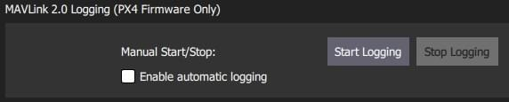
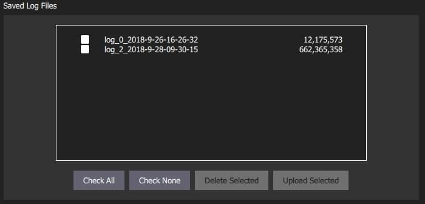

# MAVLink Settings

The MAVLink settings (**SettingsView > MAVLink**) allow you to configure options and view information specific to MAVLink communications.
This includes setting the MAVLink system ID for _QGroundControl_ and viewing link quality.

The screen also allows you to manage [MAVLink 2 Log Streaming](#logging) (PX4 only), including _automating log upload to Flight Review_!

## Ground Station {#ground_station}

This section sets the MAVLink properties and behaviour of _QGroundControl_.

- **MAVLink System ID:** System ID of _QGroundControl_ on the MAVLink network (Default: 255).
  Vehicles are typically allocated IDs from 1.
  You may have to specify another ID if there are multiple ground stations or MAVLink applications on the network.
- **Emit heartbeat:** Disable emission of regular MAVLink HEARTBEAT message (Default: True).
  Generally speaking, you should not turn this off.
- **Only accept MAVs with the same protocol version:** Set true to only connect to MAVLink 1 or to MAVLink 2 vehicles (Default: True).
- **Enable MAVLink forwarding:** Enable _QGroundControl_ to forward MAVLink messages from connected vehicles to another UDP endpoint (Default: False).
  Note that this forwarding is one-way: from QGC to the specified host.
  Any MAVLink messages that are received from the specified host will be ignored.

## Link Status {#link_status}

This shows the status of MAVLink message transfer over the communications link.
A high **Loss rate** may lead to protocol errors for things like parameter download or mission upload/download.

## MAVLink 2 Logging (PX4 only) {#logging}

The _MAVLink 2 Logging_ settings (PX4 only) configure real-time log streaming from PX4 to _QGroundControl_ and upload of logs to [Flight Review](https://logs.px4.io).

::: warning
MAVLink 2 Logging cannot be used on "basic" setups because it requires a constant high-rate MAVLink connection to the vehicle (it _may_ work over WiFI but will _not_ work over a Telemetry link).
:::

::: tip
In theory log streaming allows real time analysis of data.
At time of writing real-time analysis has not yet been implemented.
:::

The log format is the same as for SD Card logs (downloaded using [Analyze View > Log Download](../analyze_view/log_download.md)), but actual data logged may be slightly different because log start/stop time is controlled by _QGroundControl_ and because some dropouts may occur when streaming over a lossy channel.

The _MAVLink 2 Logging_ section allows you to manually start and stop logging, and to enable automatic capture of logs.

The _MAVLink 2 Log Uploads_ section allows you configure uploading of MAVLink logs to [Flight Review](https://logs.px4.io).
You can specify all the fields that you would otherwise have to directly enter in the site, and also choose whether logs are automatically or manually uploaded.

The fields are:

- **Email address for Log Uploads:** _Flight Review_ will email you a link to the upload at this address.
  This is important as otherwise you will have no way to access a non-public log after upload.
- **Default Description:** Description/name of flight used for log.
- **Default Upload URL:** URL for upload of the log/log metadata.
  This is set by default to the _Flight Review_ URL.
- **Video URL:** (Optional) URL for video of flight associated with log.
  This may be included on the Flight Review page to ease analysis.
- **Wind Speed:** Used to aid debugging and filtering (from multiple flights). Allowed values: _Calm_ | _Breeze_ | _Gale_ | _Storm_.
- **Flight Rating:** Used to aid debugging and filtering (from multiple flights). Allowed values: _Crashed (Pilot Error)_ | _Crashed (Software or Hardware Issue)_ | _Unsatisfactory_ | _Good_ | _Great_.
- **Additional Feedback:** (Optional). Enter a more detailed description of the flight or behaviour.
- **Make this log publically available:** If set, the log will be visible and searchable on _Flight Review_.
  If not set, it will only be available via the link emailed on upload.
- **Enable automatic log uploads:** If set, the log will automatically be uploaded on completion.
- **Delete log file after uploading:** If set, the log will automatically deleted after upload.

The _Saved Log Files_ section is used to manually manage log uploads.
Use the checkboxes and buttons to select logs, and either delete or upload them.

::: tip
You can change the parameters in _MAVLink 2 Log Uploads_ above to specify separate descriptions for uploaded logs.
:::

