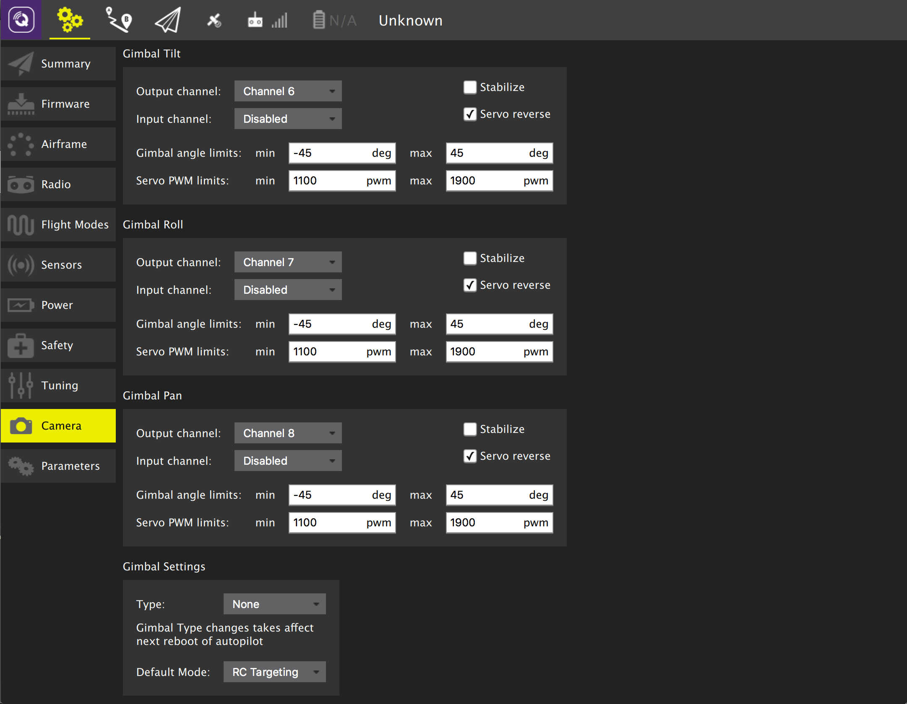

# Camera Setup

The details of the page differ if you are using PX4 firmware or ArduPilot firmware.

## ArduPilot Camera Setup

## PX4 Camera Setup

For more information see [Camera](http://docs.px4.io/master/en/peripherals/camera.html) (PX4 User Guide).

::: info
The camera settings section is not available by default for FMUv2-based flight controllers (e.g. 3DR Pixhawk) because the camera module is not automatically included in firmware.
For more information see [this topic](http://docs.px4.io/master/en/advanced_config/parameters.html#parameter-not-in-firmware).
:::
