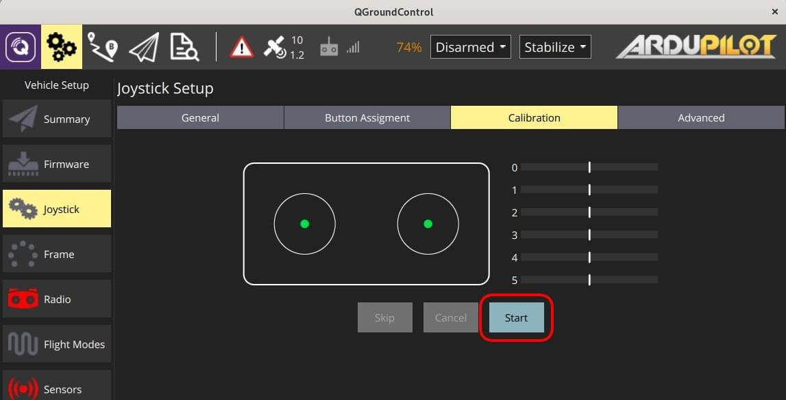
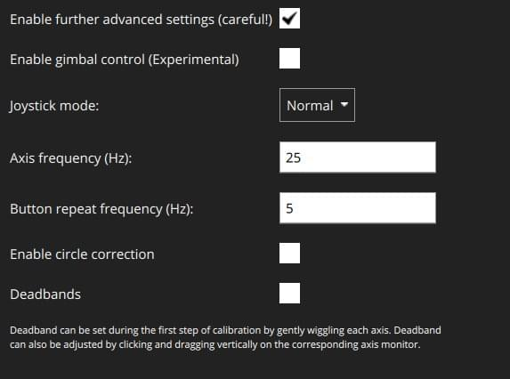

# Joystick Setup

_QGroundControl_ allows you to control a vehicle using a joystick or gamepad instead of an RC Transmitter.

::: info
Flying with a Joystick (or [virtual thumb-sticks](../settings_view/virtual_joystick.md)) requires a reliable high bandwidth telemetry channel to ensure that the vehicle is responsive to joystick movements (because joystick information is sent over MAVLink).
:::

::: info
Joystick and Gamepad support is enabled using the cross-platform [SDL2](http://www.libsdl.org/index.php) library.
Compatibility with a particular controller depends on SDL (all buttons that are exposed by that API are displayed through the _QGroundControl_ UI).
A [number of common joysticks and gamepads](#supported-joysticks) are known to work.
:::

::: info
The joystick is _enabled_ as the last step of the calibration process. You can also toggle it later using the **Enable** checkbox at the top of the joystick setup page.
:::

## Enabling PX4 Joystick Support

To enable Joystick support in PX4 you need to set the parameter [`COM_RC_IN_MODE`](https://docs.px4.io/en/main/advanced_config/parameter_reference.html#COM_RC_IN_MODE) to `1` - _Joystick_.
If this parameter is `0` then _Joystick_ will not be offered as a setup option.

This is enabled by default for PX4 SITL builds (see the [Parameters](../setup_view/parameters.md) topic for information on how to find and set a particular parameter).

## Ardupilot Joystick Support

All ArduPilot vehicles are supported. No parameter configuration is necessary.

## Configuring the Joystick {#configure}

To configure a joystick:

1. Start _QGroundControl_ and connect to a vehicle.
1. Connect the joystick or gamepad to a USB port.
1. Select the **Gear** icon (Vehicle Setup) in the top toolbar and then **Joystick** in the sidebar.
   The screen below will appear.

   

1. Make sure your joystick is selected in the **Active joystick** dropdown and, if required, enable it for the current vehicle using the **Enable** checkbox.
1. Press **Calibrate** and follow the on-screen instructions. During the first step, gently move each stick just enough to define the deadband that is highlighted on the range bars.

   

   When calibration finishes, _QGroundControl_ prompts you to enable the joystick if it is not already active.

    ::: warning
    On some controllers the calibration process does not work because of incorrect channel mappings. You can follow [supported joysticks section](#supported-joysticks) for more information.
    :::

1. Use the live channel monitor at the bottom of the page to verify stick ranges. The colored bar shows the current value and the shaded region indicates the configured deadband.
1. Assign flight modes and vehicle functions in the **Buttons** tab. Actions marked as **Repeat** keep firing while you hold the button.
   
1. Fine-tune throttle behaviour, expo, deadbands, and other options in the **Settings** tab.

### Buttons Tab

The **Buttons** tab lists every button that currently has an action. Select a button index on the left and choose an action from the list. When the same action is assigned to multiple buttons, they must be pressed together to trigger it. You can also enable **Repeat** on supported actions to keep firing while the button stays pressed.

### Settings Tab

The **Settings** tab collects the throttle, expo, and advanced controls for the joystick. Use the **Advanced Settings** toggle to reveal less common options.

#### Throttle Options


- **Center stick is zero throttle**: Centered or lowered stick sends 0 in [MANUAL_CONTROL **z**](https://mavlink.io/en/messages/common.html#MANUAL_CONTROL), raised stick sends 1000.
  - **Spring loaded throttle smoothing**: In this mode you control the rate of change instead of the absolute throttle. This is useful for spring-loaded sticks where you want the throttle to hold its value when you release the stick.
- **Full down stick is zero throttle**: Lowered stick sends 0 in [MANUAL_CONTROL **z**](https://mavlink.io/en/messages/common.html#MANUAL_CONTROL), centered stick 500, and raised stick 1000.
- **Negative thrust**: When **Center stick is zero throttle** is enabled, this allows you to send negative values by lowering the stick. Lowered stick sends -1000, centered sends zero, and raised stick sends 1000. This is only available on vehicles that support negative thrust, such as [Rover](http://ardupilot.org/rover/index.html).

#### Expo

The expo slider allows you to make the sticks less sensitive near the center for finer control. The right-hand graph shows how the curve changes as you adjust the percentage.


#### Advanced Settings

The advanced settings are available when the **Advanced Settings** toggle is enabled. They can cause unexpected results if misconfigured.



- **Circle correction**: Adjusts circular stick travel to map to the full square range used by RC radios.
  - **Disabled:** The joystick position is sent to the vehicle unchanged. Because many joysticks move within a circle, you might not reach the extreme corners (full roll and full pitch simultaneously).
    
  - **Enabled:** The joystick values are adjusted in software to ensure the full range of commands can be reached. The usable area shrinks slightly because the grey region is no longer used.
    
- **MANUAL_CONTROL extensions (pitch/roll)**: Enables the extra MAVLink fields used for gimbal pitch and yaw on supported vehicles.
- **Axis frequency**: Sets the maximum rate (Hz) at which axis updates are transmitted while you are actively flying. Commands idle at 5 Hz and scale up to this value as inputs change (default 25 Hz).
- **Button frequency**: Controls how often repeated button actions are sent when **Repeat** is enabled.
- **Deadband**: Toggles deadband support. Adjust the values during the first step of [calibration](#configure), by dragging vertically on the axis monitor, or by editing the numeric fields directly. The shaded region on each channel bar indicates the current deadband.

### Migrated Settings

Existing joystick calibrations and preferences from older _QGroundControl_ releases are migrated automatically the first time you connect the device. If calibration data cannot be found, the new setup workflow guides you through creating it.

## Supported Joysticks

The following joysticks/controllers have been shown to work with relatively recent _QGroundControl_ builds.

### Sony Playstation 3/4 Controllers

Both these joysticks are highly recommended.
They work well "out of the box" and have many buttons that you can map to flight modes.

#### Sony PS4 - DualShock 4 Controller V2 (Wireless setup)

This controller supports both USB and Bluetooth wireless connection.
Wired USB connection usually works out of the box.
The wireless connection needs some setup.

##### Linux Ubuntu setup

To make the controller work wirelessly under Linux the [jstest-gtk](https://jstest-gtk.gitlab.io/) and [ds4drv](https://github.com/chrippa/ds4drv) utilities are needed.

The steps are:

1. Install _jstest-gtk_:
   ```
   sudo apt install jstest-gtk
   ```
1. Install _ds4drv_:
   ```
   sudo pip install ds4drv
   ```
1. Run ds4drv
   ```
   sudo ds4drv
   ```
1. Hold **Share** button and then **PS** button until controller LED starts blinking rapidly.
   The _ds4drv_ should then detect a new device.
1. Last of all, you should check the controller setup by running the _jstest-gtk_ utility.

### FrSky Taranis XD9 plus

The _FrSky Taranis XD9 plus_ remote control can also be connected as a joystick.
You will need to connect it via the USB port on the back.

The Taranis does not allow you to use button options (to be precise, you can set the options, but toggling the buttons on your transmitter does not cause them to be pressed).

::: info
The Taranis is an open system that is openly being worked on.
It is possible that at time of writing there is a firmware or configuration that allows it to work effectively as a joystick.
:::

### TBS Tango 2

The TBS Tango 2 can also be used as a joystick controlled via QGroundControl. In order to make it work, you need to remap the channels by using the following commands:

```bash
export SDL_GAMECONTROLLERCONFIG="03002de7d80400001057000011010000,Team-BlackSheep TBS Joystick,a:b0,b:b1,x:b3,y:b4,back:b10,guide:b12,start:b11,leftstick:b13,rightstick:b14,leftshoulder:b6,rightshoulder:b7,leftx:a0,lefty:a1,rightx:a2,righty:a3,lefttrigger:a4,righttrigger:a5,crc:e72d,platform:Linux"
./QGroundControl-x86_64.AppImage
```

For another radio, the first command above can be found by using the [jstest software tool](http://github.com/meleu/jstest-sdl) and run:

```bash
jstest-sdl -l
```

**Take care of the channels remapping you need to do between a2, a3 and other if needed**

### Logitech Gamepad F310

The Logitech Gamepad F310 has been tested via USB on MacOSX "Sierra".

### Logitech Extreme 3D Pro

The [Logitech Extreme 3D Pro](http://gaming.logitech.com/en-ch/product/extreme-3d-pro-joystick) Joystick has been tested on all platforms (Linux, Windows, Mac OSX).
This is a single stick controller that can also be twisted. The main stick axes are used for pitch and roll, while the twist action is used for yaw. The throttle is mapped onto a separate wheel.

### Logitech F710 Gamepad

<!-- This is from http://qgroundcontrol.org/users/joystick -->

This gamepad is great for flying a multirotor manually via QGroundControl. It works on Windows, Linux and Mac OS.

#### Mac OS Leopard / Lion Setup

The F710 is detected under Leopard / Lion but is not automatically configured as an input device.
In order to get a working configuration, the F710 has to be recognised as _Rumblepad2_.

First check how it is recognised: **Apple > About this Mac > Additional Information > System Report > USB**.
It is detected as "Logitech Cordless RumblePad 2" then nothing further needs to be done.

If it is detected as a "Logitech Wireless 710", perform these steps:

1. Unplug the USB receiver of the gamepad
1. Prepare to quickly plug it into a USB port
1. Hit the Logitech button (its silver with the Logitech Logo on it in the center of the pad)
1. Quickly connect the USB receiver to your Mac
1. The pad should now be detected in the system report as "Logitech Cordless RumblePad 2". If not, retry the above steps.

```
