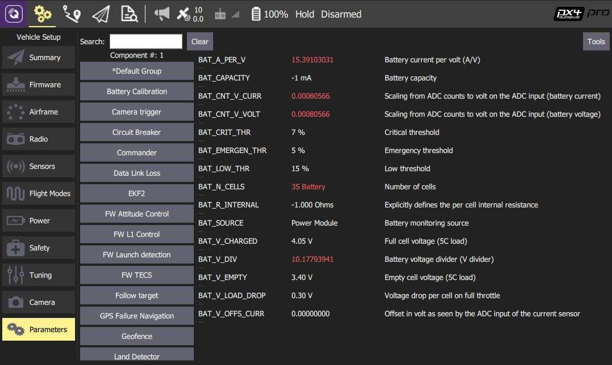

# Parameters

The _Parameters_ screen allows you to find and modify any of the parameters associated with the vehicle.

::: info
PX4 Pro and ArduPilot use different parameter sets, but they are both managed as described in this section.
:::

## Finding a Parameter

The parameters are organized in groups. Select a group of parameters to view by clicking on the buttons to the left (in the image above the _Battery Calibration_ group is selected).

You can also _search_ for a parameter by entering a term in the _Search_ field. This will show you a list of all parameter names and descriptions that contain the entered substring (press **Clear** to reset the search).

## Changing a Parameter

To change the value of a parameter click on the parameter row in a group or search list. This will open a side dialog in which you can update the value (this dialog also provides additional detailed information about the parameter - including whether a reboot is required for the change to take effect).

::: info
When you click **Save** the parameter is automatically and silently uploaded to the connected vehicle. Depending on the parameter, you may then need to reboot the flight controller for the change to take effect.
:::

## Tools

You can select additional options from the **Tools** menu on the top right hand side of the screen.

**Refresh**
 Refresh the parameter values by re-requesting all of them from the vehicle.

**Reset all to defaults**
 Reset all parameters to their original default values.

**Load from file / Save to file**
 Load parameters from an existing file or save your current parameter settings to a file.

**Clear RC to Param**
 This clears all associations between RC transmitter controls and parameters. For more information see: [Radio Setup > Param Tuning Channels](../setup_view/radio.md#param-tuning-channels-px4).

**Reboot Vehicle**
 Reboot the vehicle (required after changing some parameters).
