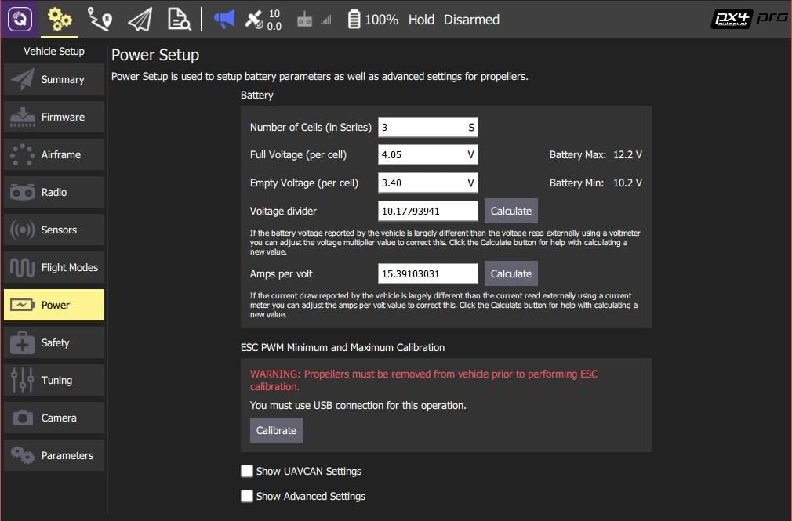

# Power Setup

The _Power Setup_ screen is used to configure battery parameters and also provide advanced settings for propellers.

## Battery Voltage/Current Calibration

Enter data for your battery/power module from its data sheet: number of cells, full voltage per cell, empty voltage per cell. If provided, also enter voltage divider and amps-per-volt information.

_QGroundControl_ can be used to calculate appropriate voltage divider and amps-per-volt values from measurements:

1. Measure the voltage from the battery using a multimeter.
1. Click **Calculate** next to the _Voltage divider_ field. On the prompt that appears:
1. Enter the measured voltage.
1. Click **Calculate** to generate a new voltage-divider value.
1. Click **Close** to save the value into the main form.
1. Measure the current from the battery.
1. Click **Calculate** next to the _Amps per volt_ field. On the prompt that appears:
1. Enter the measured current.
1. Click **Calculate** to generate a new _amps per volt_ value.
1. Click **Close** to save the value into the main form.

## Advanced Power Settings

Click the **Show Advanced Settings** checkbox to specify advanced power settings.

### Voltage Drop on Full Load

Batteries show less voltage at high throttle. Enter the difference in Volts between idle throttle and full throttle, divided by the number of battery cells. The default value should be used if unsure!

::: warning
If the value is too high the battery may be deep-discharged and damaged.
:::

## ESC PWM Minimum and Maximum Calibration

To calibrate the ESC max/min PWM values:

1. Remove the propellers.
1. Connect the vehicle to QGC via USB (only).
1. Click the **Calibrate** button.

::: warning
Never attempt ESC calibration with props on.

Motors should not spin during ESC calibration.
However if an ESC doesn't properly support/detect the calibration sequence then it will respond to the PWM input by running the motor at maximum speed.
:::

## Other Settings

Select the **Show UAVCAN Settings** checkbox to access additional settings for UAVCAN Bus Configuration and motor index and direction assignment.
