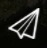

# Main Toolbar

The main toolbar provides access to select the different application views, and high level status information for connected vehicles.
The toolbar is the same in all views except for "PlanView" (which has a single icon to take you back to "Fly" view).

## View-select icons

The following icons are used to switch between the main _Views_. These are displayed even if no vehicle is connected.

 **[Settings](../settings_view/settings_view.md)**
 Configure the _QGroundControl_ application.

 **[Setup](../setup_view/setup_view.md)**
 Configure and tune your vehicle.

 **[Plan](../plan_view/plan_view.md)**
 Create autonomous missions.

 **[Fly](../fly_view/fly_view.md)**
 Monitor your vehicle(s) while flying, including streaming video.

 **[Analyze](../analyze_view/index.md)**
 Download logs, geotag images from a survey mission, access the MAVLink console.

## Status icons

Status icons are displayed when _QGroundControl_ is connected to a vehicle.
These show the high level status of the vehicle, and can be clicked to see more detailed information.

  **Vehicle Messages**
 Click to show a list of messages from the vehicle. Note that version on the right is displayed when there are critical messages.

 **GPS Status**
 Shows you satellite count and curent HDOP.

 **RC RSSI**
 RC signal strength information.

 **Telemetry RSSI**
 Telemetry signals strength information.

 **Battery**
 Remaining battery percent.

 **Flight Mode**
 Current flight mode. Click to change flight mode.

 **RTK GPS Survey-In Status**
 Shows you progress of RTK GPS Survey-In process.
