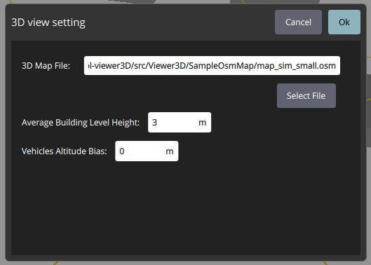

# 3D View

The 3D View is used to visualize and monitor the vehicle, the environment, and the planned mission in 3D. Most of the capabilities available in the [Fly View](../fly_view/fly_view.md)  is also available in the 3D View. 

You can use it to:
- To import and display the 3D map for any region of interest downloaded from the OpenStreetMap website (.osm file).
- Display the vehicle along with its mission in 3D.
- And most of the capabilities of the [Fly View](../fly_view/fly_view.md), including:
    - Run an automated [pre-flight checklist](#preflight_checklist).
    - Arm the vehicle (or check why it won't arm).
    - Control missions: [start](#start_mission), [continue](#continue_mission), [pause](#pause), and [resume](#resume_mission).
    - Guide the vehicle to [arm](#arm)/[disarm](#disarm)/[emergency stop](#emergency_stop), [takeoff](#takeoff)/[land](#land), [change altitude](#change_altitude), and [return/RTL](#rtl).
    - Switch between a map view and a video view (if available)
    - Display video, mission, telemetry, and other information for the current vehicle, and also switch between connected vehicles.

# UI Overview
The screenshot above shows the main elements of the 3D View. You can navigate through the 3D View by using the mouse as follows:
- **To move horizontally and vertically**: Press and hold mouse left click, then move the cursor.
- **To rotate**: Press and hold mouse right click, then move the cursor.
- **To zoom**: Use the mouse wheel\middle button.

# Setting icon  
This icon will open a pop-up window for setting up the 3D View as shown below:

The following properties can be modified in the setting window:
- **3D Map File**: The path to the .osm file of a region of interest to be visualized in the QGC. The .osm file can be uploaded by clicking on the "Select File" button.
- **Average Building Level Height**: This parameter determines the height of each storey of the buildings, as in .osm file sometimes the height of the buildings is specified in terms of the level/storey. 
- **Vehicle Altitude Bias**: This refers to the bias in the altitude of vehicles and their missions with respect to the ground level. It is helpful in cases where the estimated altitude of the vehicle by its flight control is biased, as the relative altitude is currently used in the 3D View.

To apply the changes you have to press the "OK" button, otherwise, the changes will be discarded.

