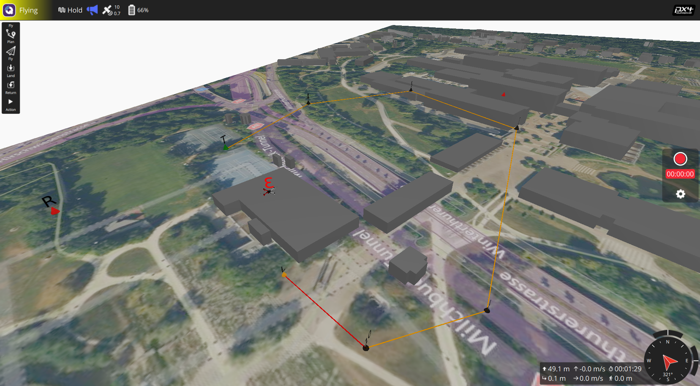
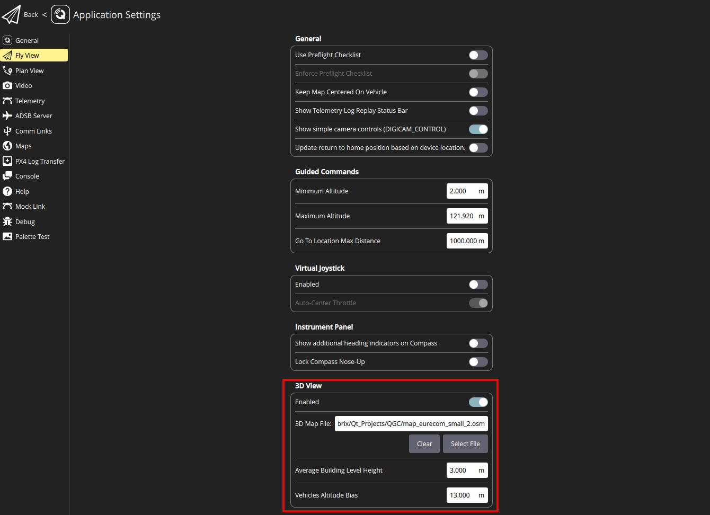
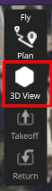

# 3D View

The 3D View is used to visualize and monitor the vehicle, the environment, and the planned mission in 3D. Most of the capabilities available in the [Fly View](../fly_view/fly_view.md)  is also available in the 3D View. 

You can use it to:
- To import and display the 3D map for any region of interest downloaded from the OpenStreetMap website (.osm file).
- Display the vehicle along with its mission in 3D.
- And most of the capabilities of the [Fly View](../fly_view/fly_view.md), including:
    - Run an automated [pre-flight checklist](#preflight_checklist).
    - Arm the vehicle (or check why it won't arm).
    - Control missions: [start](#start_mission), [continue](#continue_mission), [pause](#pause), and [resume](#resume_mission).
    - Guide the vehicle to [arm](#arm)/[disarm](#disarm)/[emergency stop](#emergency_stop), [takeoff](#takeoff)/[land](#land), [change altitude](#change_altitude), and [return/RTL](#rtl).
    - Switch between a map view and a video view (if available)
    - Display video, mission, telemetry, and other information for the current vehicle, and also switch between connected vehicles.

# UI Overview
The screenshot above shows the main elements of the 3D View. 

**Enabling the 3D View:** The 3D View is disabled by default. To enable it, go to **Application Settings** ->**Fly View** tab, and under the **3D View** settings group, toggle the **Enabled** switch as shown below:

To open the 3D View, when you are in the [Fly View](../fly_view/fly_view.md), from the toolbar on the left, select the 3D View icon as illustrated below:

Once the 3D View is opened, you can navigate through the 3D environment by using either a mouse or a touchscreen as follows:
- **Mouse:**
    - **To move horizontally and vertically**: Press and hold the mouse left-click, then move the cursor.
    - **To rotate**: Press and hold the mouse right-click, then move the cursor.
    - **To zoom**: Use the mouse wheel\middle button.

- **Touchscreen:**
    - **To move horizontally and vertically**: Use a single finger, then tap and move your finger.
    - **To rotate**: Use two fingers, then tap and move your fingers while keeping them together.
    - **To zoom**: Use a pinch with two fingers and move them together or apart to zoom in or out.

To visualize the 3D map of a particular area in the 3D viewer, you have to download the .osm file of that area from the [OpenStreetMap](https://www.openstreetmap.org/#map=16/47.3964/8.5498) website and then import it through the **3D View** settings. More details on the **3D View** settings can be found in the next section.
# Settings
You can change the settings of the 3D View from **Application Settings** ->**Fly View** tab under the **3D View** settings group.
The following properties can be modified in the 3D View settings group:

- **Enabled**: To enable or disable the 3D View.
- **3D Map File**: The path to the .osm file of a region of interest to be visualized in the QGC. The .osm file can be uploaded by clicking on the **Select File** button. To clear the 3D View from the previously loaded .osm file, you can click on the **Clear** button.
- **Average Building Level Height**: This parameter determines the height of each storey of the buildings, as in .osm file sometimes the height of the buildings is specified in terms of the level/storey. 
- **Vehicle Altitude Bias**: This refers to the bias in the altitude of vehicles and their missions with respect to the ground level. It is helpful in cases where the estimated altitude of the vehicle by its flight control is biased, as the relative altitude is currently used in the 3D View.

