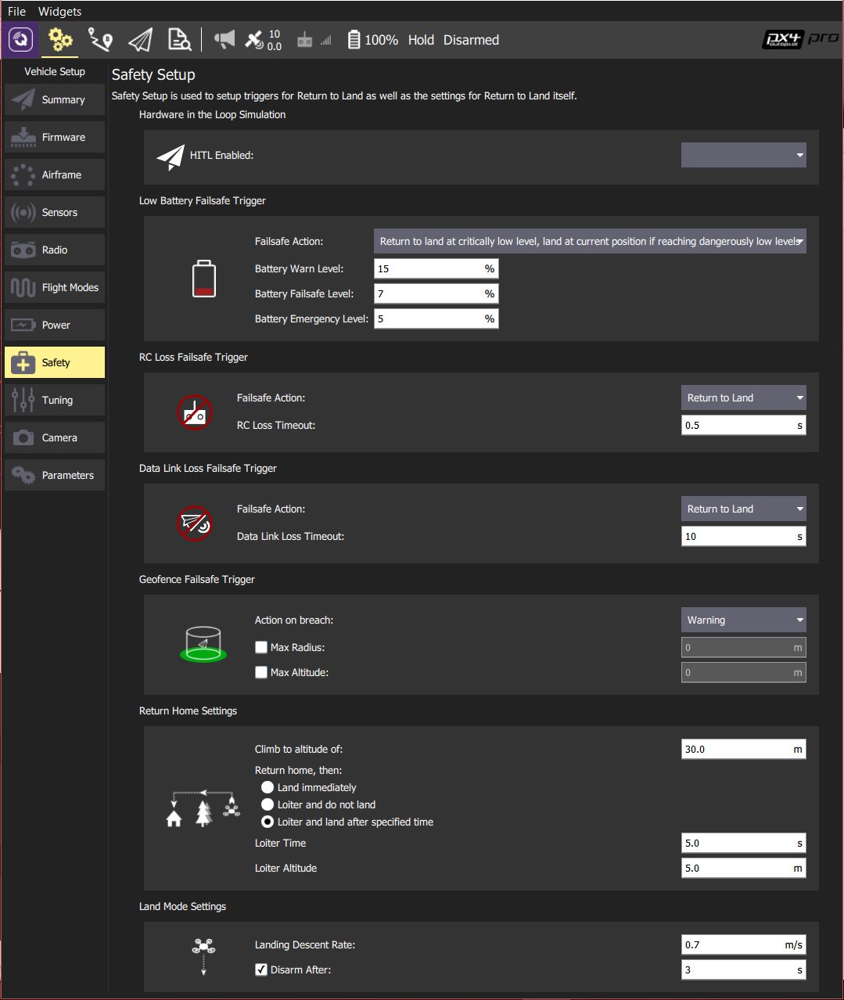

# 안전 설정

*안전 설정* 페이지에서 가장 중요한 안전 장치를 설정합니다(다른 안전 장치 설정은 각 차량 유형에 대한 안전 장치 설명서에 설명된 [매개변수](../SetupView/Parameters.md)를 통하여 설정할 수 있음).

ArduPilot 안전 설정은 [안전(ArduPilot)](../SetupView/safety_ardupilot.md)을 참고하십시오.

PX4 안전설정은 아래와 같습니다.

> **Note** 추가 PX4 안전 설정은 [안전 설정](https://docs.px4.io/en/config/safety.html)을 참고하십시오.