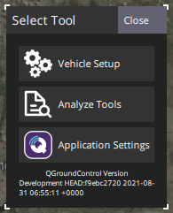

# 분석 화면

_분석 화면_은 _QGroundControl_ 애플리케이션 메뉴(왼쪽 상단의 "Q" 아이콘)를 선택한 다음 **분석 도구** 버튼을 선택하여 액세스할 수 있습니다(_도구 선택_ 팝업에서).

화면에서 제공하는 도구들은 다음과 같습니다.

- [로그 다운로드](../analyze_view/log_download.md) — 차량의 로그를 나열, 다운로드 및 삭제합니다.
- [GeoTag 이미지(PX4)](../analyze_view/geotag_images.md) — 비행 로그(컴퓨터에서)를 사용하여 측량 임무 이미지에 위치 정보 태그를 지정합니다.
- [MAVLink 콘솔(PX4)](../analyze_view/mavlink_console.md) — 기체에서 실행 중인 nsh 셸에 액세스합니다.
- [MAVLink Inspector](../analyze_view/mavlink_inspector.md) — 수신된 MAVLink 메시지와 값을 표시하거나 차트로 표시합니다.
