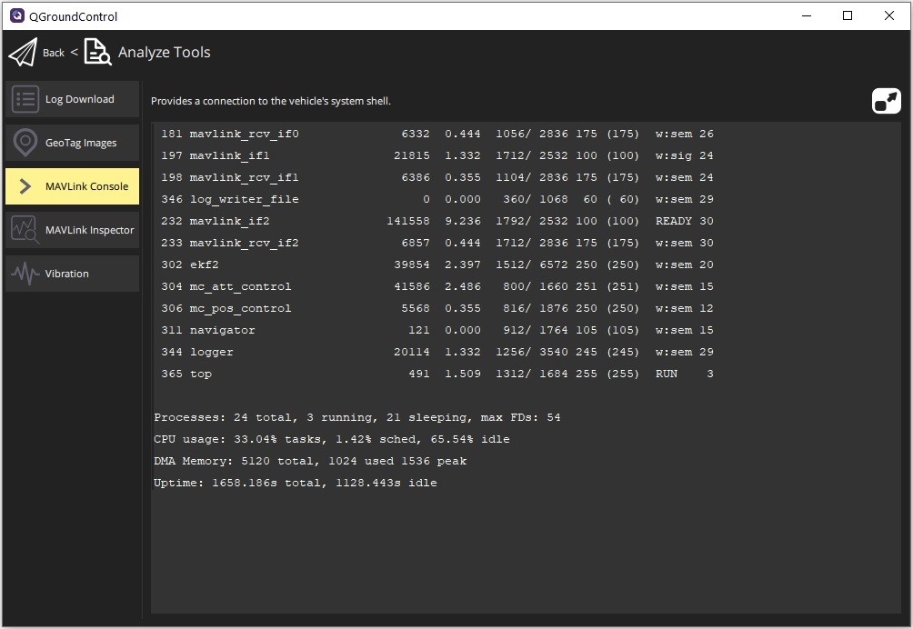

# MAVLink 콘솔(분석 화면)

The MAVLink Console (**Analyze > Mavlink Console**) allows you to connect to the PX4 [System Console](https://docs.px4.io/main/en/debug/system_console.html) and send commands.

:::info
콘솔은 _PX4_ 플라이트 스택을 실행하는 _하드웨어_에 연결된 경우에만 작동합니다.
PX4 SITL 및 ArduPilot은 지원되지 않습니다.
:::

:::tip
이것은 시스템에 대한 깊은 액세스가 가능하여 개발자에게 매우 유용합니다. 특히, Wi-Fi로 연결된 기체의 비행중에도 동일한 수준의 액세스가 가능합니다.
:::

화면에서는 명령에 대한 응답외의 출력을 표시되지 않습니다.
기체가 연결되면, 표시줄에 명령어를 입력할 수 있습니다. 명령의 전체 목록을 보려면 `?` 입력합니다.

명령 출력은 명령 모음 위의 보기에 표시됩니다.
**최신 표시**를 클릭하여 명령 출력의 맨 아래로 이동합니다.
