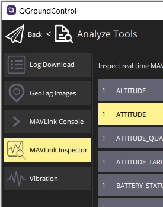

# MAVLink 탐색기

_MAVLink 탐색기_는 _QGroundControl_에서 수신한 MAVLink 트래픽에 대한 실시간 정보와 차트를 제공합니다.

:::warning
이 기능은 **자동 조종 장치 개발자**와 **자동차 제작자**에게 매우 유용합니다.
데스크톱(Windows, Linux, Mac OS) 버전에서 지원됩니다.
:::

탐색기는 현재 기체에서 수신된 모든 메시지를 소스 구성 요소 ID 및 업데이트 빈도를 출력합니다.
개별 메시지로 드릴다운하여 메시지 Id, 소스 구성 요소 Id 및 모든 개별 필드의 값을 제공합니다.
또한 실시간으로 필드 값을 차트로 작성하여, 메시지들의 필드 정보들을 선택하여 두 차트 중 하나에 표시할 수 있습니다.

_MAVLink 탐색기_를 사용하려면:

1. _QGroundControl_ 애플리케이션 메뉴(왼쪽 상단의 "Q" 아이콘)를 선택한 다음 **분석 도구** 버튼을 선택하여 _분석 보기_를 엽니다(_도구 선택_ 팝업).
   

2. 사이드바에서 **MAVLink 탐색기**를 선택합니다.

   

   보기는 수신되는 메시지로 채워지기 시작합니다.

3. 조회할 필드와 해당(동적으로 업데이트되는) 값의 메시지를 선택하십시오.

   

4. 인접한 확인란을 활성화하여 차트에 필드를 추가합니다(플롯 1은 플롯 2 아래에 표시됨).

   

   - 필드는 하나의 차트에만 추가할 수 있습니다.

   - 차트에는 여러 필드와 여러 메시지의 필드가 있을 수 있습니다(각 차트 위에 나열됨).
     차트로 표시되는 필드가 포함된 메시지는 별표로 강조됩니다.

     

   - _Scale_ 및 _Range_는 적절한 값으로 설정되지만 필요한 경우 수정할 수 있습니다.
