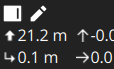
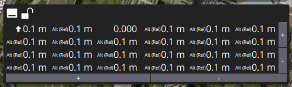
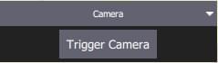
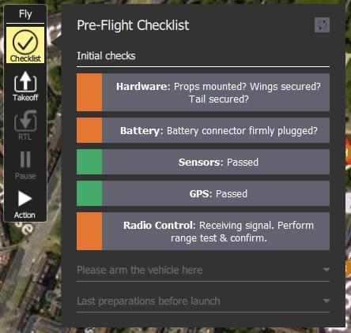
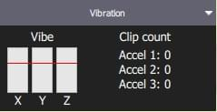
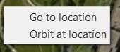
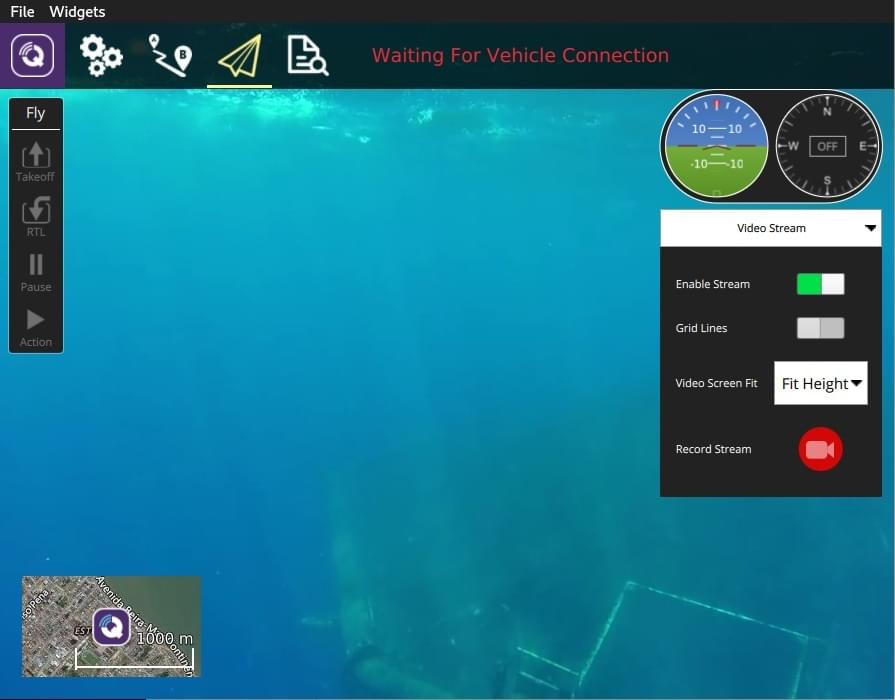

# Fly View

비행 화면은 비행중인 기체에 명령어를 실행하고 그 결과를 모니터링합니다.

다음과 같은 목적으로 사용할 수 있습니다:

- 자동화된 [비행 전 체크리스트](#preflight_checklist)를 제공합니다.
- Arm the vehicle (or check why it won't arm).
- 미션 제어:: [시작](#start_mission), [계속](#continue_mission), [일시중지](#pause) 및 [재개](#resume_mission).
- 기체의 [시동](#arm)/[시동 해제](#disarm)/[비상 정지](#emergency_stop), [이륙](#takeoff)/[착륙](#land), [고도 변경](#change_altitude), 특정 위치로 [이동](#goto) 또는 [궤도](#orbit), [복귀/RTL](#rtl)할 수 있습니다.
- 지도 화면과 동영상 화면간의 전환(사용 가능한 경우)
- 현 기체의 비디오 출력, 미션, 텔레메트리 및 기타 정보를 표시하고 연결된 기체간에 전환합니다.

## UI 개요

위의 스크린샷은 비행 화면의 주요 요소를 나타냅니다.

- **지도:** 연결된 모든 기체의 위치와 현재 차량의 임무를 표시합니다.
  - 지도를 드래그하여 이동할 수 있습니다(일정 시간이 지나면 지도가 자동으로 중앙에 위치함).
  - 비행 후에는 지도를 클릭하여 [이동](#goto) 또는 [궤도](#orbit) 위치를 설정할 수 있습니다.
- **비행 툴바:** 센서(GPS, 배터리, RC 제어) 및 차량 상태(비행 모드, 무장/해제 상태)에 대한 주요 상태 정보.
  - 더 자세히 보려면 센서 표시기를 선택하십시오.
  - 새 모드를 선택하려면 _비행 모드_ 텍스트(예: "Hold")를 누르십시오.
    모든 모드를 사용할 수 있는 것은 아닙니다.
  - The text next to the **Q** icon indicates the flight readiness using text: "Not Ready", "Ready to Fly", "Flying", and status using colour: "green" (all good!), amber (a warning), red (serious problem).
    Select the text when the background is amber or red to find out the cause of any preflight issues (QGC 4.2.0 and later).
    You can also select the text to reach a button to arm/disarm/emergency-stop the vehicle.
- **비행 도구:** 다음과 같은 목적으로 사용할 수 있습니다:
  - Toggle between takeoff/land.
  - 현재 작업(예: 착륙 또는 미션)을 일시 중지하거나 재시작합니다.
  - 안전 복귀(RTL 또는 복귀라고도 함).
  - _작업_ 버튼은 현재 상태에 대한 적절한 옵션을 제공합니다(이 옵션은 _확인 슬라이더_와 중첩됨).
    조치에는 고도 변경과 미션 지속을 포함됩니다.
  - [실행 전 체크리스트](#preflight_checklist)를 활성화합니다(도구 옵션은 기본적으로 비활성화되어 있음).
- **[Instrument Panel](#instrument_panel):** A widget that displays vehicle telemetry.
- **Attitude/Compass**: A widget that provides virtual horizon and heading information.
- **Camera Tools**: A widget for switching between still and video modes, starting/stopping capture, and controlling camera settings.
- **[동영상/전환기](#video_switcher):** 창에서 비디오 또는 지도를 전환합니다.
  - 요소를 눌러 _동영상_ 및 _지도_를 전경으로 전환합니다.
  - _QGroundControl_은 UDP 프로토콜을 이용하여 RTP 및 RTSP 비디오를 스트리밍합니다.
    또한, 직접 연결된 UVC 장치를 지원합니다.
    QGroundControl 비디오 지원은 [비디오 README](https://github.com/mavlink/qgroundcontrol/blob/master/src/VideoStreaming/README.md)을 참고하십시오.
  - [텔레메트리 오버레이](../fly_view/video_overlay.md)가 자막 파일로 자동 생성됩니다.
- **확인 슬라이더:** 요청된 작업을 확인하는 슬라이더입니다.
  슬라이드하여 작동을 시작합니다. 취소하려면 **X**를 클릭하십시오.

기본적으로 표시되지 않거나 특정 조건에서만 표시되는 다른 요소들 많습니다.
예를 들어, 다중 기체 선택기는 여러 대의 기체가 연결된 경우에만 표시되며, 비행 전 체크리스트 도구 버튼은 적절한 설정이 활성화된 경우에만 표시됩니다.

## 계기판 {#instrument_panel}

The instrument panel displays telemetry information about the current vehicle.

기본적으로 고도(홈 위치 기준) 및 지면 속도입니다.

패널 왼쪽 상단의 작은 톱니바퀴 아이콘을 눌러 표시할 정보를 설정할 수 있습니다.
This toggles the position of the panel between bottom centre and right-centre.

You configure what information is display by selecting the edit/pencil icon.
The grid will then display "+" and "-" icons that you can use to add or remove rows and columns (and the pencil icon is replaced by a "lock" icon that you can use to save the settings).

Select a value to launch its "Value Display" editor.
This allows you to change the icon, text, size, units and so on of the current telemetry value.

The selection list on the top left is used to change the source of the telemetry.
By default this is the vehicle, but you can use the selector to choose a particular sensor type.

The selection list on the top right is used to select a particular telemetry value for the vehicle or sensor.

비행 중인 기체의 시동을 꺼려면 _비행 도구 모음_에서 **시동**을 선택합니다.

### 카메라 {#camera_instrument_page}

The camera panel is used to capture still images and video, and to configure the camera.

The camera capture and configuration options depend on the connected camera.
The configuration options are selected using the panel gear icon.
The configuration for a simple autopilot-connected camera are shown below.

[MAVLink 카메라 프로토콜](https://mavlink.io/en/services/camera.html)을 지원하는 카메라에 연결하면, 사용 가능한 다른 카메라 서비스를 추가로 설정하고 사용할 수 있습니다.
예를 들어, 카메라가 비디오 모드를 지원하는 경우 정지 이미지 캡처와 비디오 모드 사이를 전환하고 녹화를 시작하고 중지할 수 있습니다.

::: info
Most of the settings that are displayed depend on the camera (they are defined in its [MAVLink Camera Definition File](https://mavlink.io/en/services/camera_def.html)).

> 마지막에 몇 가지 일반적인 설정이 하드 코딩되어 있습니다: 사진 모드(단일/인터벌), 사진 간격(인터벌인 경우), 카메라 기본값 재설정(카메라에 재설정 명령 전송), 포맷(저장)

### 비디오 스트림 {#video_instrument_page}

비디오 페이지는 비디오 스트리밍을 활성화 하거나 비활성화 합니다.
활성화시에는 비디오 스트림을 시작하고, 그리드 오버레이를 활성화하고, 이미지가 화면에 맞는 방식을 변경하고, QGroundControl을 사용하여 로컬로 비디오를 녹화할 수 있습니다.

## 액션/태스크

다음 섹션에서는 비행 화면에서 일반적인 작업 수행 방법을 설명합니다.

::: info
Many of the available options depend on both the vehicle type and its current state.
:::

### 비행 전 점검 사항 {#preflight_checklist}

자동 비행 전 점검을 통하여 기체의 설정과 비행 안전 여부를 검사합니다.

적검 항목을 사용하려면 [애플리케이션 설정 > 일반 > 비행 화면](../settings_view/general.md)로 이동하고 **비행 전 점검 항목 사용**을 선택하여 도구를 활성화합니다.
그러면, _비행 도구_에 도구가 추가됩니다.
점검 항목들을 열려면 클릭합니다.

각 테스트 수행 후 UI에서 해당 테스트를 선택하여 완료로 표시합니다.

### 시동 {#arm}

Arming a vehicle starts the motors in preparation for takeoff.
You will only be able to arm the vehicle if it is safe and ready to fly.

:::tip
Generally, if the vehicle is ready to arm, _QGroundControl_ will arm the vehicle for you if you start a mission or takeoff.
:::

The vehicle is ready to fly in all modes if the status text says "Ready to Fly" and the background is green.

If the background is amber then it is ready to take off in the current mode, but may not be able to switch to other modes.
If the background is red and the text is "Not Ready" then you will not be able to arm in the current mode.

From QGC 4.2.0 (at time of writing, a daily build) you can find out the exact cause of the warning or error, and possible solutions, by pushing the status text.

This launches the preflight arming checks popup with a list of all preflight warnings.
The toggle on the right expands each error with additional information and possible solutions.

Once each issue is resolved it will disappear from the UI.
When all issues blocking arming have been removed you can use the arm button to display the arming confirmation slider, and arm the vehicle (or you can just take off - note that the vehicles will (by default) disarm automatically if you do not take off after a few seconds.

::: info
The status text also displays when flying.

>  
>
> The arming checks UI will open even when flying, allowing you to emergency disarm.
> :::

### 시동 끄기 {#disarm}

기체의 시동이 꺼지면, 모터는 정지합니다(기체를 안전한 상태로 변경함).

Generally you do not need to explicitly disarm as vehicles will disarm automatically after landing, or shortly after arming if you do not take off.

If needed, you can do so from the Arming Preflight Checks UI.

You will then need to use the disarming slider.

비행 중 기체의 시동을 꺼는 것을 [비상 정지](#emergency_stop)라고 합니다.

### 비상 정지 {#emergency_stop}

비상 정지는 비행 중 기체의 시동을 꺼는 것과 동일합니다.
Your vehicle will crash!

If needed, you can do so from the Arming Preflight Checks UI.

기체의 시동을 꺼려면 기체가 **착륙**하였을 때 _비행 도구 모음_에서 **시동**을 선택하십시오.

You will then need to use the emergency disarming slider.

### 이륙 {#takeoff}

:::tip
멀티콥터의 미션을 시작하면, _QGroundControl_에서 자동으로 이륙 단계를 수행합니다.
:::

이륙 절차(착륙 후):

1. _비행 도구_에서 **이륙** 버튼을 클릭합니다(이륙 후 **착륙** 버튼으로 전환됨).
2. 오른쪽 수직 슬라이더에서 이륙 고도를 설정할 수 있습니다.
3. 슬라이더를 사용하여 이륙 실행을 확인합니다.

### 착륙 {#land}

비행 중에는 언제든 지 현재 위치에 착륙 가능합니다.

1. _비행 도구_에서 **착륙** 버튼을 클릭합니다(착륙 시 **이륙** 버튼으로 전환됨).
2. 슬라이더를 사용하여 착륙 실행을 확인합니다.

### RTL/Return

비행 중 언제든 지 "안전 지점"으로 복귀할 수 있습니다.

1. _비행 도구_에서 **RTL** 버튼을 클릭합니다.
2. 슬라이더를 사용하여 착륙지 복귀 실시를 확인합니다.

:::info
기체는 일반적으로 "홈"(이륙) 위치와 착륙 지점으로 복귀합니다.
이 동작은 기체 유형과 설정에 따라 차이가 날 수 있습니다.
예를 들어, 집결지나 임무 착륙을 대체 반환 목표로 사용할 수 있습니다.
:::

### 고도 변경 {#change_altitude}

미션 수행중을 제외하고는, 비행 중 고도 변경이 가능합니다.

1. _비행 도구_에서 **액션** 버튼을 클릭합니다.

2. 대화상자에서 _고도 변경_ 작업을 선택합니다.

   

3. 수직 슬라이더를 원하는 고도로 이동한 다음 확인 슬라이더를 끌어 작업을 실행합니다.

   

### 위치 이동 {#goto}

이륙후 특정 위치 이동을 지정할 수 있습니다.

1. 지도에서 기체의 이동 지점을 왼쪽 클릭 후, 팝업에서 **위치 이동**을 선택합니다.

1. 위치는 확인 슬라이더와 함께 지도에 표시됩니다.

   

2. 준비가 되면 슬라이더를 끌어 작업을 시작합니다(또는 **X** 아이콘을 눌러 취소).

:::info
위치 이동 지점은 기체에서 1km 이내로 설정하여야 합니다(QGroundControl에 하드 코딩됨).
:::

### 선회 비행 {#orbit}

이륙 후 특정 위치 선회를 지정할 수 있습니다.

1. 지도(원하는 궤도의 중심 부근)를 마우스 왼쪽 버튼 클릭후, 팝업에서 **위치에서 궤도**를 선택합니다.

1. 예정 궤도는 확인 슬라이더와 함께 지도에 표시됩니다.

   

   - 중심 마커를 선택하고 끌어서 궤도 위치를 이동합니다.
   - 외부 원의 점을 선택하고 끌어 궤도 반경을 변경합니다.

2. 준비가 되면 슬라이더를 끌어서 작업을 시작합니다(또는 **X** 아이콘을 눌러 취소).

### 일시 중지

이륙, 착륙, RTL, 임무 실행 및 위치 궤도를 포함한 대부분의 작업을 일시 중지할 수 있습니다.
일시 정지 시 기체의 동작은 기체 유형에 따라 달라집니다. 일반적으로 멀티콥터는 호버링을 하고, 고정익은 선회 비행을합니다.

:::info
_위치 이동_ 작업은 일시 중지가 불가능 합니다.
:::

일시 중지하려면:

1. _비행 도구_에서 **일시중지** 버튼을 클릭합니다.
2. 선택적으로 오른쪽 수직 슬라이더를 사용하여 새 고도를 설정합니다.
3. 슬라이더를 사용하여 일시 중지를 확인합니다.

### 미션

#### 미션 시작 {#start_mission}

기체는 착륙후 미션를 시작할 수 있습니다(미션 시작 확인 슬라이더는 대부분 기본적으로 표시됩니다).

착륙후 임무를 시작하려면:

1. _비행 도구_에서 **액션** 버튼을 클릭합니다.

2. 대화 상자에서 _미션 시작_ 작업을 선택합니다.

   

   (확인 슬라이더를 표시하기 위하여)

3. 확인 슬라이더가 나타나면 드래그하여 미션을 시작합니다.

   

#### 미션 지속 {#continue_mission}

비행 중일 때 _다음_ 웨이포인트에서 미션을 _지속_할 수 있습니다(이륙 후에 _미션 지속_ 확인 슬라이더가 기본적으로 표시되는 경우가 많습니다).

:::info
미션 지속과 [미션 재개](#resume_mission)는 차이가 있습니다.
지속은 일시 중지되었거나 이륙했기 때문에, 이륙 미션 명령을 놓친 미션를 다시 시작시에 사용합니다.
미션 재개는 착륙지 복귀를 사용하였거나 미션 중간 착륙시 사용합니다(예: 배터리 교체). 그런 다음 다음 미션 항목을 지속할 수 있습니다(즉, 미션에서 지속하는 것이 아니라 미션에 있었던 위치로 이동합니다).
:::

현재 임무를 계속할 수 있습니다(이미 임무에 참여하지 않는 한!):

1. _비행 도구_에서 **액션** 버튼을 클릭합니다.

2. 대화 상자에서 _임무 지속_ 작업을 선택합니다.

   

3. 확인 슬라이더를 끌어 임무를 지속하십시오.

   

#### 임무 재개 {#resume_mission}

_임무 재개_는 임무 수행중 [착륙지 복귀/복귀](#rtl)나 [착륙](#land)을 수행 후 임무를 재개합니다 (예를 들어 배터리 교체).

:::info
배터리를 교체하는 경우에는 배터리를 분리한 후 기체에서 QGroundControl를 분리하지 **마십시오**.
새 배터리를 교체하면 _QGroundControl_에서 차량을 다시 감지하고 자동으로 연결을 복원합니다.
:::

착륙 후에는 _비행 계획 완료_ 대화상자가 표시되며, 이 대화상자에서는 계획을 기체에서 제거하거나, 기체에 그대로 두거나, 또는 통과한 마지막 웨이포인트에서 임무를 재개합니다.

임무 재개를 선택하면 _QGroundControl_에서 임무를 재구성하고 차량에 업로드합니다.
그런 다음 _임무 시작_ 슬라이더를 사용하여 임무를 계속 수행합니다.

아래 이미지는 위의 귀환 이후 재건된 임무를 나타냅니다.

:::info
임무는 임무의 다음 단계에 영향을 미치는 마지막 웨이포인트에 여러 항목이 있을 수 있으므로, 기체가 실행한 마지막 미션 항목에서 단순히 재개할 수 없습니다(예: 속도 명령 또는 카메라 제어 명령).
대신 _QGroundControl_은 비행한 마지막 임무 항목부터 시작하여 임무를 재구성하고 자동으로 임무 앞에 관련 명령을 추가합니다.
:::

#### 착륙 후 임무 프롬프트 제거 {#resume_mission_prompt}

임무가 완료후 기체가 착륙한 다음 시동이 해제되면 기체의 임무를 제거하라는 메시지가 표시됩니다.
이는 이전의 임무가 의도치 않게 기체에 저장되어, 예기치 않은 동작을 초래하는 문제를 방지합니다.

### 비디오 출력 {#video_switcher}

비디오 스트리밍이 활성화되면, _QGroundControl_은 지도 왼쪽 하단의 "비디오 전환기 창"에 현재 선택된 기체의 비디오 스트림을 표시합니다.
아무 곳이나 스위처를 눌러 _동영상_ 및 _지도_를 전경으로 전환할 수 있습니다(아래 이미지에서 동영상은 전경에 표시됨).

:::info
비디오 스트리밍은 [애플리케이션 설정 > 일반 탭 > 비디오](../settings_view/general.md#video)에서 활성화하거나 설정할 수 있습니다.
:::

스위처의 컨트롤을 사용하여, 비디오 디스플레이를 추가로 설정할 수 있습니다.

- 오른쪽 상단 모서리에 있는 아이콘을 끌어 스위처의 크기를 조정합니다.
- 왼쪽 하단의 토글 아이콘을 눌러 스위처를 숨깁니다.
- 왼쪽 상단 모서리에 있는 아이콘을 눌러서 비디오 스위처 창을 분리합니다.
  분리된 창을 닫으면 스위처가 QGroundControl의 비행 화면으로 다시 전환됩니다.

### 동영상 녹화

카메라와 기체에서 지원하는 경우 _QGroundControl_에서 카메라 자체의 동영상 녹화를 시작하거나 중지할 수 있습니다. _QGroundControl_은 또한 비디오 스트림을 녹화하고 로컬에 저장할 수 있습니다.

:::tip
카메라에 저장된 동영상의 품질은 훨씬 높을 수 있지만, 지상국의 녹화 용량은 훨씬 더 클 수 있습니다.
:::

#### 비디오 스트림 녹화(GCS에서)

비디오 스트림 녹화는 [비디오 스트림 도구 페이지](#video_instrument_page)에서 제어합니다.
새 비디오 녹화를 시작하려면, 빨간색 원을 누르십시오(원을 누를 때마다 새 비디오 파일이 생성됨).

비디오 스트림 녹화는 [애플리케이션 설정 > 일반 탭](../settings_view/general.md)에서 설정합니다.

- [동영상 녹화](../settings_view/general.md#video-recording) - 녹화 파일 형식 및 저장 제한을 지정합니다.

  **참고** 동영상은 기본적으로 Matroska 형식(.mkv)으로 저장됩니다.
  이 형식은 오류 발생으로 인한 손상에 대해 상대적으로 강건합니다.
  :::

- [Miscellaneous](../settings_view/general.md#miscellaneous) - 스트리밍된 동영상은 **애플리케이션 로드/저장 경로** 아래에 저장됩니다.

:::tip
저장된 동영상에는 동영상 스트림 자체만 포함됩니다.
QGroundControl 애플리케이션을 포함하여 비디오를 녹화하려면 별도의 화면 녹화 프로그램을 사용하여야 합니다.
:::

#### 카메라 비디오 녹화

[카메라 기기 페이지](#camera_instrument_page)를 사용하여 _카메라 자체에서_ 동영상 녹화를 시작하거나 중지합니다.
먼저 비디오 모드로 전환한 다음, 빨간색 버튼을 클릭하여 녹화를 시작합니다.

