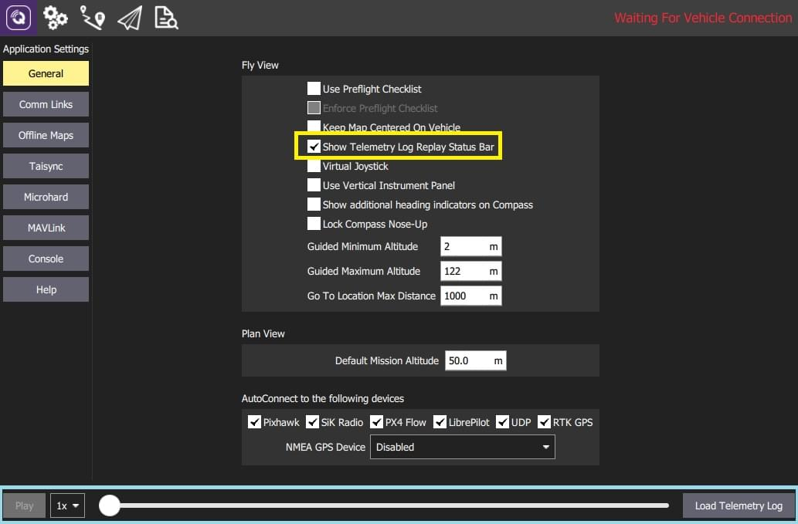

# Replay Flight Data

:::warning
This feature is intended primarily for **autopilot developers**/**vehicle creators**.
It is only supported on desktop builds (Windows, Linux, Mac OS).
:::

The _Replay Flight Data_ feature allows users to replay a telemetry log, enabling review of past or problematic flights.
The flight can be started, paused, stopped, restarted etc.

:::info
_QGroundControl_ treats flight replay like an active connection.
When you pause/stop playing, the ground station will report "Communication Lost" and wait for disconnection or for more messages.
:::

To replay a flight:

1. Disconnect any active connections.

2. Select **Application Settings > General > Fly View**

3. Check **Show Telemetry Log Replay Status Bar** to toggle the flight replay bar at the bottom of the screen.

   

4. Select the **Load Telemetry Log** button in the bar to display a _file selection_ dialog.
   - Choose a log file to replay from the available telemetry logs.
   - _QGroundControl_ will immediately start playing the log.

5. When a log is loaded you can use the:
   - **Pause/Play** button to pause and restart playing.
   - _Slider_ to drag to a new position in the log.
   - _Rate_ selector to choose the playback speed.

6. To stop replay (i.e. to load a new file to replay), first pause the flight, and then select **Disconnect** (when it appears).
   After disconnecting, the **Load Telemetry Log** button will be displayed.

:::tip
You can inspect the running replay in more detail using the [MAVLink Inspector](../analyze_view/mavlink_inspector.md).
:::
