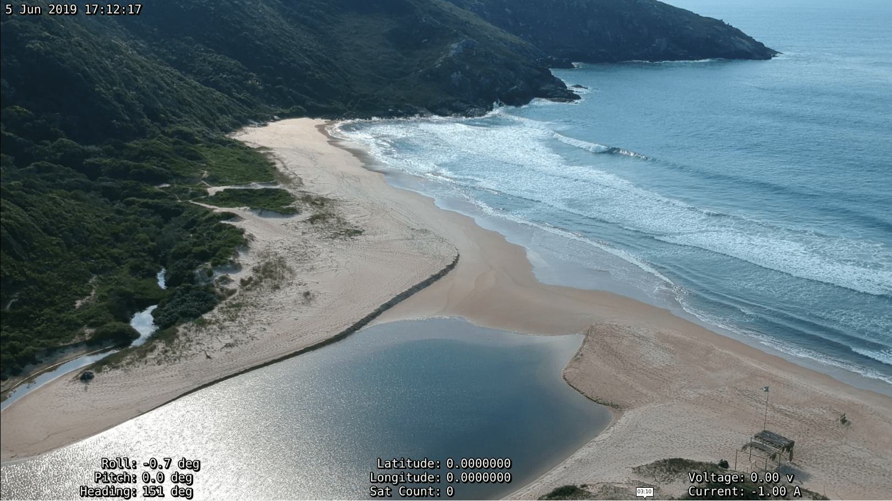
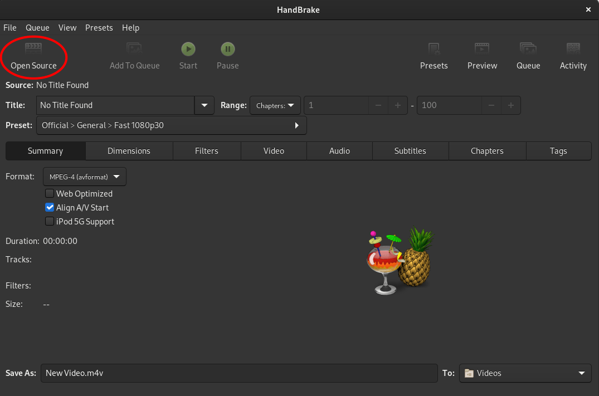
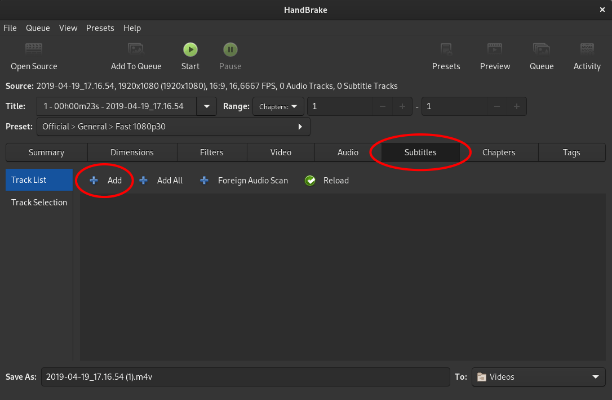
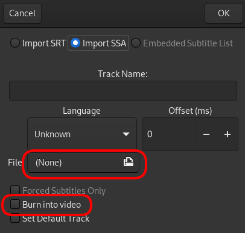

# 비디오 오버레이

QGroundControl이 비디오 스트림을 파일에 기록할 때 재생하는 동안 비디오에 원격 측정을 오버레이하는 데 사용할 수 있는 원격 측정 데이터가 포함된 자막 파일도 내보냅니다. 원격 측정 [값 위젯](FlyView.md#values-telemetry)에 표시하기 위해 선택한 원격 측정 값도 오버레이로 내보내집니다. 오버레이 값은 1Hz에서 업데이트됩니다.

선택한 값은 화면 활용을 최적화하기 위해 3개의 열에 배치됩니다.
이것이 QGC에 의해 생성된 방식입니다.

## 재생 중

오버레이는 [SubStation Alpha](https://en.wikipedia.org/wiki/SubStation_Alpha#Players_and_renderers) 자막 형식을 지원하는 모든 플레이어와 함께 사용할 수 있습니다.
대부분의 플레이어는 비디오를 재생하려고 할 때 두 파일을 함께 오픈합니다. 그들은 같은 폴더에 있어야 하고 같은 이름을 가져야 합니다.

## 수동 브레이크를 사용한 영구 비디오 자막

자막은 [HandBrake](https://handbrake.fr/)를 사용하여 동영상 파일에 영구적으로 추가할 수 있습니다.
이렇게 하면 모든 비디오 플레이어에서 자막이 영구적으로 표시됩니다.

**HandBrake**를 열면 기본 인터페이스가 표시됩니다.
**열기**를 클릭하고 동영상 파일을 선택합니다.

비디오 파일이 로드된 상태에서 자막 탭으로 전환합니다.
**추가**를 클릭하여 자막 파일을 로드합니다.

**SSA 가져오기**를 선택합니다([ASS](https://en.wikipedia.org/wiki/SubStation_Alpha#Advanced_SubStation_Alpha)는 SSA의 확장임).

동영상에 해당하는 **.ass** 파일을 로드하고 **동영상으로 굽기** 확인란을 선택합니다.

새 파일을 저장할 위치를 선택하고 **시작**을 클릭하십시오.

자막과 비디오를 새 파일로 굽기 시작합니다.
