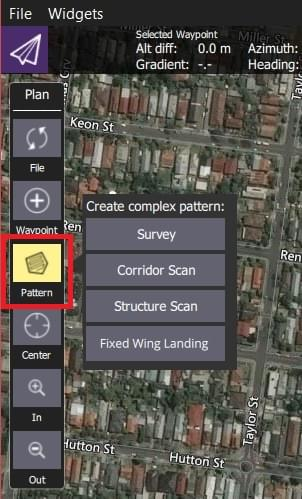

# 패턴

_패턴 도구_([계획 화면](../plan_view/plan_view.md) _계획 도구_)를 사용하면 간단한 그래픽 UI를 사용하여 복잡한 비행 패턴을 지정할 수 있습니다.
The available pattern tools depend on the vehicle (and support for the vehicle-type in the flight stack).

| 패턴                                                   | 설명                                                                                                                                   | 차량         |
| ---------------------------------------------------- | ------------------------------------------------------------------------------------------------------------------------------------ | ---------- |
| [탐사](../plan_view/pattern_survey.md)                 | 다각형 영역에 그리드 비행 패턴을 작성합니다. 지오태깅 이미지 생성에 적합한 그리드 및 카메라 설정에 대한 사양과 다각형을 지정할 수 있습니다.                     | 전체         |
| [구조물 스캔](../plan_view/pattern_structure_scan_v2.md)  | 수직 표면(다각형 또는 원형) 위의 이미지를 캡처하는 그리드 비행 패턴을 작성합니다. 일반적으로 육안 검사 또는 구조물의 3D 모델을 생성합니다. | 멀티콥터, VTOL |
| [복도 스캔](../plan_view/pattern_corridor_scan.md)       | 폴리라인을 따르는 비행 패턴을 생성합니다(예: 도로 측량).                                                 | 전체         |
| [고정익 착륙](../plan_view/pattern_fixed_wing_landing.md) | 임무에 고정익의 착륙 패턴을 추가합니다.                                                                                               | Fixed Wing |
