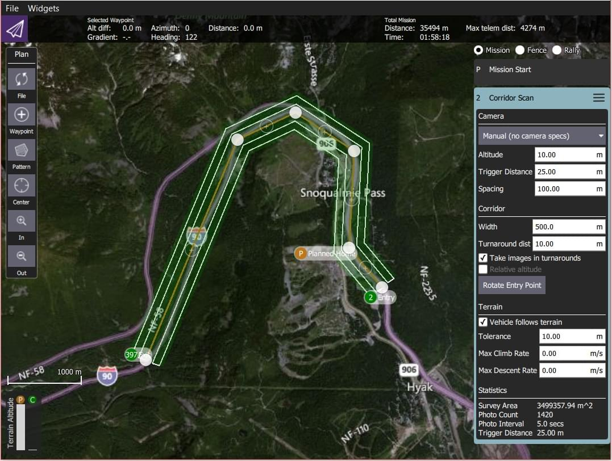
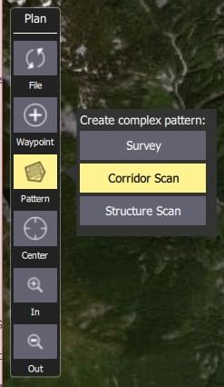
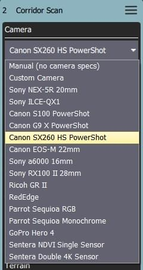
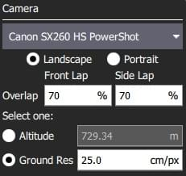
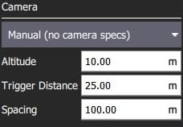
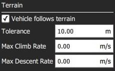
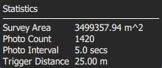

# 복도 스캔 (계획 패턴)

복도 스캔은 폴리라인 형태의 비행 패턴을 생성합니다. 도로 측량 등에 사용할 수 있습니다. It is supported on all autopilots and vehicle types.

> **Important** 카메라를 이용한 복도 스캔 계획은 조사 영역의 지상 고도는 발사/홈 위치와 동일하다고 가정합니다. 조사 지역 아래의 지면 고도가 발사/홈 위치보다 높거나 낮으면 이미지의 효과적인 중첩이 계산된 것보다 (각각) 더 적거나 더 많이 발생합니다. 조사 지역 아래의 지상 고도가 발사/홈 위치보다 훨씬 높으면 차량이 나무, 장애물 또는 지상으로 날아가도록 하는 임무를 무심코 계획할 수 있습니다. 지형 추적을 사용하여 발사/홈 고도와 고도 차이가 큰 지형 위의 원하는 고도를 더 가깝게 유지하는 측량을 할 수 있습니다.

위치 태그가 지정된 이미지를 만드는 데 적합한 경로, 복도의 너비 및 카메라 설정을 지정할 수 있습니다.

## 스캔 생성

복도 스캔을 생성하려면:

1. [계획 뷰](../plan_view/plan_view.md)에서 _계획 도구_를 엽니다.

2. _계획 도구_에서 _패턴 도구_를 선택한 다음 _복도 스캔_을 선택합니다.

   

   그러면 지도에 복도 도형이 추가되고 임무 목록(오른쪽)에 _복도 스캔_ 항목이 추가됩니다.

3. 지도에서 복도 끝을 스캔의 시작 위치와 끝 위치로 드래그합니다.

4. 선 중앙에 있는 `(+)` 기호를 클릭하여 정점을 추가합니다.
   그런 다음, 새 정점을 원하는 복도 경로를 따라 위치로 끌어서 변경할 수 있습니다.

The corridor scan settings are covered in the next section.

## 설정

복도 스캔에 연결된 미션 항목(플랜 보기의 오른쪽에 있는 미션 항목 목록)에서 추가하여 설정할 수 있습니다.

### 카메라

카메라 트리거 동작은 카메라/카메라 설정에 따라 변경됩니다.
기존 카메라를 선택하거나 수동으로 설정할 수 있습니다.
사용 가능한 카메라(QGC 3.4) 목록은 아래와 같습니다.

#### 알려진 카메라

옵션 드롭다운에서 알려진 카메라를 선택하면 카메라 사양에 따라 격자 패턴을 생성할 수 있습니다.

설정 옵션은 다음과 같습니다:

- **가로/세로** - 차량의 "정상" 방향을 기준으로 한 카메라 방향입니다.
- **영상 겹침** - 각 이미지 캡처 간에 겹칩니다.
- 하나를 선택하십시오:
  - **고도** - 조사 고도(지상 해상도가 이 고도에 대해 계산/표시됨).
  - **지상 해상도** - 각 이미지의 지상 해상도(해상도를 계산하고 표시하는 데 필요한 고도).

#### 수동 카메라

수동 카메라 옵션을 사용하여 측량 높이, 트리거 간격 및 카메라에 적합한 격자 간격을 지정할 수 있습니다.

설정 옵션은 다음과 같습니다:

- **고도** - 탐색 고도.
- **트리거 거리** - 각 카메라 샷 사이의 지상 거리입니다.
- **간격** - 복도를 가로지르는 인접한 그리드(비행 경로) 선 사이의 거리입니다.

### 복도

설정 옵션은 다음과 같습니다:

- **너비** - 경로를 정의하는 폴리라인 주변의 스캔 너비를 설정합니다.
- **회전 거리** - 차량 회전을 위해 조사 영역 외부에 추가할 추가 거리입니다.
- **회전 위치에서 영상 촬영** - 회전 지점에서 영상을 촬영시에 선택합니다.
- **상대 고도** - 상대 고도를 지정하려면 선택합니다. 이것은 [지형 추적](#terrain_following)을 사용하지 않는 수동 그리드에만 지원됩니다.
- **진입점 회전** - 버튼을 클릭하여 복도 스캔의 시작점과 끝점을 변경합니다.

### 지형 추적 {#terrain_following}

기본적으로 기체는 고정 고도에서 복도 경로를 따라 비행합니다.
Enabling _Terrain Following_ makes the vehicle maintain a constant height relative to ground.

:::info
지형 추적은 _AirMap_ 서버에서 쿼리한 지형 높이를 사용합니다.
:::

설정 옵션은 다음과 같습니다:

- **기체 지형 추적** - 지형 추적을 활성화하려면 선택합니다(및 다음 옵션 표시).
  - **허용 오차** - 목표 고도에서 허용되는 고도 편차입니다.
  - **최대 상승률** - 지형을 따라갈 때의 최대 상승률입니다.
  - **최대 하강 속도** - 지형을 따라갈 때의 최대 하강 속도.

### 통계

_통계_ 섹션에는 계산된 조사 영역, 사진 간격, 사진 간격 및 계획된 사진 수가 표시됩니다.

