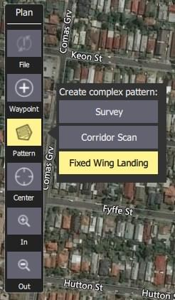
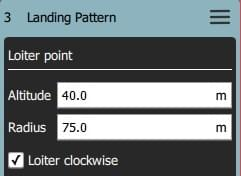

# 고정익 착륙 패턴(계획 패턴)

_고정익 착륙 패턴_ 도구를 사용하여 임무에 고정익 착륙 패턴을 추가할 수 있습니다.
ArduPilot과 PX4 모두에서 지원됩니다.

패턴의 첫 번째 지점은 특정 고도를 가진 배회 지점이고 두 번째 지점은 착륙 지점입니다.
기체는 목표 고도에 도달할 때까지 첫 번째 지점에서 배회한 다음, 착륙 시퀀스를 순서대로 지정된 착륙 지점으로 비행합니다.

배회 및 착륙 지점을 모두 새 위치로 드래그할 수 있으며, 관련 임무 항목에서 여러가지를 설정할 수 있습니다.

## 착륙 패턴 생성

착륙 패턴을 생성하려면:

1. [계획 뷰](../plan_view/plan_view.md)에서 _계획 도구_를 오픈합니다.

2. _계획 도구_에서 _패턴 도구_를 선택한 다음 _고정익 착륙 패턴_을 선택합니다.

   

   그러면 임무 목록(오른쪽)에 _착륙 패턴_ 항목이 추가됩니다.

   

3. 지도를 클릭하여 배회 지점과 착륙 지점을 모두 생성합니다.
   지도에서 이동할 수 있습니다.

추가 설정은 다음 섹션에서 설명합니다.

## 설정

착륙 패턴은 연계된 미션 아이템(플랜 보기 우측 미션 아이템 목록)에서 추가로 설정할 수 있습니다.

### 배회 지점

_배회 지점_ 설정은 배회 고도, 반경 및 방향을 설정합니다.

설정 옵션은 다음과 같습니다:

- **고도** - 배회 고도.
- **반경** - 배회 반경.
- **시계 방향 배회** - 시계 방향으로 배회하려면 선택합니다(반시계 방향이 기본값임).

### 착륙 지점

_착륙 지점_ 설정은 착륙 위치와 경로를 설정합니다.

설정 옵션은 다음과 같습니다:

- **방향** - 배회 지점에서 착륙 지점까지의 방향입니다.
- **고도** - 착륙 지점의 고도입니다(일반적으로 0).
- _라디오 버튼_
  - **착륙 거리** - 배회 지점과 착륙 지점 사이의 거리입니다.
  - **글라이드 슬로프** - 배회 지점과 착륙 지점 사이의 글라이드 슬로프입니다.
- **홈을 기준으로 한 고도** - 임무 항목의 모든 고도를 홈 기준으로 설정하려면 선택합니다(기본값은 AMSL).

## 구현

이 패턴은 세 가지 임무 항목을 생성합니다:

- `DO_LAND_START` - 착륙을 중단하면 기체에 `DO_GO_AROUND`가 전송되어 임무가 이 지점으로 돌아가 다시 착륙을 시도합니다.
- `NAV_LOITER_TO_ALT` - 착륙 시작점
- `NAV_LAND` - 착륙 종료 지점

기체는 `NAV_LOITER_TO_ALT` 지점과 `NAV_LAND` 지점 사이의 펌웨어에 의해 생성된 비행 경로를 사용하여 착륙하기 위해 플레어합니다.

이 두 위치가 차량의 플레어 제약을 위반하는 경우(예: 하강 각도가 너무 가파름) 기체에 잘못된 임무를 업로드한 후 오류가 발생합니다.

:::info
PX4에서 플레어 제약 조건을 위반하면 업로드 시에는, 지상국에 오류 메시지가 전송되고 자동 조종 장치는 임무 시작을 거부합니다(무결성 검사에 실패했기 때문에).
:::
