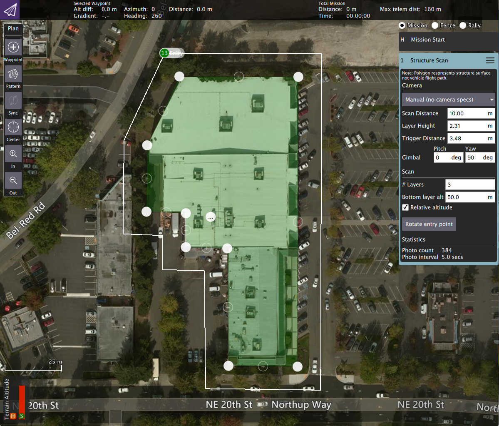
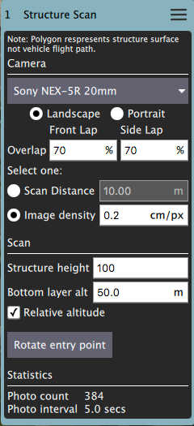
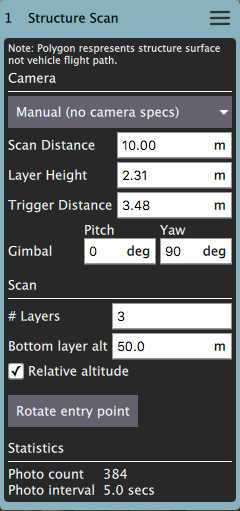

# Structure Scan (Plan Pattern)

A _Structure Scan_ allows you to create a grid flight pattern that captures images over vertical surfaces. These are typically used for the visual inspection or creation of 3d models of structures.

Structure Scan is available to insert into a mission from the _Pattern_ tool.

::: warning
This feature is available in PX4 but is [not yet supported](https://github.com/ArduPilot/ardupilot/issues/10820) in ArduPilot.
:::

In the diagram green is used to show the polygon that represents the structure. In white you can see the flight path for the vehicle. You can also fly circular structure scans by change the polygon to a circle using the _center tool_.

## Camera based scan

The settings for the scan can be based on the specifications of the camera on the vehicle. By using the option you can also specify the resolution of the images for the structure surface. You do this by selecting a camera from the list or selecting **Custom Camera** to provide you own camera specs.

For camera based scans the camera is always pointed directly at the right angles to the surface which it is capturing images for.

### Structure information

The vehicle will fly a pattern such that images fully cover the structure starting from "Base layer alt" up to "Structure height":

- Base layer alt - The bottom of the lowest layer of the scan.
- Structure height - The height of the structure.

## Manual scan

A manual scan allows you to specify the various distances and heights associated with a structure scan yourself. You select **Manual** from the list for a manual scan.

- Scan Distance - The amount of distance to fly away from the structure.
- Bottom Layer Alt - The bottom altitude of the first layer.
- Layer Height - The height of each subsequent layer.
- Layers - The number of layers to generate.
- Trigger Distance - The distance between each camera trigger.
- Gimbal - Gimbal angles you want to use for the scan.
