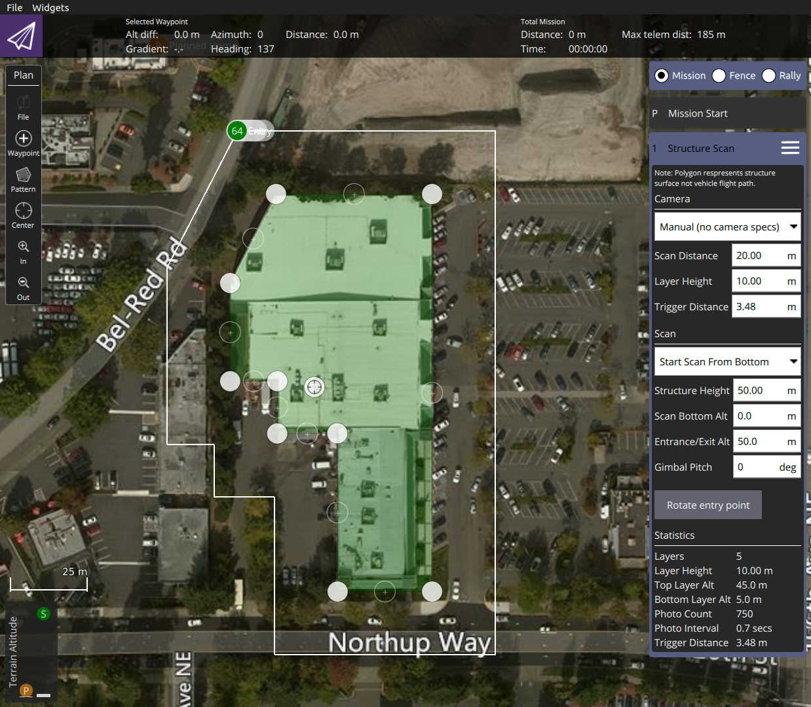
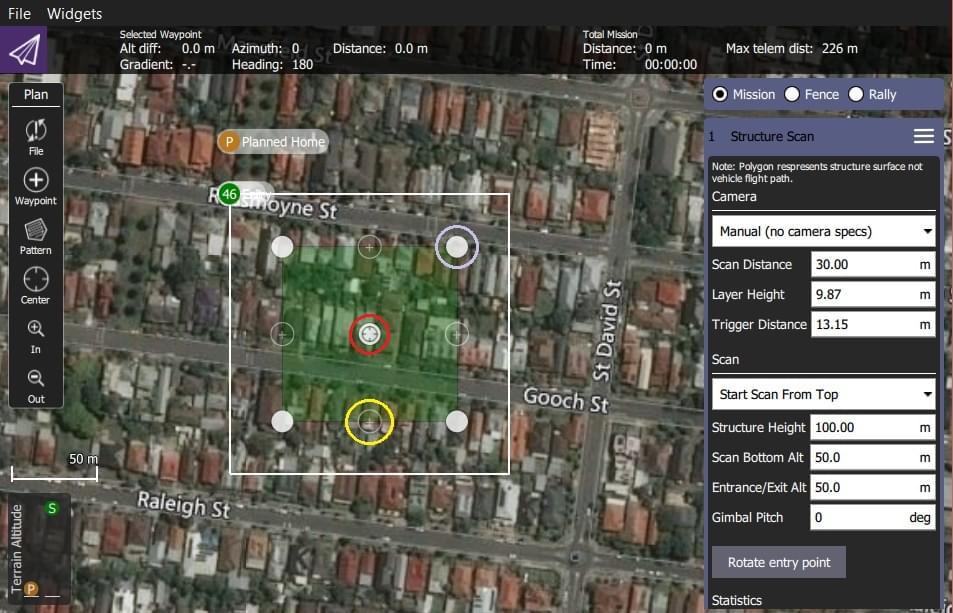
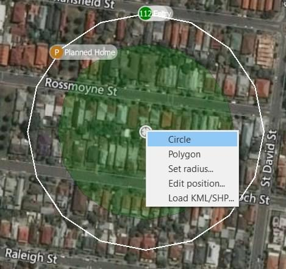

# 구조물 스캔 (계획 패턴)

_구조물 스캔_은 임의의 다각형(또는 원형) 지면 공간이 있는 구조물 주변의 _수직 표면_(예: 벽) 위의 이미지를 캡처하는 그리드 비행 패턴을 생성합니다.
구조물 스캔은 일반적으로 육안 검사 또는 구조의 3D 모델을 생성합니다.

_구조물 스캔_은 계획 보기 **패턴 > 구조 스캔** 도구를 사용하여 미션에 삽입할 수 있습니다.

:::info
The new version of _Structure Scan_ can't read older _Structure Scan_ plans. 다시 생성하여야 합니다.
:::

:::warning
이 기능은 아직 ArduPilot 펌웨어에서 지원되지 않습니다.
PX4에서만 지원됩니다.
:::

## 개요

아래 이미지는 구조물 스캔의 스크린샷을 나타냅니다.
녹색 다각형은 구조물의 지면 발자국을 표시하는 데 사용되며, 주변의 흰색 선은 차량의 비행 경로를 표시합니다.
비행 경로의 녹색 번호 원은 스캔 진입/종료 지점(스캔이 시작되는 지점)을 나타냅니다.

차량은 구조물로부터 특정 고도 및 _스캔 거리_에서 구조물 주위를 계속 날아간 다음 전체 표면이 스캔될 때까지 각 레이어에서 프로세스를 반복합니다.

사용자는 _스캔 바닥 고도_를 설정하여 구조물 바닥의 장애물을 피하고 _외부/출구 고도_를 설정하여 차량이 스캔을 오가는 동안 장애물을 피할 수 있습니다.

## 스캔 생성

스캔을 생성하려면:

1. **계획 보기**에서 **패턴 도구 > 구조물 스캔**을 선택합니다.

1. 이렇게 하면 지도에 간단한 정사각형 구조물 스캔이 생성됩니다.

   

   녹색으로 표시된 영역은 구조물을 둘러싸도록 수정하여야 합니다.

   - 지도의 불투명한 정점을 구조물의 가장자리로 드래그합니다(위의 자주색 원으로 표시된 예).
   - 구조물 공간이 단순한 정사각형 이상인 경우 정점 사이의 반투명 원을 클릭하여 새 정점을 생성할 수 있습니다.

2. 중앙의 "정점"(빨간색으로 표시)을 클릭하고 팝업 메뉴에서 _원_을 선택하여 원형 발자국으로 변경할 수 있습니다.

   .

   - 팝업 메뉴에서 폴리곤 풋프린트로 다시 전환하고 스캔의 반경 및/또는 위치를 변경할 수 있습니다.
   - 중심 정점을 드래그하여 원의 중심점을 배치합니다.

3. 나머지 구성은 보기의 오른쪽에 있는 _구조물 스캔_ 편집기를 사용하여 처리합니다.
   먼저 수동 스캔을 수행할지, 특정 카메라를 사용한 스캔 또는 사용자 정의 카메라 정의를 사용한 스캔을 수행할 지를 선택합니다.

   ::: info
   모드 간의 주요 차이점은 사전 정의된 카메라가 이미 유효 레이어 높이와 트리거 거리를 계산하도록 설정되어 있는 것입니다.
   :::

   다양한 모드에 대한 옵션이 아래와 같습니다.

   

사용자는 아래의 항목들을 설정할 수 있습니다.

- **위/아래에서 스캔 시작:** 레이어가 스캔되는 방향입니다.
- **구조 높이:** 스캔 중인 개체의 높이입니다.
- **스캔 거리:** 구조물에서 비행 경로까지의 거리입니다.
- **고도 진입/진출** 이 설정을 사용하면 마지막/다음 웨이포인트와 스캔할 구조물 사이의 장애물을 회피할 수 있습니다.
  - 차량은 이 고도의 _출입구_ 지점으로 비행한 다음 초기 레이어로 하강하여 스캔을 시작합니다.
  - 차량은 스캔을 완료한 후 이 고도까지 상승한 후 다음 웨이포인트로 이동합니다.
- **Scan Bottom Alt:** 이 설정을 사용하여 구조물 바닥 주변의 장애물을 회피합니다.
  이렇게 하면 구조물의 바닥이 지면보다 높기 때문에 첫 번째 스캔의 고도가 조정됩니다(가장 낮은 레이어 비행 경로의 높이는 스캔 통계에 _하부 레이어 고도_으로 표시됨).
- **진입점 회전:** 시작/종료 지점을 비행 경로의 다음 정점/위치로 이동합니다.

나머지 설정은 _카메라 모드_에 따라 다릅니다.

- _수동 모드_ 다음을 지정할 수 있습니다.
  - **레이어 높이:** 각 레이어의 높이입니다.
  - **트리거 거리:** 각 카메라 트리거 사이의 거리입니다.
    카메라는 레이어 경로를 비행하는 동안에만 트리거됩니다.
    한 레이어에서 다음 레이어로 전환하는 동안 이미지를 트리거하지 않습니다.
  - **짐벌 피치** - 스캔에 사용할 짐벌 피치입니다.

- _알려진/사전 정의된 카메라_ 필요한 이미지 중첩에서 레이어 높이와 이미지 트리거를 자동으로 계산하고 스캔 거리를 절충하고 이미지 해상도를 요구할 수 있습니다.
  또한, 이미지 캡처시 카메라가 표면을 직접 가리키도록 합니다(즉, 접선이 아닌 직각으로).
  설정은 다음과 같습니다:

  - **카메라 방향:** 세로 또는 가로
  - _중첩_:
    - **프론트 랩:** 이미지가 위에서 아래로 겹칩니다(증가하면 레이어 높이가 줄어들고 레이어 수가 늘어남).
    - **측면 랩:** 측면에서 이미지가 겹칩니다(증가하면 각 랩/레이어 스캔에서 더 많은 이미지가 필요함).
  - **스캔 거리:** 구조물에서 비행 경로까지의 거리입니다.
  - **지면 해상도:** 요구되는 이미지 해상도/표면의 샘플 품질.

- _사용자 지정 카메라_ 선택을 통해 자신의 카메라 특성을 입력할 수 있지만 그렇지 않으면 사전 정의된 카메라와 동일하게 작동합니다.
