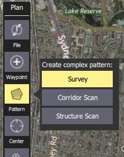
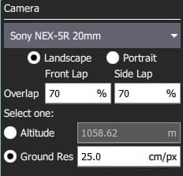
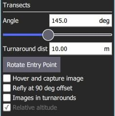

# 탐사 (패턴 계획)

탐사 기능으로 다각형 영역에 그리드 비행 패턴을 생성할 수 있습니다.
임의의 다각형, 그리드의 각도 및 기타 속성, 지오태깅된 이미지 생성에 적합한 카메라 설정을 지정할 수 있습니다.

::: warning
If the survey area has significant elevation variation then consider enabling [Terrain Following](#terrain).

카메라 사양을 사용하여 측량을 계획할 때 측량 영역 아래의 지면은 평평한 것으로 가정합니다.
측량 아래의 지면 고도가 홈 위치보다 높거나 낮으면, 이미지의 효과적인 중첩이 계산된 것보다 (각각) 더 적거나 많을 것입니다.
조사 지역 아래의 지상 고도가 홈 위치보다 _상당히_ 높으면 차량이 지상 장애물로 날아가도록 하는 잘못된 임무 경로를 계획할 수 있습니다.

지형 추적을 사용하면 측량이 지형 위의 원하는 고도와 더 가깝게 일치하도록 하고 지면 수준에 너무 가까운 임무를 계획할 가능성을 줄입니다.
:::

## 탐사 생성

탐사를 생성하려면:

1. [계획 뷰](../plan_view/plan_view.md)에서 _계획 도구_를 엽니다.

2. _계획 도구_에서 _패턴 도구_를 선택한 다음 _탐사_를 선택합니다.

   

   그러면 지도에 설문조사 그리드가 추가되고 임무 목록(오른쪽)에 _설문조사_ 항목이 추가됩니다.

3. 지도에서 정점을 끌어 다각형의 모양을 변경합니다.

4. 기존 정점 사이의 `(+)` 기호를 클릭하여 새 정점을 만듭니다.
   그런 다음 새 정점을 새 위치로 끌어서 수정할 수 있습니다.

The survey settings are covered in the next section.

## 설정

설문조사는 연결된 미션 항목(_플랜 보기_의 오른쪽에 있는 미션 항목 목록)에서 추가하여 설정할 수 있습니다.

### 카메라

카메라 트리거 동작은 카메라/카메라 설정에 따라 차이가 납니다.
기존 카메라, 사용자 지정 카메라를 선택하거나 수동으로 설정을 입력할 수 있습니다.
사용 가능한 카메라(QGC 3.4) 목록은 아래와 같습니다.

#### 알려진 카메라 {#known_camera}

드롭다운 옵션에서 알려진 카메라를 선택하면 카메라 기능을 기반으로 격자 패턴이 생성됩니다.

설정 옵션을 사용하여 설문조사에 대한 기본 설정을 조정할 수 있습니다.

- **가로/세로** - 차량의 "정상" 방향을 기준으로 한 카메라 방향입니다.
- **겹침** - 각 이미지 캡처 간에 겹칩니다.
  그리드 라인을 따라 비행하거나 그리드 라인을 가로 질러 비행할 때 별도로 설정할 수 있습니다.
- 하나를 선택하십시오:
  - **고도** - 조사 고도(지상 해상도가 이 고도에 대해 계산/표시됨).
  - **지상 해상도** - 각 이미지의 지상 해상도(해상도를 계산하고 표시하는 데 필요한 고도).

#### 카메라 최적화 {#custom_camera}

사용자 정의 카메라 옵션을 선택하면 알려진 카메라와 유사한 방식으로 새 카메라에 대한 설정을 지정할 수 있습니다.

카메라별 설정은 다음과 같습니다.

- **센서 너비/높이** - 카메라의 이미지 센서 크기입니다.
- **이미지 너비/높이** - 카메라가 캡처한 이미지의 해상도입니다.
- **초점 거리** - 카메라 렌즈의 초점 거리입니다.

나머지 설정은 [알려진 카메라](#known_camera)와 동일합니다.

#### 수동 카메라

수동 카메라 옵션을 사용하여 측량 높이, 트리거 간격 및 카메라에 적합한 격자 간격을 지정할 수 있습니다.

설정 옵션은 다음과 같습니다:

- **고도** - 전체 그리드를 비행하기 위한 측량 고도입니다.
- **트리거 거리** - 각 카메라 샷 사이의 지상 거리입니다.
- **간격** - 복도를 가로지르는 인접한 그리드(비행 경로) 선 사이의 거리입니다.

### Transects

_횡단_ 섹션은 사용된 카메라와 독립적인 그리드를 설정합니다.

설정 옵션은 다음과 같습니다:

- **각도** - 북쪽을 기준으로 한 그리드 선의 각도입니다.
  
- **회전 거리** - 차량 회전을 위해 조사 영역 외부에 추가할 추가 거리의 양입니다.
- **진입점 회전** - 버튼을 눌러 설문조사의 시작점과 끝점을 변경합니다.
- **마우스를 가져가서 이미지 캡처** - 마우스를 가져가서 이미지를 캡처합니다(멀티콥터만 해당).
- **90도 오프셋으로 비행** - 전체 임무를 90도 오프셋으로 되돌립니다.
  
- **회전 중인 이미지** - 회전시 이미지를 촬영합니다.
- **상대 고도** - 홈을 기준으로 지정된 고도를 지정하려면 선택합니다(선택하지 않은 경우 AMSL임).

### 지형

기본적으로 비행 차량은 고정 고도에서 측량 경로를 따릅니다.
Enabling _Terrain Following_ makes the vehicle maintain a constant height relative to ground.

:::info
지형 추적은 _AirMap_ 서버에서 쿼리한 지형 높이를 사용합니다.
:::

설정 옵션은 다음과 같습니다:

- **기체 지형 추적** - 지형 추적을 활성화하려면 선택합니다(및 다음 옵션 표시).
  - **허용 오차** - 목표 고도에서 허용되는 고도 편차입니다.
  - **최대 상승률** - 지형을 따라갈 때의 최대 상승률입니다.
  - **최대 하강 속도** - 지형을 따라갈 때의 최대 하강 속도.

### 통계

_통계_ 섹션에는 계산된 조사 영역, 사진 간격, 사진 간격 및 계획된 사진 수가 표시됩니다.

