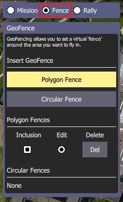
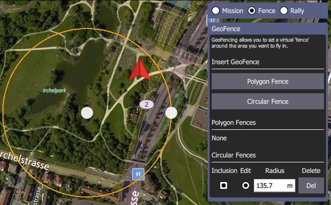

# 계획 뷰 - 지오펜스

GeoFences를 사용하면 비행이 가능한 가상 영역 또는 비행이 _허용되지 않는_ 가상 영역을 만들 수 있습니다.
또한 허용된 지역을 벗어나 비행하는 경우 취해야 할 조치를 설정할 수 있습니다.

:::info
**ArduPilot 사용자:** GeoFence 지원은 Rover 3.6 및 Copter 3.7 이상에서만 지원됩니다. 또한 일일 빌드 또는 Stable 3.6버전을 사용하여야 합니다(한 번 사용 가능).
연결된 차량에서 지원하지 않는 경우에는 _QGroundControl_은 GeoFence 옵션을 표시하지 않습니다.
:::

## 지오펜스 생성

지오펜스를 생성하려면:

1. 계획 뷰로 이동

2. 임무 명령 목록 위의 _지오펜스_ 라디오 버튼을 선택합니다.

   

3. **원형 울타리** 또는 **폴리곤 울타리** 버튼을 각각 눌러 원형 또는 다각형 영역을 삽입합니다.
   새로운 지역이 지도와 버튼 아래의 관련 울타리 목록에 추가됩니다.

:::tip
::: tip
버튼을 여러 번 눌러 여러 영역을 만들 수 있으므로 복잡한 지오펜스 정의를 생성할 수 있습니다.
:::

- 원형 영역:

  

  - 지도의 중앙 점을 드래그하여 지역을 이동
  - 원의 가장자리에 있는 점을 드래그하여 원의 크기를 조정합니다(또는 펜스 패널에서 반경 값을 변경할 수 있음).

- :::

  다각형 영역:
  

  - 채워진 점을 드래그하여 정점 이동
  - 채워진 정점 사이의 선에서 "채워지지 않은" 점을 클릭하여 새 정점을 만듭니다.

1. 기본적으로 새 지역은 _포함_ 영역으로 생성됩니다(차량은 지역 내에 있어야 함).
   울타리 패널에서 연결된 _포함_ 확인란을 선택 취소하여 차량이 이동할 수 없는 제외 구역으로 변경합니다.

## 지오펜스 편집/삭제

GeoFence 패널에서 _편집_ 라디오 버튼을 선택하여 편집할 지오펜스 영역을 선택할 수 있습니다.
그런 다음 이전 섹션에서 설명한 대로 지도에서 지역을 편집할 수 있습니다.

지역은 연결된 **Del** 버튼을 눌러 삭제할 수 있습니다.

## 지오펜스 업로드

GeoFence는 [계획 도구](../plan_view/plan_view.md)의 **파일**을 사용하여 임무와 동일한 방식으로 업로드됩니다.

## 기타 도구

나머지 도구는 임무를 편집할 때와 똑같이 동작합니다.
