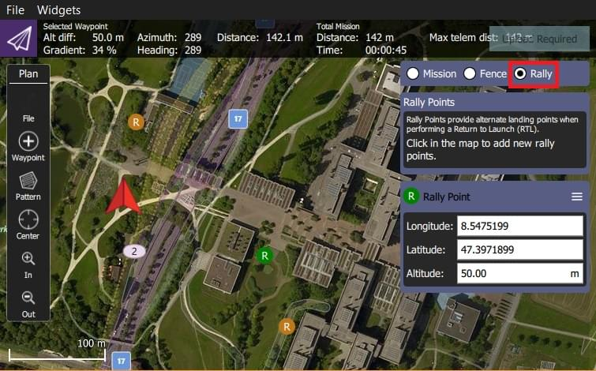

# 계획 뷰 - 랠리 포인트

랠리 포인트는 대체 착륙 또는 배회 장소입니다.
일반적으로 리턴/RTL 모드에서 홈 위치보다 더 안전하거나 더 편리한(예: 더 가까운) 목적지를 지정합니다.

:::info
랠리 포인트는 Rover 3.6 및 Copter 3.7(또는 그 이상)의 ArduPilot에서만 지원됩니다.
PX4 지원은 PX4 v1.10에 계획되어 있습니다.
또한 일일 빌드 또는 Stable 3.6 버전을 사용하여야 합니다(한 번 사용 가능).
연결된 차량에서 지원하지 않는 경우 _QGroundControl_은 랠리 포인트 옵션을 표시하지 않습니다.
:::

## 랠리 포인트 사용법

랠리 포인트를 생성하려면:

1. 계획 뷰로 이동합니다.
2. 임무 명령 목록 위의 _랠리_ 라디오 버튼을 선택합니다.
3. 랠리 포인트를 지도에서 원하는 곳을 클릭합니다.
   - 각각에 대해 **R** 마커가 추가됩니다.
   - 현재 활성화된 마커는 다른 색상(녹색)을 가지며 _집합 포인트_ 패널을 사용하여 편집할 수 있습니다.
4. 지도에서 랠리 포인트를 선택하여 활성화합니다.
   - 지도에서 드래그하거나 패널에서 위치를 편집하여 활성 랠리 포인트를 이동합니다.
   - 

## 랠리 포인트 업로드

랠리 포인트를 [계획 도구](../plan_view/plan_view.md)의 **파일**을 사용하여 미션과 동일한 방식으로 업로드합니다.

## 기타 도구

나머지 도구는 임무를 편집시와 동일한 기능을 제공합니다.
