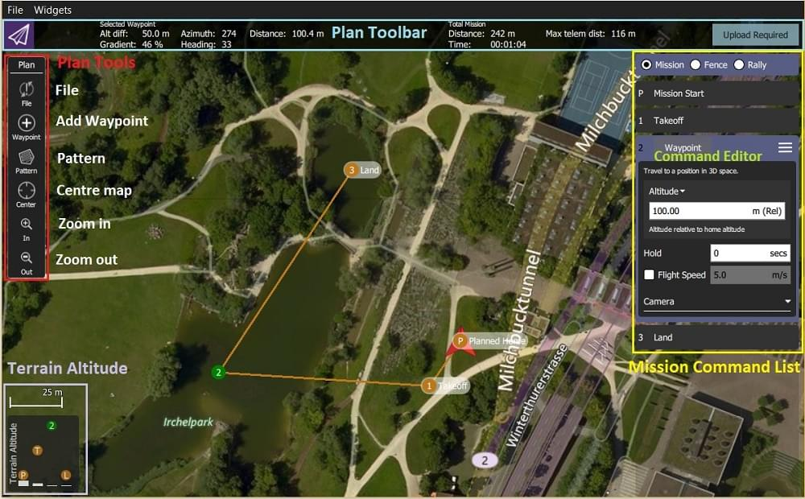
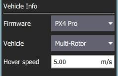

# 계획 뷰

_계획 뷰_에서는 차량에 대한 _자율 임무_를 계획하고 차량에 업로드합니다. 미션이 [계획](#plan_mission)되어 차량으로 전송되면 [비행 뷰](../fly_view/fly_view.md)로 전환하여 미션을 실행합니다.

펌웨어에서 지원하는 경우 [지오 펜스](plan_geofence.md)와 [랠리 포인트](plan_rally_points.md)를 설정할 수 있습니다.

## UI 개요 {#ui_overview}

[위의 스크린샷](#plan_screenshot)은 [Planned Home](#planned_home) 위치(H)에서 이륙으로 시작하는 간단한 임무 계획을 보여줍니다.

UI의 주요 요소는 다음과 같습니다.

- **지도:** [계획된 집](#planned_home)을 포함하여 현재 임무에 대한 번호가 매겨진 표시기를 표시합니다.
  표시기를 클릭하여 선택하거나(편집용) 드래그하여 위치를 변경합니다.
- **계획 툴바:** 이전 웨이포인트와 관련된 현재 선택된 웨이포인트의 상태 정보와 전체 임무에 대한 통계(예: 임무를 위한 수평 거리 및 시간).
  - `최대 원격 거리`는 [계획된 홈](#planned_home)과 가장 먼 웨이포인트의 거리입니다.
  - 차량에 연결하면 **업로드** 버튼도 표시되며, 차량에 계획을 업로드할 수 있습니다.
- **[계획 도구](#plan_tools):** 임무를 만들고 관리하는 데 사용됩니다.
- **[임무 명령 목록/오버레이](#mission_command_list):** 현재 임무 항목 목록을 표시합니다([편집](#mission_command_editors)할 항목 선택).
- **지형 고도 오버레이:** 각 임무 명령의 상대 고도를 표시합니다.

현재 선택된 웨이포인트와 관련된 정보와 전체 미션에 대한 통계를 보여줍니다.

## 임무 계획 {#plan_mission}

매우 높은 수준에서 임무를 생성하는 단계는 다음과 같습니다.

1. _계획 뷰_로 변경합니다.
2. 임무에 웨이포인트 또는 명령을 추가하고 필요에 따라 편집합니다.
3. 차량에 임무를 업로드합니다.
4. _비행 뷰_로 변경하여 임무 비행을 실히합니다.

다음 섹션에서는 보기의 일부 세부 정보에 대해 설명합니다.

## 지정된 홈 위치 {#planned_home}

_계획 뷰_에 표시된 _계획된 홈_은 임무 계획시 대략적인 시작 지점을 설정합니다(예: 차량이 QGC에 연결되지 않은 경우).
QGC에서 임무 시간을 추정하고 웨이포인트 라인을 그립니다.

계획된 홈 위치를 이륙 지점 근처로 끌어서 이동하여야 합니다.
계획된 홈 위치의 고도는 [미션 설정](#mission_settings) 패널에서 설정합니다.

:::tip
비행 뷰는 시동시에 차량 펌웨어에 의해 설정된 _실제_ 홈 위치를 표시합니다(차량이 리턴/RTL 모드에서 복귀하는 위치).
:::

## 계획 도구 {#plan_tools}

계획 도구는 개별 웨이포인트 추가, 복잡한 형상에 대한 쉬운 임무 생성, 임무 업로드/다운로드/저장/복원 및 지도를 탐색합니다. 주요 도구는 아래와 같습니다.

:::info
**지도 중심 이동**, **확대**, **축소** 도구는 사용자가 _계획 보기_ 지도를 탐색을 편리하게 합니다(차량에 전송되는 임무 명령에는 영향을 미치지 않음).
:::

### 경유지 추가

**경유지 추가** 도구를 클릭하여 활성화합니다. 활성 상태에서 지도를 클릭하면 클릭한 위치에 새 임무의 경유지가 추가됩니다.
도구는 다시 선택할 때까지 활성 상태를 유지합니다.
경유지를 추가한 후에는 경유지를 선택하고 끌어서 위치를 변경할 수 있습니다.

### 파일 (동기화) {#file}

_파일 도구_는 지상국과 차량 간에 임무를 이동하고 파일에서 저장/복원하는 데 사용됩니다.
도구에 `!`가 표시된면 차량에 임무 변경 내역이 완전하게 전송되지 않았음을 나타냅니다.

:::info
비행에 임무를 차량에 업로드하여야 합니다.
:::

_파일 도구_는 다음과 같은 기능을 제공합니다.

- 업로드(차량으로 전송)
- 다운로드(차량에서 적재)
- KML 파일을 포함하여 파일로 저장합니다.
- 파일로부터 불러오기
- 모두 삭제(_계획 뷰_ 및 차량에서 모든 미션의 경유지 제거)

### 패턴

[패턴](Pattern.md) 도구는 [설문조사](../plan_view/pattern_survey.md) 및 [구조 스캔](../plan_view/pattern_structure_scan_v2.md)을 포함하여 복잡한 형상을 비행하기 위한 임무 생성을 단순화합니다.

## 임무 명령 목록 {#mission_command_list}

현재 임무에 대한 임무 명령은 보기의 오른쪽에 나열됩니다.
상단에는 임무 편집, GeoFence 및 집회 지점 간을 전환하는 옵션 세트가 있습니다.
목록 내에서 개별 임무 항목을 선택하여 값을 편집할 수 있습니다.

### 임무 명령 편집자 {#mission_command_editors}

목록에서 임무 명령을 클릭하면 편집기가 표시됩니다(여기에서 명령 속성을 설정/변경할 수 있음).

명령 이름을 클릭하여 명령의 **유형**을 변경할 수 있습니다(예: _경유지_).
그러면 아래와 같은 _임무 명령 선택_ 대화 상자가 표시됩니다.
기본적으로 이것은 "기본 명령"만 표시하지만 **범주** 드롭다운 메뉴를 사용하여 더 많이 표시할 수 있습니다(예: 모든 옵션을 보려면 **모든 명령** 선택).

각 명령 이름의 오른쪽에는 _삽입_ 및 _삭제_와 같은 추가 옵션에 액세스하기 위해 클릭할 수 있는 메뉴가 있습니다.

:::info
사용 가능한 명령 목록은 펌웨어 및 차량 유형에 따라 차이가 납니다.
예로는 경유지, 이미지 캡처 시작, 항목으로 이동(임무 반복) 및 기타 명령이 포함될 수 있습니다.
:::

### 임무 설정 {#mission_settings}

_임무 시작_ 패널은 [임무 명령 목록](#mission_command_list)에 나타나는 첫 번째 항목입니다.
임무 시작 또는 종료에 영향을 줄 수 있는 기본 설정 번호를 지정하는 데 사용할 수 있습니다.

#### 임무 기본값

##### Waypoint alt

계획에 추가된 첫 번째 임무 항목의 기본 고도를 설정합니다(이후 항목은 이전 항목의 초기 고도를 가짐).
이것은 또한 계획에 있는 모든 항목의 고도를 동일한 값으로 변경하는 데 사용할 수 있습니다.

##### 비행 속도

기본 미션 속도와 다른 미션의 비행 속도를 설정합니다.

#### 미션 종료

##### 미션 종료 후 출발지로 복귀하기

최종 미션 아이템 이후에 차량이 Return/RTL이 되도록 하려면 체크하세요.

#### 지정된 홈 위치

[계획된 홈 위치](#planned_home) 섹션에서는 임무를 계획하는 동안 차량의 홈 위치를 시뮬레이션할 수 있습니다.
이를 통해 이륙부터 임무 완료까지 차량의 경유지 궤적을 조회할 수 있습니다.

:::info
이것은 _계획된_ 홈 위치일 뿐이며 차량을 출발할 계획인 위치에 놓아야 합니다.
미션 비행에 실질적인 영향은 없습니다.
차량의 실제 홈 위치는 시동시 차량에 의해 설정됩니다.
:::

이 섹션에서는 **고도** 및 **홈을 지도 중심으로 설정**을 설정할 수 있습니다(지도에서 드래그하여 다른 위치로 이동할 수 있음).

#### 카메라

카메라 섹션에서는 수행할 카메라 동작을 지정하고 짐벌을 제어하며 카메라를 사진 또는 비디오 모드로 설정합니다.

사용 가능한 카메라 동작은 다음과 같습니다.

- 변경 없음(현재 작업 계속)
- 사진 찍기(시간)
- 사직 찍기 (거리)
- 사진 촬영 중지
- 동영상 녹화 시작
- 동영상 녹화 중지

#### 차량 정보

차량에 대한 적절한 임무 명령은 펌웨어 및 차량 유형에 따라 차이가 납니다.

_차량에 연결_한 상태에서 임무를 계획하고 있다면 차량에 따라 펌웨어 및 차량 유형이 결정됩니다.
이 섹션에서는 차량에 연결되어 있지 않을 때 차량 펌웨어/유형을 지정할 수 있습니다.

임무를 계획할 때 지정할 수 있는 추가 값은 차량 비행 속도입니다.
이 값을 지정하면 차량에 연결되지 않은 상태에서도 총 임무 또는 조사 시간을 대략적으로 계산할 수 있습니다.

## 문제 해결

### 미션(계획) 업로드/다운로드 실패 {#plan_transfer_fail}

계획 업로드 및 다운로드는 통신 장애로 인하여 실패할 수 있습니다(미션, GeoFence 및 집회 지점에 영향을 미침).
오류가 발생하면 QGC UI에 다음과 유사한 상태 메시지가 표시되어야 합니다.

> 미션 전송 실패. 전송 재시도. 오류: 임무 쓰기 임무 수에 실패했습니다.

링크의 손실률은 [설정 보기 > MAVLink](../settings_view/mavlink.md)에서 볼 수 있습니다.
손실률은 낮은 한 자릿수(즉, 최대 2 또는 3)이어야 합니다.

- 한 자릿수 이상보다 높은 손실률은 간헐적인 고장을 야기할 수 있습니다.
- 높은 손실률은 종종 100% 실패로 이어집니다.

문제가 플라이트 스택이나 QGC의 버그로 인해 발생할 가능성은 매우 적습니다.
이 가능성을 분석하기 위해 계획 업로드/다운로드에 대해 [콘솔 로깅](../settings_view/console_logging.md)을 켜고 프로토콜 메시지 트래픽을 검토할 수 있습니다.

## 추가 정보

- New Plan View features for [QGC release v3.2](../qgc-user-guide/releases/release_note_stable_v3.md#plan_view)
- New Plan View features for [QGC release v3.3](../qgc-user-guide/releases/release_note_stable_v3.md#plan-view-1)
