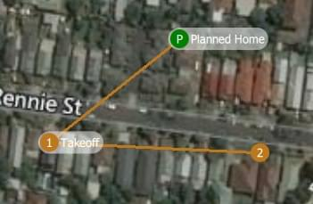
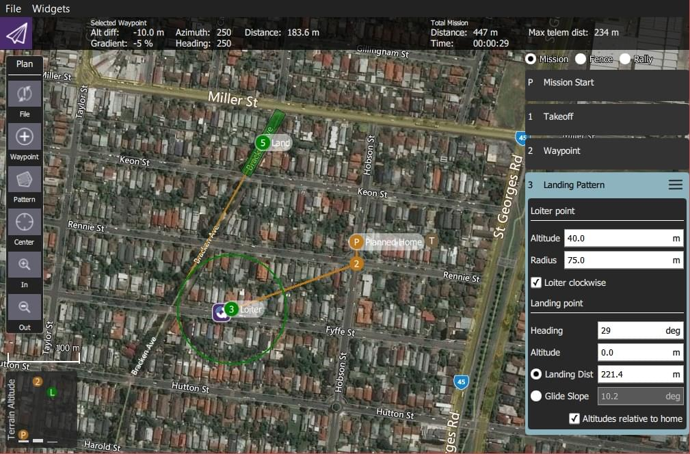

# QGroundControl v3.2 릴리스 노트(추가)

이 섹션에는 버전 3.2에서 _QGroundControl_에 추가된 새 기능의 상위 수준 및 _전체_ 목록이 포함되어 있습니다.

## 설정

### 원격 측정 로그 자동 저장

_비행 후 텔레메트리 로그 저장_을 켠 경우 더 이상 차량이 시동 정지 시마다 로그를 저장 위치를 묻는 메시지가 표시되지 않습니다.
로그는 [애플리케이션 로드/저장 경로](../settings_view/general.md#load_save_path)에 자동으로 저장됩니다.

자세한 내용은 [설정 > 일반(기타)](../settings_view/general.md#autosave_log)을 참고하십시오.

### 계획 자동 로드

이 설정이 켜져 있으면, _QGroundControl_에 차량 연결시 계획을 자동으로 업로드합니다.
계획 파일의 이름은 **AutoLoad#.plan**이어야 하며, 여기서 `#`은 차량 Id로 대체됩니다.
계획 파일은 [응용 프로그램 로드/저장 경로](../settings_view/general.md#load_save_path)에 위치하여야 합니다.

자세한 내용은 [설정 > 일반(기타)](../settings_view/general.md#autoload_missions)을 참고하십시오.

### 응용프로그램 불러오기/저장 경로

이제 QGroundControl에 매개변수, 원격 측정 또는 임무 계획의 기본 저장 경로를 지정할 수 있습니다.

자세한 내용은 [설정 > 일반(기타)](../settings_view/general.md#load_save_path)을 참고하십시오.

### RTK GPS

이제 연결된 RTK GPS와 함께 사용할 _정확도 조사_ 및 _최소 관찰 기간_을 지정할 수 있습니다.

자세한 내용은 [설정 > 일반(RTK GPS)](../settings_view/general.md#rtk_gps)을 참고하십시오.

## 설정

### ArduPilot - 비행 전 기압계 및 대기 속도 보정

이제 센서 페이지에서 지원됩니다.

### ArduPilot - RC 트림 복사

이제 라디오 설정 페이지의 트림 복사 버튼에서 지원됩니다.

## 계획 화면 {#plan_view}

### 계획 파일

이전 버전의 _QGroundControl_은 미션, 지오펜스 및 집회 지점을 별도의 파일(**.mission**, **.fence**, **.rally**)에 저장하였습니다 . QGroundControl은 이제 비행 계획과 관련된 모든 정보를 파일 확장자를 **.plan**인 _계획 파일_을 사용합니다.

Information about the format can be found in [Plan File Format](../../qgc-dev-guide/file_formats/plan.md) (QGC Developer Guide).

### 계획 툴바

[계획 화면](../plan_view/plan_view.md) 상단에 새로운 _계획 도구 모음_이 표시됩니다.
현재 선택된 웨이포인트와 관련된 정보와 전체 미션에 대한 통계를 나타냅니다.

차량에 연결하면 **업로드** 버튼도 표시되며, 차량에 계획을 업로드할 수 있습니다.

### 임무 설정

[미션 설정](../plan_view/plan_view.md#mission_settings) 패널을 사용하면 전체 미션에 적용되는 값을 지정하거나 미션 시작 시 바로 제어하려는 설정을 지정할 수 있습니다.
화면 오른쪽 미션 목록의 첫 번째 아이템입니다.

#### 임무 기본값

##### Waypoint alt

새로 추가된 임무 항목의 기본 고도를 지정합니다.
임무를 로드한 상태에서 이 값을 업데이트하면, 모든 경로점들을 새로운 고도값으로 업데이트하는 메시지가 표시됩니다.

##### 비행 속도

이를 통하여 미션의 비행 속도를 기본 미션 속도와 다르게 설정합니다.

##### 임무 종료 후 출발지 복귀

Check this if you want your vehicle to RTL after the final mission item.

#### 카메라 선택

카메라 섹션에서는 수행할 카메라 동작을 지정하고 짐벌을 제어하며 카메라를 사진 또는 비디오 모드로 설정합니다.

사용 가능한 카메라 작업은 다음과 같습니다.

- 현재 동작 지속
- 사진 찍기(시간)
- 사직 찍기 (거리)
- 사진 촬영 중지
- 동영상 녹화 시작
- 동영상 녹화 중지

#### Vehicle Info section

임무 계획시, QGroundControl에서 기체에 적합한 임무 명령을 표시하려면 실행 중인 펌웨어와 기체 유형을 알아야 합니다.

기체가 연결된 상태에서 임무를 계획하는 경우에는 펌웨어와 기체 유형은 기체에서 결정됩니다. 기체에 연결되지 않은 상태에서 임무를 계획하는 경우 이 정보를 직접 지정하여야 합니다.

임무를 계획할 때 지정할 수 있는 추가 값은 기체 비행 속도입니다. 이 값을 지정하면 기체에 연결되지 않은 상태에서도 총 임무 또는 조사 시간을 대략적으로 계산할 수 있습니다.

#### 지정된 홈 위치

계획된 홈 위치를 사용하면, 임무를 계획하는 동안 기체의 홈 위치를 시뮬레이션할 수 있습니다. 이 방법을 통해 이륙에서 임무 완료까지 차량의 경로점들의 궤적을 조회할 수 있습니다. 이것은 "계획된" 홈 위치일 뿐이며 기체가 출발할 계획인 위치에 배치하여야 합니다. 미션 비행에 실질적인 영향은 없습니다. 차량의 실제 홈 위치는 시동시 결정됩니다.

### 새로운 경로점 기능

- 이제 각 경로점의 방향과 비행 속도를 조정할 수 있습니다.
- 각 경로점에서 카메라 변경에 사용할 수 있는 카메라 섹션이 있습니다. 카메라 섹션에 대한 설명은 위의 미션 설정에서 읽을 수 있습니다.

### 비주얼 짐벌 방향

경로점에서 짐벌 편요각 변경을 지정하면, 평면도와 조감도는 짐벌 방향을 시각적으로 나타냅니다.

### 패턴 도구

새로운 _패턴 도구_가 있습니다. 아래의 패턴들을 사용할 수 있습니다:

- 고정익 착륙 (신규)
- 탐사(신규 기능)

#### 고정익 착륙 패턴

이것은 미션에 고정익 착륙 패턴을 추가합니다.
패턴의 첫 번째 지점은 기체가 특정 고도로 배회하도록 명령하는 배회 지점입니다.
해당 고도에 도달하면 기체는 착륙 시퀀스를 시작하고 지정된 착륙 지점으로 비행합니다.

배회 지점과 착륙 지점 모두 드래그하여 수정할 수 있습니다.
또한, 패턴과 관련된 모든 다양한 값들을 수정할 수 있습니다.

자세한 내용은 [고정 날개 착륙 패턴](../plan_view/pattern_fixed_wing_landing.md)을 참고하십시오.

#### 탐사(신규 기능)

- 다각형 조사 영역 외부의 회전 구역에서는 이미지가 자동으로 촬영되지 않습니다.
- 각 이미지 위치에서 최고 품질의 이미지를 캡처하는 데 사용할 수 있는 새로운 _마우스 오버 및 캡처_ 옵션이 있습니다. 영상 촬영전에 기체가 안정성을 위하여 영상 촬영 위치에서 정지합니다.
- 이전 패스에 대해 90도 각도로 측량 그리드를 다시 비행하는 새로운 옵션이 있습니다. 이를 통해 훨씬 더 조밀한 영상 적용 범위를 생성할 수 있습니다.

이제 터치 스크린이 있는 태블릿에서 조사 영역 다각형을 더 쉽게 조작할 수 있습니다:

- 중심점 핸들을 끌어 전체 다각형을 새 위치로 끌 수 있습니다.
- 각 다각형 정점을 새 위치로 드래그할 수 있습니다.
- 다각형 정점을 제거하려면, 해당 정점에 대한 드래그 핸들을 클릭하면 됩니다.
- 두 개의 기존 정점 사이에 새 정점을 추가하려면, **+** 핸들을 클릭합니다.

## Fly View

### RTK GPS

이제 RTK 상태가 도구 모음에 표시됩니다.

### 시동/비시동

도구 모음에 무장/해제 표시기가 있습니다. 클릭하면 차량을 시동을 걸거나 끌 수 있습니다. 기체가 비행하는 동안 도구 모음에서 시동 해제를 클릭하면, 기체가 비상 정지할 수 있는 옵션이 제공됩니다.

### 안내 작업

- 이륙
- 착륙
- RTL
- 일시 중지
- 액션
  - 미션 시작
  - 임무 재개
  - 고도 변경
  - Land Abort
- 지도와 직접 상호 작용
  - 경로점 설정
  - 위치 이동

#### 미션 재개

미션 재개 가이드 액션은 배터리 교체를 위하여, 미션 내에서 출발지 복귀 후 미션을 재개합니다.
차량이 출발지 복귀후 착륙하고 배터리를 분리한 후 QGroundControl 연결를 중단하지 **마십시오**.
새 배터리를 장착하면, QGroundControl에서 기체를 다시 감지하고 자동으로 연결을 복원합니다.
Once this happens you will be prompted with a Resume Mission confirmation slider.
임무를 재개하려면, 이를 확인하고 지난 웨이포인트에서 임무를 재개합니다.
임무가 재개되면, 다시 시작하기 전에 재개된 임무를 검토할 수 있는 또 다른 임무 재개 슬라이드가 표시됩니다.
미션을 계속하려면 이 미션 재개 슬라이더를 확인하십시오.

###### 미션 재개 작동 방식

임무를 재개하려면, 기체가 실행한 마지막 임무 항목에서 단순히 임무를 계속할 수 없습니다.
그 이유는 미션에서 해당 항목 이전에 중요한 변경 속도 명령이나 카메라 제어 명령을 건너뛸 수 있기 때문입니다.
이를 건너뛰면, 나머지 미션이 제대로 실행되지 않습니다.
재개 임무가 올바르게 작동을 위하여 QGroundControl은 비행 마지막 임무 항목에서 거꾸로 임무를 재구축하고 임무 전면에 관련 명령을 자동으로 추가합니다.
이렇게 하면 재개 시점 이전의 미션 상태가 복원됩니다.
다음 임무 명령은 스캔된 명령입니다.

- `MAV_CMD_DO_CONTROL_VIDEO`
- `MAV_CMD_DO_SET_ROI`
- `MAV_CMD_DO_DIGICAM_CONFIGURE`
- `MAV_CMD_DO_DIGICAM_CONTROL`
- `MAV_CMD_DO_MOUNT_CONFIGURE`
- `MAV_CMD_DO_MOUNT_CONTROL`
- `MAV_CMD_DO_SET_CAM_TRIGG_DIST`
- `MAV_CMD_DO_FENCE_ENABLE`
- `MAV_CMD_IMAGE_START_CAPTURE`
- `MAV_CMD_IMAGE_STOP_CAPTURE`
- `MAV_CMD_VIDEO_START_CAPTURE`
- `MAV_CMD_VIDEO_STOP_CAPTURE`
- `MAV_CMD_DO_CHANGE_SPEED`
- `MAV_CMD_NAV_TAKEOFF`

### 기체 착륙 후 임무 제거

임무가 완료후, 기체가 착륙하고 무장 해제되면 기체의 임무를 제거하라는 메시지가 표시됩니다.
이는 오래된 임무가 의도치 않게 기체에 남겨져, 예기치 않은 동작을 일으키는 문제를 방지합니다.

### 계기판

#### 카메라 트리거

#### 비행 시간

이제 계기판에 비행 시간을 표시할 수 있습니다.
신규 사용자의 경우 기본적으로 비행 시간이 표시됩니다.
이미 계기판 값을 수정한 기존 사용자의 경우, 이를 사용하려면 직접 추가하여야 합니다.

## [분석 화면](../analyze_view/index.md)

- [로그 다운로드](../analyze_view/log_download.md)가 메뉴에서 _분석 화면_으로 이동하였습니다.
- PX4 Pro 펌웨어에 대한 새로운 [GeoTag 이미지](../analyze_view/geotag_images.md) 지원
- 기체에서 실행되는 _nsh 쉘_에 대한 액세스를 제공하는 새로운 [MAVLink 콘솔](../analyze_view/mavlink_console.md).

## Multi-Vehicle View

여러 기체들이 QGroundControl에 연결된 경우 사용할 수 있는 새로운 화면을 제공합니다. 두 대 이상의 기체가 연결된 경우에만 표시됩니다. 이 경우 계획 화면의 오른쪽 상단에 추가 라디오 버튼 세트가 표시됩니다.

계기판을 다중 기체 목록으로 바꾸려면 **다중 기체** 라디오 버튼을 클릭합니다.

위의 예는 세 대의 기체를 나타냅니다. 숫자는 차량 ID입니다. 큰 글꼴은 현재 비행 모드입니다. 비행 모드 이름을 클릭하여 다른 비행 모드로 변경할 수 있습니다. 오른쪽에는 각 차량용 계기의 작은 버전이 있습니다. 제어판에서 기체의 다음 작업을 수행하도록 명령할 수 있습니다.

- 시동/비시동
- 미션 시작/중지
- 출발지 복귀
- 임무에서 수동 제어로 돌아와 기체의 제어권을 확보합니다.

### Multi-Vehicle Gotchas - Unique vehicle ids

QGroundControl에 연결된 각 기체는 고유한 ID가 있어야 합니다. 그렇지 않으면, QGroundControl에서는 동일한 기체로 판별합니다. The symptom of this is the Plan view jerking around as it tries to position itself to one vehicle and then the next. PX4 Pro 펌웨어의 경우 이것은 `MAV_SYS_ID` 매개변수입니다. ArduPilot 펌웨어의 경우 `SYSID_THISMAV` 매개 변수

## 타사 맞춤형 QGroundControl 지원

표준 QGroundControl는 다양한 펌웨어와 다향한 기체들을 지원합니다. 이제 QGroundControl에서 지원이 제공되어 타사에서 사용자 지정 기체를 대상으로 하는 자체 사용자 지정 버전의 QGroundControl를 제작 가능합니다. 그런 다음, 기체와과 함께 자체 버전의 QGroundControl를 출시할 수 있습니다.
