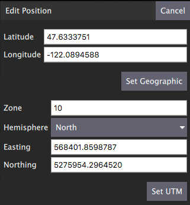

# QGroundControl v3.3 릴리스 노트(추가)

이 섹션에는 버전 3.3에서 _QGroundControl_에 추가된 새 기능의 상위 수준 및 _전체_ 목록이 포함되어 있습니다.

## 상세 참고 사항

### 설정 화면

#### NMEA GPS 장치 지원

일반 페이지에서 이러한 장치 연결을 지정할 수 있습니다.
GPS 정보는 지상국 위치 측정에 사용됩니다.

자세한 내용은 [설정 > 일반(다음 장치에 자동 연결)](../settings_view/general.md#auto_connect)을 참고하십시오.

#### 비디오 녹화

비디오는 QGroundControl 파일 저장 경로의 비디오 디렉토리에 저장됩니다.
비디오 파일들의 최대 저장 용량을 지정할 수 있습니다.
해당 크기를 초과하면 가장 오래된 비디오 파일을 삭제합니다.
비디오 녹화는 플라이 뷰의 비디오 위젯에서 켜고 끌 수 있습니다.

자세한 내용은 [설정 > 일반(동영상/동영상 녹화)](../settings_view/general.md#video)을 참고하십시오.

### 계획 화면 {#plan_view}

#### 구조 스캔

구조 스캔은 수직 표면(다각형 또는 원형) 위의 이미지를 캡처하는 격자 비행 패턴을 만들 수 있습니다.
일반적으로 육안 검사나 구조물의 3D 모델을 생성합니다.

자세한 내용은 [여기](../plan_view/pattern_structure_scan_v2.md)를 참고하십시오.

#### 새로운 MAVLink GeoFence, Rally Point 지원

QGroundControl은 새로운 MAVLink GeoFence 및 Rally Point 사양과 프로토콜을 지원합니다. 이 새로운 시스템은 제외 또는 포함 울타리로 지정할 수 있는 다중 다각형과 원형 울타리를 지원합니다.

"편집" 라디오 버튼은 현재 선택된 울타리는 폴리곤 편집을 위한 드래그 포인트와 같은 화면 편집 컨트롤을 표시합니다.

**Note** PX4 Pro 펌웨어만 신규 사양을 지원합니다. ArduPilot은 아직 신규 사양을 지원하지 않습니다. QGC ArduPilot 코드가 새 아키텍처로 재작업될 때까지 QGC에서 GeoFence/Rally 지원이 일시적으로 비활성화됩니다.

#### 위치 편집 대화 상자

위치 편집 대화 상자는 지리적 또는 UTM 좌표계에서 항목에 대한 자세한 위치를 지정할 수 있습니다. 다각형 도구 메뉴와 좌표를 지정하는 모든 미션 항목의 햄버거 메뉴에서 사용할 수 있습니다.

#### 폴리곤 도구

이제 폴리곤 중심 드래그 핸들을 클릭하여 폴리곤 조작 도구 세트를 불러올 수도 있습니다. 이 도구는 측량, 구조 스캔, GeoFence 등 다각형 편집이 지원되는 모든 곳에서 사용할 수 있습니다.

- 원 - 폴리곤을 원형 폴리곤으로 변환합니다.
- 다각형 - 원형 다각형을 다시 직사각형 다각형으로 변경합니다.
- 반경 설정 - 원의 반경을 설정합니다.
- 위치 편집 - 원 중심의 세부 위치를 지정하는 위치 편집 대화 상자를 표시합니다.
- KML 로드 - 폴리곤을 KML 파일에서 로드된 폴리곤으로 설정합니다.

원형 다각형 예:

### Fly View

#### 비디오 녹화를 시작/중지

이것은 비디오 창의 비디오 녹화 버튼입니다. 저장된 비디오에 대한 설정은 설정 보기의 일반 페이지에서 사용할 수 있습니다.

#### 다중 기체 표시기

여러 기체에 연결되어 있는 경우, 기체 아이콘 아래에 기체 ID가 표시됩니다. The active vehicle will be opaque and the inactive vehicles will be semi-transparent.

#### Multi-Vehicle View supports batch commands

다중 기체 목록은 이제 모든 기체에 적용되는 명령을 지원합니다.

현재 사용 가능한 명령 목록은 일시 중지 및 임무 시작이지만, 추가 개발에서 확장될 것입니다.

#### ADS-B 센서 차량 디스플레이

차량의 ADS-B 센서에 의해 보고된 기체는 지도에 고도와 아이콘 아래 호출부호가 있는 작은 파란색 아이콘으로 표시됩니다.

