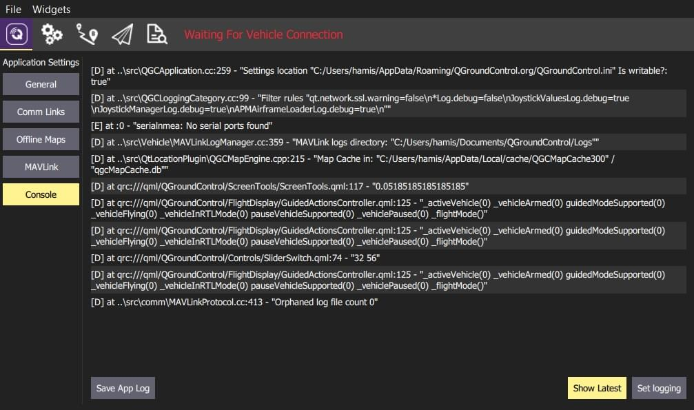

# 콘솔 로그 설정

_콘솔_은 _QGroundControl_ 문제를 진단하는 데 유용한 도구입니다. **설정 화면 > 콘솔**에서 설정할 수 있습니다.



**로깅 설정** 버튼을 클릭하여 _QGroundControl_에 의해 표시되는 로깅 정보를 활성화 또는 비활성화합니다.

## 콜솔 로그 옵션

The most commmonly used logging options are listed below.

| 옵션                                                                                  | 설명                                                                                |
| ----------------------------------------------------------------------------------- | --------------------------------------------------------------------------------- |
| `LinkManagerLog`, `MultiVehicleManagerLog`                                          | 디버그 연결 문제                                                                         |
| `LinkManagerVerboseLog`                                                             | Debug serial ports not being detected. 디버그 직렬 포트 미감지 사용 가능한 직렬 포트의 매우 시끄러운 연속 출력. |
| `FirmwareUpgradeLog`                                                                | 펌웨어 플래시 문제를 디버그                                                                   |
| `ParameterManagerLog`                                                               | 디버그 매개변수 로드 문제                                                                    |
| `ParameterManagerDebugCacheFailureLog`                                              | 디버그 매개변수 캐시 crc가 누락                                                               |
| `PlanManagerLog`, `MissionManagerLog`, `GeoFenceManagerLog`, `RallyPointManagerLog` | 디버그 계획 업로드/다운로드 문제                                                                |
| `RadioComponentControllerLog`                                                       | 무선 보정 문제를 디버그                                                                     |

## 명령줄 로깅

로깅을 위한 대체 메커니즘은 `--logging` 명령줄 옵션을 사용하는 것입니다. 이는 _QGroundControl_이 충돌하는 상황에서 로그 조회시에 편리합니다.

이 작업을 수행하는 방법과 추적 출력은 운영체제에 따라 조금씩 다릅니다.

- 윈도우

  - 명령 프롬프트를 열고 디렉토리를 **qgroundcontrol.exe** 위치로 변경후 실행합니다.

    ```sh
    bash
        cd "\Program Files (x86)\qgroundcontrol"
        qgroundcontrol --logging:full
    ```

  - _QGroundControl_이 시작되면 로그 출력이 있는 별도의 콘솔 창을 사용합니다.

- OSX

  - 터미널에서 _QGroundControl_을 실행합니다. 터미널 앱은 응용 프로그램/유틸리티에 있습니다. 터미널이 열리면 다음을 입력합니다.

    ```sh
    bash
        cd /Applications/qgroundcontrol.app/Contents/MacOS/
        ./qgroundcontrol --logging:full
    ```

  - 로그 추적은 터미널 창으로 출력됩니다.

- Linux

  ```sh
  bash
  ./qgroundcontrol-start.sh --logging:full
  ```

  - 로그 추적은 실행 중인 셸에 출력됩니다.
