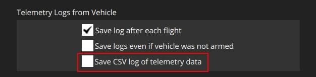

# CSV 로깅

선택하면 CSV(쉼표로 구분된 값) 원격 분석 파일이 일반적인 **.tlog** 원격 분석 파일과 함께 생성됩니다.
파일은 **각 비행 후 로그 저장**이 활성화된 경우에만 생성되고 동일한 기간 동안 기록됩니다.

이 CSV 파일에는 GPS 위치, 자세, 배터리 상태 등과 같은 빠른 분석에 사용할 수 있는 가장 관련성이 높은 차량 원격 측정 데이터가 포함되어 있습니다.
1Hz로 채워지며 원격 분석 로그만큼 상세하지 않지만 작업하기가 훨씬 쉽고 데이터를 추출하는 속도가 빠릅니다.

파일은 Microsoft Excel, Google Sheets, LibreOffice Calc 또는 OpenOffice Calc를 포함한 일반적인 스프레드시트 소프트웨어로 열 수 있습니다.
