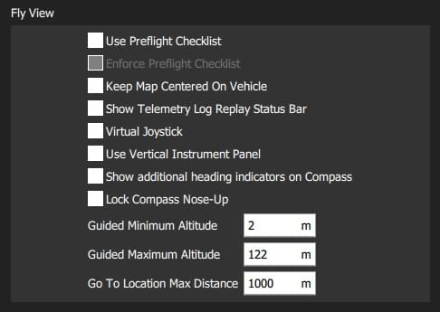
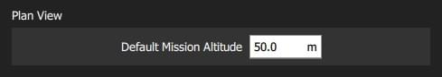
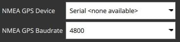
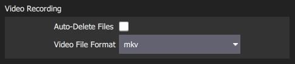
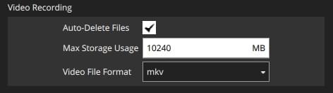

# 일반 설정(설정 화면)

일반 설정(**설정 화면> 일반 설정**)은 애플리케이션의 주요 항목들을 설정합니다.
디스플레이 장치, 자동 연결 장치, 비디오 디스플레이 및 저장 장치, RTK GPS, 브랜드 이미지 및 기타 항목들을 설정합니다.

:::info
Values are settable even if no vehicle is connected. 차량 재시동이 필요한 설정은 UI에 표시됩니다.
:::

## 단위

이 섹션에서는 응용 프로그램의 표시 단위를 정의합니다.

설정은 다음과 같습니다:

- **거리**: 미터 | 피트
- **면적**: 평방미터 | 스퀘어피트 | 평방킬로미터 | 헥타르 | 에이커 | 스퀘어마일스
- **속도**: 미터/초 | 피트/초 | 마일/시간 | 킬로미터/시간 | 매듭
- **온도**: 섭씨 | 화씨

## 기타

이 섹션에서는 (완벽하지 않음)과 관련된 여러 가지 항목들을 설정합니다: 글꼴 크기, 색 구성표, 지도 제공자, 지도 유형, 원격 측정 로깅, 오디오 출력, 배터리 부족 알림 수준, 기본 임무 고도, [가상 조이스틱](../settings_view/virtual_joystick.md), 임무 자동 로드, 기본 애플리케이션 파일 로드/저장 경로 등

설정 항목들은 다음과 같습니다:

- **언어**: 시스템(시스템 언어) | 불가리아어, 중국어, ...

  

  Translations are generally built into the application and selected automatically based on the system language.

  Metadata downloaded from the vehicle (such as parameter descriptions) might have translations as well.
  These are downloaded from the internet upon vehicle connection. The translations are then cached locally.
  This means an internet connection during vehicle connection is required at least once.

- **색 구성표**: 실내(어두운) | 야외(조명)

- **지도 제공자**: Google | 맵박스 | 빙 | 에어맵 | 브이월드 | 에니로 | 스탯카트

- **지도 유형**: 도로 | 하이브리드 | 위성

- **스트림 GCS 위치**: 안 함 | 항상 | 팔로우 미 플라이트 모드 시

- **UI 크기 조정**: UI 크기 비율(글꼴, 아이콘, 버튼 크기, 레이아웃 등에 영향)

- **모든 오디오 출력 음소거**: 모든 오디오 출력을 끕니다.

- **인터넷 연결 확인**: 지도 데이타의 다운로드 실패할 수 있는 환경에서 지도를 사용 가능하도록하려면 선택을 취소합니다(지도 타일 엔진이 인터넷 연결을 지속적으로 재확인하는 것을 중지함).

-  **미션 자동 로딩**: 활성화하면 연결 시 차량에 자동으로 미션을 업로드합니다.
  - 계획 파일의 이름은 **AutoLoad#.plan**이어야 하며, 여기서 `#`은 차량 Id로 대체됩니다.
  - 계획 파일은 [응용 프로그램 로드/저장 경로](#load_save_path)에 위치하여야 합니다.

- **다음 시작 시 모든 설정 지우기**: _QGroundControl_이 다시 시작될 때 모든 설정을 기본값(이 항목 포함)으로 재설정합니다.

- **배터리 부족 알림**: _QGroundControl_이 배터리 부족 알리는 배터리 수준입니다.

- **애플리케이션 로드/저장 경로**: 매개변수, 원격 측정 로그 및 임무 계획을 포함하여 애플리케이션 파일을 로드 및 저장하는 기본 위치입니다.

## 데이터 지속성 {#data_persistence}

설정 항목들은 다음과 같습니다:

- **모든 데이터 지속성 사용 안함**: 로그, 지도 타일 등 데이터가 저장되거나 캐시되지 않도록 확인합니다.

## 기체의 텔레메트리 로그 {#telemetry_logs}

설정 항목들은 다음과 같습니다.

- **비행 후 로그 저장** : 원격 측정 로그(`.tlog`)는 비행 후 _응용 프로그램 로드/저장 경로_([위](#load_save_path))에 자동으로 저장됩니다.
- **차량 비시동시 로그 저장**: 차량이 _QGroundControl_에 연결시 기록을 저장합니다.
  차량 연결이 끊어지면 기록을 중지합니다.
- [**CSV 로깅**](csv.md): 원격 측정 데이터의 하위 집합을 CSV 파일에 기록합니다.

## 비행 화면 {#fly_view}

설정 항목들은 다음과 같습니다:

- **실행 전 체크리스트 사용**: 빗행도구 모음에서 실행 전 체크리스트를 활성화합니다.

- **실행 전 체크리스트 적용**: 체크리스트 완료는 무장을 위한 전제 조건입니다.

- **차량 중앙에 지도 유지**: 지도가 현재 선택된 차량의 중앙에 위치하도록 합니다.

- **텔레메트리 로그 재생 상태 표시줄 표시**: [비행 데이터 재생](../fly_view/replay_flight_data.md)에 대한 상태 표시줄을 표시합니다.

- **가상 조이스틱**: [가상 조이스틱](../settings_view/virtual_joystick.md) 활성화(PX4만 해당)

- **수직 계기판 사용**: 계기판을 수평이 아닌 수직으로 정렬합니다(기본값).

- **나침반에 추가 방향 표시기 표시**: 나침반에 추가 표시기를 표시합니다.

- _파란색 화살표_: 지면 위의 코스입니다.

- _백악관_: 집으로 돌아가는 방향.

- _녹색 선_: 다음 웨이포인트 방향.

- **Lock Compass Nose-Up**: 나침반 장미를 회전하려면 선택합니다(기본값은 나침반 표시기 내부에서 기체을 회전입니다).

- **안내식 최소 고도**: 안내식 작업 고도 슬라이더의 최소값입니다.

- **안내식 최대 고도**: 안내식 작업 고도 슬라이더의 최소값입니다.

- **이동 위치 최대 거리**: 이동 위치가 현재 차량 위치에서 설정될 수 있는 최대 거리(안내 모드에서).

## 계획 화면 {#plan_view}

설정 항목들은 다음과 같습니다:

- **기본 임무 고도**: 임무 시작 패널 및 첫 번째 웨이포인트의 기본 고도입니다.

## 다음 장치에 자동으로 연결 {#auto_connect}

이 섹션은 _QGroundControl_이 자동으로 연결할 기기 세트를 정의합니다.

설정 항목들은 다음과 같습니다:

- <strong>Pixhawk:</strong> Pixhawk 시리즈 기기에 자동 연결
- **SiK 라디오:** SiK(텔레메트리) 라디오에 자동 연결
- **PX4 Flow:** PX4Flow 기기에 자동 연결
- **LibrePilot:** Libre Pilot 자동조종장치에 자동 연결
- **UDP:** UDP에 자동 연결
- **RTK GPS:** RTK GPS 기기에 자동 연결
- **NMEA GPS 장치:** 외부 GPS 장치에 자동 연결하여 지상국 위치를 획득합니다([아래 참조](#nmea_gps)).

### 지상국 위치(NMEA GPS 장치) {#nmea_gps}

_QGroundControl_은 자동으로 내부 GPS를 사용하여 자주색 `Q` 아이콘으로 지도에 자신의 위치를 표시합니다(GPS가 방향을 제공하는 경우 이는 아이콘으로도 표시됩니다.
현재 [PX4 멀티콥터에서만](https://docs.px4.io/en/flight_modes/follow_me.html) 지원됩니다.

직렬 또는 UDP 포트를 통하여 외부 GPS 장치에 연결하도록 QGroundControl을 설정할 수 있습니다.
GPS 장치는 일반적으로 ASCII NMEA 형식을 지원합니다.

:::tip
**도움말** 지상국에 내부 GPS 지원 기능이 있는 경우에도 고품질 외부 GPS 시스템이 유용할 수 있습니다.
:::

_NMEA GPS 장치_ 드롭다운 선택기를 사용하여 GPS 장치 및 기타 옵션을 수동으로 선택합니다.

- USB 연결:

  

  - **NMEA GPS 장치:** _직렬_
  - **NMEA GPS Baudrate**: 직렬 포트 전송 속도

  ::: tip
  직렬 GPS 문제를 해결하려면 RTK GPS [자동 연결](#auto_connect)을 비활성화하고 _QGroundControl_을 닫고 GPS를 다시 연결한 다음 QGroundControl을 실행합니다.
  :::

- 네트워크 연결:

  

  - **NMEA GPS 장치:** _UDP 포트_.
  - **NMEA 스트림 UDP 포트**: QGC가 NMEA 데이터를 수신할 UDP 포트(QGC는 포트를 서버로 바인딩)

## RTK GPS {#rtk_gps}

이 섹션에서는 RTK GPS "측량" 설정을 지정하고, 측량 작업의 결과를 저장 및 재사용하거나, 베이스 스테이션에 대해 알려진 다른 위치를 직접 입력할 수 있습니다.

:::info
_설문조사_ 프로세스는 기지국 위치의 정확한 추정치를 얻기 위해 RTK GPS 시스템에 필요한 시작 절차입니다.
이 프로세스는 시간이 지남에 따라 측정을 수행하여 위치 정확도를 높입니다.
설문조사가 완료되려면 두 가지 설정 조건이 모두 충족되어야 합니다.
자세한 내용은 [RTK GPS](https://docs.px4.io/en/advanced_features/rtk-gps.html)(PX4 문서) 및 [GPS- 작동 방식](http://ardupilot.org/copter/docs/common-gps-how-it-works.html#rtk-corrections)(ArduPilot 문서)을 참고하십시오.
:::

:::tip
기본 위치를 저장하고 재사용하려면(서베이 인은 시간이 많이 소요됩니다!) 현재 기준 위치를 저장\*\*하여 마지막 설문조사의 값을 복사합니다.
그러면, 값이 변경시까지 QGC 재부팅시에도 유지됩니다.
:::

설정 항목들은 다음과 같습니다:

- 측량 수행
  - **설문 조사 정확도(U-blox만 해당):** RTK 조사 조사를 완료하기 위한 최소 위치 정확도입니다.
  - **최소 관찰 기간:** RTK 설문 조사에 소요되는 최소 시간입니다.
- 지정된 기준 위치 사용
  - **기본 위치 위도:** 고정 RTK 기지국의 위도입니다.
  - **기본 위치 경도:** 고정 RTK 기지국의 경도입니다.
  - **Base Position Alt(WGS94):** 고정 RTK 기지국의 고도입니다.
  - **기지 위치 정확도:** 기지국 위치 정보의 정확도.
  - **현재 베이스 위치 저장**(버튼): 마지막 Survey-In 작업의 설정을 위의 _지정된 베이스 위치 사용_ 필드에 복사하려면 누릅니다.

## ADSB 서버 {#adsb_server}

설정 항목들은 다음과 같습니다:

- **ADSB SBS 서버에 연결**: 시작 시 ADSB 서버에 연결합니다.
- **호스트 주소**: ADSB 서버 호스트 주소
- **서버 포트**: ADSB 서버 포트

QGroundControl는 원격 또는 로컬 서버(지정된 IP 주소/포트)에서 SBS 형식의 ADSB 메시지를 사용하고 탐지된 기체를 비행화면의 지도에 표시할 수 있습니다.

::: tip
One way to get ADSB information from nearby vehicles is to use [dump1090](https://github.com/antirez/dump1090) to serve the data from a connected RTL-SDR dongle to QGC.

과정은 다음과 같습니다: 1.

1. RTL-SDR 동글(및 안테나)을 가져와 지상국 컴퓨터에 연결합니다(사용 중인 OS에 대해 호환되는 드라이버를 찾아야 할 수도 있음).
2. OS에 _dump1090_을 설치합니다(사전 빌드 또는 소스에서 빌드).
3. `dump1090 --net`을 실행하여 TCP localhost 포트 30003(127.0.0.1:30003)에서 감지된 차량에 대한 메시지 브로드캐스트를 시작합니다.
4. 위의 QGroundControl 설정에 서버(`127.0.0.1`)와 포트(`30003`) 주소를 입력합니다.
5. 지도에서 지역 차량을 보려면 QGroundControl을 다시 시작하세요.

:::

## 비디오 {#video}

_비디오_ 섹션은 _비행 화면_에 표시될 비디오의 소스 및 연결 설정을 정의합니다.

설정 항목들은 다음과 같습니다:

- **비디오 소스**: 비디오 스트림 비활성화됨 | RTSP 비디오 스트림 | UDP h.264 비디오 스트림 | UDP h.265 비디오 스트림 | TCP-MPEG2 비디오 스트림 | MPEG-TS(h.264) 비디오 스트림 | 통합 카메라 > **참고** 비디오 소스가 지정되지 않으면 다른 비디오 또는 _비디오 녹화_ 설정이 표시되지 않습니다(위에서 UDP 소스가 선택되었을 때의 설정을 볼 수 있음).

  ::: info
  If no video source is specified then no other video or _video recording_ settings will be displayed (above we see the settings when UDP source is selected).
  :::

- **URL/포트**: 연결 유형별 스트림 주소(포트 또는 URL일 수 있음).

- **Aspect Ratio**: 비디오 위젯에서 비디오 크기 조정을 위한 종횡비(크기 조정을 무시하려면 0.0으로 설정)

- **Disabled When Disarmed**: 기체 비시동시 비디오 전송을 비활성화합니다.

- **낮은 대기 시간 모드**: 짧은 대기 시간 모드를 사용하면 동영상 스트림 대기 시간이 줄어들지만 프레임 손실과 끊김 현상이 발생할 수 있습니다(특히 네트워크 연결이 불량한 경우). <!-- disables the internal jitter buffer -->

## 비디오 녹화

_동영상 녹화_ 섹션은 파일 형식과 동영상 저장을 위해 할당된 최대 파일 저장 공간을 지정하는 데 사용됩니다.
비디오는 [애플리케이션 로드/저장 경로](#load_save_path)의 하위 디렉토리("비디오")에 저장됩니다.

설정 항목들은 다음과 같습니다:

- **파일 자동 삭제**: 이 옵션을 선택하면 지정된 저장용량을 사용하면 파일이 자동으로 삭제됩니다.
- **최대 저장용량**: 동영상 파일이 자동 삭제되기 전의 최대 동영상 파일 저장용량입니다.
- **동영상 파일 형식**: 저장된 동영상 녹화를 위한 파일 형식: mkv, mov, mp4.

## 브랜드 이미지

이 설정은 실내/실외 색 구성표에 사용되는 _브랜드 이미지_를 지정합니다.

도구 모음의 오른쪽 상단 모서리에 있는 연결된 자동 조종 장치의 아이콘 대신 브랜드 이미지가 표시됩니다.
회사 로고/브랜딩이 포함된 화면/동영상 캡처를 사용자가 쉽게 생성할 수 있습니다.

설정 항목들은 다음과 같습니다:

- **실내 이미지**: [실내 배색](#colour_scheme)에 사용되는 브랜드 이미지
- **실외 이미지**: [야외 배색](#colour_scheme)에 사용되는 브랜드 이미지
- **기본 브랜드 이미지 재설정**: 브랜드 이미지를 기본값으로 재설정합니다.
