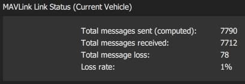
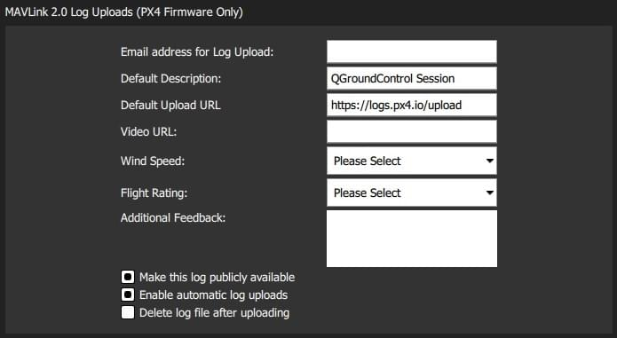

# MAVLink 설정

MAVLink 설정(**설정 화면> MAVLink**)에서 MAVLink 통신과 관련된 옵션을 설정하고 정보를 조회합니다.
여기에는 _QGroundControl_에 대한 MAVLink 시스템 ID 설정 및 링크 품질 보기가 포함됩니다.

또한 이 화면에서 _플라이트 리뷰에 로그 업로드 자동화_를 포함하여 [MAVLink 2 로그 스트리밍](#logging)(PX4만 해당)을 관리할 수 있습니다!

## 지상국 {#ground_station}

이 섹션은 _QGroundControl_의 MAVLink 속성과 동작을 설정합니다.

- **MAVLink 시스템 ID:** MAVLink 네트워크에서 _QGroundControl_의 시스템 ID(기본값: 255).
  차량에는 일반적으로 1부터 ID가 할당됩니다.
  네트워크에 여러 지상국 또는 MAVLink 애플리케이션이 있는 경우 다른 ID를 지정해야 할 수 있습니다.
- **Emit heartbeat:** 일반 MAVLink HEARTBEAT 메시지의 방출을 비활성화합니다(기본값: True).
  일반적으로 이 기능을 끄면 안 됩니다.
- **동일한 프로토콜 버전의 MAV만 허용:** MAVLink 1 또는 MAVLink 2 차량에만 연결하려면 true로 설정합니다(기본값: True).
- **MAVLink 전달 활성화:** 연결된 차량에서 다른 UDP 엔드포인트로 MAVLink 메시지를 전달하려면 _QGroundControl_을 활성화합니다(기본값: False).
  Note that this forwarding is one-way: from QGC to the specified host.
  지정된 호스트에서 수신된 모든 MAVLink 메시지는 무시됩니다.

## 연결 상태 {#link_status}

이것은 통신 링크를 통한 MAVLink 메시지 전송의 상태를 보여줍니다.
**손실률**이 높으면 매개변수 다운로드 또는 미션 업로드 및 다운로드와 같은 프로토콜 오류가 발생할 수 있습니다.

## MAVLink 2 로깅(PX4만 해당) {#logging}

_MAVLink 2 Logging_ 설정(PX4만 해당)은 PX4에서 _QGroundControl_으로의 실시간 로그 스트리밍과 [Flight Review](https://logs.px4.io)로의 로그 업로드를 설정합니다.

:::warning
MAVLink 2 Logging은 차량에 대한 지속적인 고속 MAVLink 연결이 필요하기 때문에 "기본" 설정에서 사용할 수 없습니다(WiFI를 통해 작동할 수 _ 있지만\*\* 원격 측정 링크에서는 작동하지 않습니다_.
:::

:::tip
이론상 로그 스트리밍을 사용하면 데이터를 실시간으로 분석할 수 있습니다.
작성 당시 실시간 분석은 아직 구현되지 않았습니다.
:::

로그 형식은 SD 카드 로그와 동일하지만([Analyze View > Log Download](../analyze_view/log_download.md)를 사용하여 다운로드), 로그 시작/중지 시간이 \*QGroundControl<에 의해 제어되기 때문에 실제 로그된 데이터는 약간 다를 수 있습니다.

_MAVLink 2 로깅_ 섹션에서는 로깅을 수동으로 시작 및 중지하고 로그 자동 캡처를 활성화할 수 있습니다.

_MAVLink 2 로그 업로드_ 섹션에서는 [비행 검토](https://logs.px4.io)에 대한 MAVLink 로그 업로드를 설정할 수 있습니다.
그렇지 않으면, 사이트에 직접 입력해야 하는 모든 필드를 지정할 수 있으며 로그를 자동으로 업로드할지 수동으로 업로드를 선택할 수 있습니다.

The fields are:

- **로그 업로드용 이메일 주소:** _항공편 검토_에서 이 주소로 업로드 링크를 이메일로 전송합니다.
  그렇지 않으면, 업로드 후 비공개 로그에 액세스할 방법이 없기 때문에 이것은 중요합니다.
- **기본 설명:** 로그에 사용되는 항공편의 설명/이름.
- **기본 업로드 URL:** 로그/로그 메타데이터 업로드를 위한 URL입니다.
  기본적으로 _항공편 검토_ URL로 설정됩니다.
- **동영상 URL:** (선택 사항) 로그와 연결된 비행 동영상의 URL입니다.
  이는 분석을 용이하게 하기 위해 항공편 검토 페이지에 포함될 수 있습니다.
- **풍속:** (여러 항공편에서) 디버깅 및 필터링을 지원하는 데 사용됩니다. 허용되는 값: _Calm_ | _브리즈_ | _강풍_ | _폭풍_.
- **비행 등급:** 디버깅 및 필터링을 지원하는 데 사용됩니다(여러 항공편에서). 허용되는 값: _크래시(파일럿 오류)_ | _크래시(소프트웨어 또는 하드웨어 문제)_ | _불만족_ | _좋음_ | _훌륭합니다_.
- **추가 피드백:** (선택 사항). 비행 또는 행동에 대한 자세한 설명을 입력합니다.
- **이 로그를 공개적으로 사용할 수 있도록 설정:** 설정하면 로그가 _항공편 검토_에서 표시되고 검색할 수 있습니다.
  설정하지 않으면, 업로드 시 이메일로 전송된 링크를 통해서만 사용할 수 있습니다.
- **자동 로그 업로드 사용:** 설정하면 완료 시 로그가 자동으로 업로드됩니다.
- **업로드 후 로그 파일 삭제:** 설정하면 업로드 후 로그가 자동으로 삭제됩니다.

_저장된 로그 파일_ 섹션은 로그 업로드를 수동으로 관리하는 데 사용됩니다.
확인란과 버튼을 사용하여 로그를 선택하고 삭제하거나 업로드합니다.

:::tip
위의 _MAVLink 2 로그 업로드_에서 매개변수를 변경하여 업로드된 로그에 대해 별도의 설명을 지정할 수 있습니다.
:::

