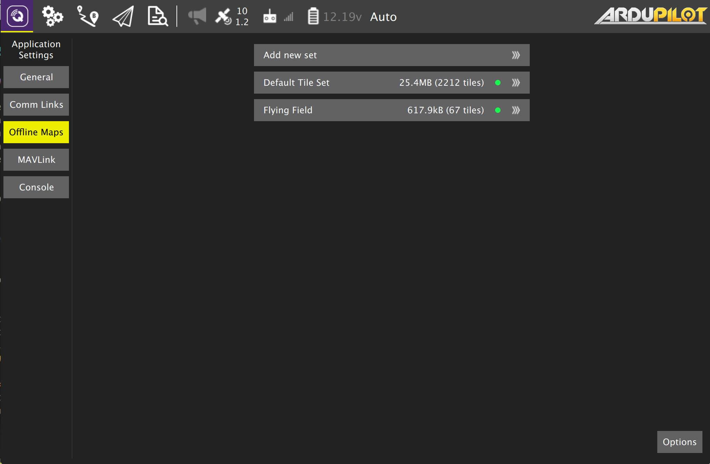

# 오프라인 지도 설정

오프라인 지도는 인터넷에 연결되어 있지 않아도 지도 데이터를 캐시하여 사용합니다. 각각 다른 위치에 대해 여러 오프라인 세트를 생성할 수 있습니다.

## 신규 세트 추가

새 오프라인 지도 세트를 생성하려면 "새 세트 추가"를 클릭하십시오. 다음 페이지로 이동합니다: 

여기에서 세트의 이름을 지정하고 캐시할 데이터의 확대 및 축소 수준을 지정할 수 있습니다. 지도를 캐시하려는 위치로 이동한 다음 확대 및 축소 수준을 설정하고, 다운로드를 클릭하여 지도를 캐시합니다.

왼쪽에서 선택한 최소 및 최대 확대 및 축소 수준의 미리보기를 볼 수 있습니다.
