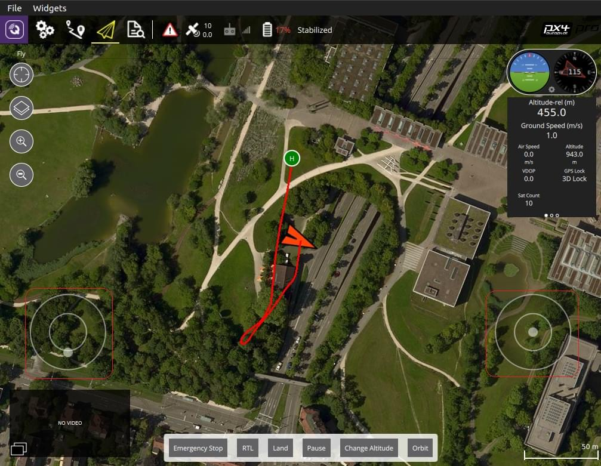

# Virtual Joystick

_QGroundControl_ allows you to control a vehicle with on-screen virtual thumbsticks. These are displayed as shown below in the flight view.

:::info
Thumbstick control is not as responsive as using an RC Transmitter (because the information is sent over MAVLink). Another alternative is to use a [USB Joystick/Gamepad](../setup_view/joystick.md).
:::

## Enable the thumbsticks

To enable the virtual joysticks:

1. Select the **Q** icon from the top toolbar
2. Open the **Application Settings**
3. Make sure you're on the **General** tab
4. Check the **Virtual joystick** box

   
