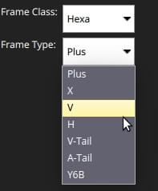

# 기체 설정(ArduPilot)

기체에 대한 최상위 _프레임 클래스_를 선택하십시오.

:::info
기체 설정은 _ArduCopter_ 및 _ArduSub_ 차량에만 사용할 수 있습니다(_ArduPilot_ Rover 또는 Plane 차량에는 표시되지 않습니다).
:::

## ArduCopter 기체 설정

To select the airframe in Copter:

1. 상단 툴바에서 **톱니바퀴** 아이콘(기체 설정)을 선택한 다음 사이드 바에서 **기체 프레임**을 먼저 선택하십시오.

   

2. Select the broad _Frame Class_ for your vehicle:

   

   ::: info
   클래스 변경 사항을 적용하려면 차량을 재부팅하여야 합니다.
   :::

3. 기체애 대한 특정 _프레임 유형_을 선택하십시오.

   

## ArduSub 프레임 설정 {#ardusub}

Sub의 프레임 유형을 선택하려면:

1. 상단 툴바에서 **톱니바퀴** 아이콘(기체 설정)을 선택한 다음 사이드 바에서 **프레임**을 먼저 선택하십시오.
2. 차량과 일치하는 프레임 유형을 선택하십시오(프레임을 선택하면 선택 사항이 적용됨).
3. 모든 **녹색** 스러스터에 **시계 방향** 프로펠러가 있고 모든 **파란색** 스러스터에 **반시계 방향** 프로펠러가 있는 지 확인합니다(또는 반대 방향으로 반대로).

   

   - 또한, **차량 기본 매개변수 로드**를 클릭하여 ArduSub에 대한 기본 매개변수 세트를 로드할 수 있습니다.

     
