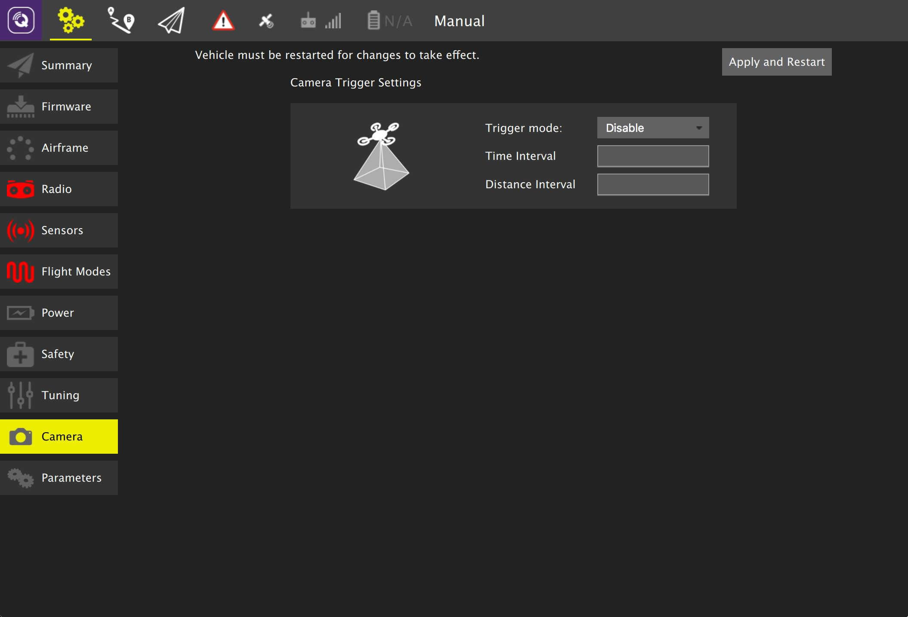

# 카메라 설정

PX4 펌웨어 또는 ArduPilot 펌웨어에 따라 페이지의 세부 정보가 차이가 납니다.

## ArduPilot 카메라 설정

## PX4 카메라 설정

For more information see [Camera](http://docs.px4.io/main/en/peripherals/camera.html) (PX4 User Guide).

:::info
카메라 모듈이 펌웨어에 자동으로 포함되지 않기 때문에 FMUv2 기반 비행 콘트롤러 (예 : 3DR Pixhawk)의 경우 기본적으로 카메라 설정 섹션을 사용할 수 없습니다.
For more information see [this topic](http://docs.px4.io/main/en/advanced_config/parameters.html#parameter-not-in-firmware).
:::
