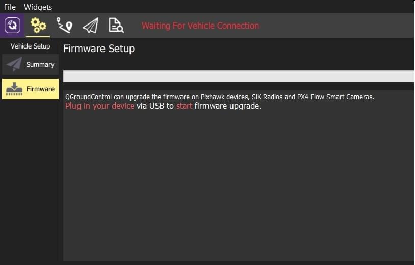
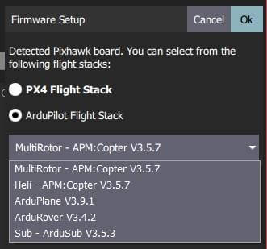
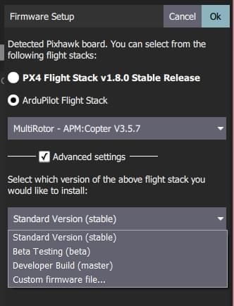
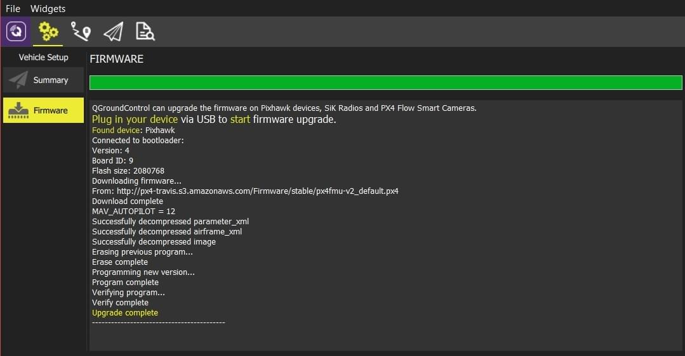

# 펌웨어 로딩

_QGroundControl_ **데스크탑** 버전을 이용하여 Pixhawk 비행 컨트롤러에 [PX4 Pro](http://px4.io/) 또는 [ArduPilot](http://ardupilot.com) 펌웨어를 설치할 수 있습니다. QGroundControl은 선택한 자동조종장치의 최신 안정적인 버전을 기본적으로 설치하며, 베타 버전, 일일 빌드 버전 또는 사용자 지정 버전의 펌웨어를 설치할 수 있습니다.

_QGroundControl_은 SiK 라디오 및 PX4 Flow 기기용 펌웨어도 설치할 수 있습니다.

> **Caution** 펌웨어 업로드는 현재 _QGroundControl_의 태블릿이나 스마트폰 버전에서는 사용할 수 없습니다.

## 펌웨어 업데이트를 위한 장치 연결

> **Caution** 펌웨어를 설치 전에 기체에 모든 USB (직접 또는 원격 측정 라디오) 연결은 _해제_하여야 합니다. 기체에 배터리를 연결하지 _않아야_ 합니다.

1. 상단 툴바에서 **기어** 아이콘 (_기체 설정_) 을 선택한 다음 사이드 바에서 **펌웨어**를 선택하십시오.

1. USB를 통해 장치(Pixhawk, SiK Radio, PX4 Flow)를 컴퓨터에 직접 연결합니다.

   ::: info
   컴퓨터에서 전원이 공급되는 USB 포트에 직접 연결합니다(USB 허브를 사용하여 연결하지 마십시오).
   :::

## 업로드할 펌웨어 선택

장치가 연결되면 업로드 펌웨어를 선택할 수 있습니다(QGroundControl은 연결된 하드웨어를 기반으로 최적의 옵션을 자동으로 제공합니다).

1. Pixhawk 호환 보드에서는 **PX4 Flight Stack vX.X.X Stable Release** 또는 **ArduPilot Flight Stack** 라디오 버튼을 선택하여 _현재 안정적인 릴리즈_ 버전를 다운로드하십시오.

   

   _ArduPilot_을 선택하면 특정 펌웨어와 차량 유형도 선택하여야 합니다(아래의 그림 참조).

   

2. 특정 개발자 릴리즈를 선택하거나 로컬 파일 시스템에서 펌웨어를 설치하려면 **고급 설정**을 사용하십시오.

   

## 펌웨어 업데이트

1. 업데이트를 시작하려면 **OK** 버튼을 클릭합니다.

   펌웨어가 업그레이드(펌웨어 다운로드, 이전 펌웨어 삭제 등)를 진행합니다.
   각 단계 화면을 표출하고, 전체 진행률이 표시줄에 출력됩니다.

   

펌웨어의 업로드가 완료되면, 장치가 재부팅되고 다시 연결됩니다.
다음으로 [기체 프레임](../setup_view/airframe.md)을 지정하여야 합니다(그리고 센서, 라디오 등).
