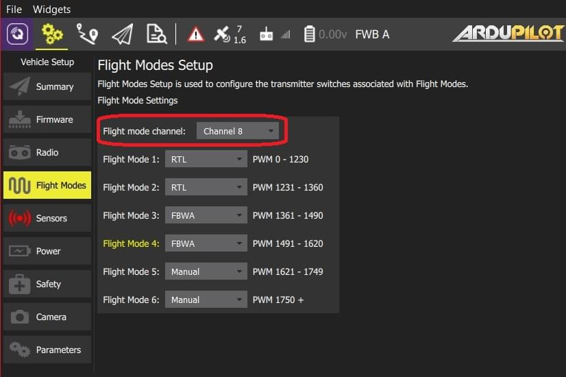

# ArduPilot 비행 모드 설정

_비행 모드_ 섹션에서는 RC 송신기의 특정 스위치/스위치 위치에 의해 트리거되는 비행 모드 및 기타 작업을 설정할 수 있습니다.

::: info
In order to set up flight modes you must already have

> - 비행 모드를 설정하려면 비행 모드를 설정하기 위해 [무전기를 구성](../setup_view/radio.md)해야 합니다.
> - - [RC 송신기 설정](../setup_view/FlightModes.md#transmitter-setup)(비행 모드 & 송신기 설정)

이 섹션에 액세스하려면, 상단 툴바에서 **기어** 아이콘(차량 설정)을 선택한 다음 사이드바에서 **비행 모드**를 선택하세요.

## 비행 모드 설정

ArduPilot에서 최대 6개의 다른 비행 모드를 송신기의 단일 채널에 할당할 수 있습니다(채널은 평면에서 선택 가능하지만 멀티콥터에서는 채널 5로 고정됨).
또한 ArduCopter를 사용하면 채널 7-12에 대한 추가 _채널 옵션_을 설정할 수 있습니다.
이를 통하여 스위치에 기능을 설정합니다(예: 카메라를 켜거나 실행으로 돌아가기).

비행 모드를 설정 방법:

1. RC 송신기를 켭니다.

2. 상단 툴바에서 **기어** 아이콘(차량 설정)을 선택한 다음 사이드바에서 **비행 모드**를 선택합니다.

   

   ::: info
   위 이미지는 ArduCopter의 비행 모드 설정 스크린샷입니다.
   :::

3. 드롭다운에서 최대 6개의 비행 모드를 선택합니다.

4. **ArduCopter만 해당:** 채널 7-12에 대해 추가 _채널 옵션_을 선택합니다.

5. **ArduPlane만 해당:** 드롭다운에서 모드 채널을 선택합니다.

   

6. 송신기의 각 모드 스위치를 차례로 선택하여 모드가 올바른 송신기 스위치에 매핑되는지 테스트하고, 선택한 비행 모드 활성화 여부를 확인합니다(활성 모드의 경우 _QGroundControl_에서 텍스트가 노란색으로 변경됩니다).

모든 값은 변경시에 자동으로 저장됩니다.

위의 ArduCopter 스크린샷은 채널 7 스위치에 RTL의 추가 옵션이 있는 3위치 비행 모드 스위치의 일반적인 설정을 보여줍니다.
또한 2개의 스위치와 송신기의 믹싱을 사용하여 6가지 비행 모드를 설정할 수 있습니다. 방법에 대한 자습서를 보려면 이 [페이지](http://ardupilot.org/copter/docs/common-rc-transmitter-flight-mode-configuration.html#common-rc-transmitter-flight-mode-configuration)의 중앙 섹션으로 스크롤하십시오.
:::

## See Also

- [ArduCopter 비행 모드](http://ardupilot.org/copter/docs/flight-modes.html)
- [ArduPlane 비행 모드](http://ardupilot.org/plane/docs/flight-modes.html)
- [ArduCopter > 보조 기능 스위치](https://ardupilot.org/copter/docs/channel-7-and-8-options.html#channel-7-and-8-options) - 채널 설정에 대한 추가 정보
