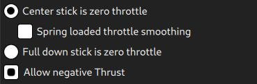

# 조이스틱 설정

_QGroundControl_은 RC 송신기 대신 조이스틱이나 게임패드로 기체를 조종할 수 있습니다.

:::info
조이스틱(또는 [가상 썸스틱](../settings_view/virtual_joystick.md))으로 비행하려면 조이스틱 정보가 MAVLink로 전송되기 때문에 기체가 조이스틱에 반응하기 위하여 안정적인 고대역폭 원격 측정 채널이 필요합니다.
:::

:::info
조이스틱과 게임패드 지원은 이기종 플랫폼 [SDL2](http://www.libsdl.org/index.php) 라이브러리를 사용하여 활성화됩니다.
특정 컨트롤러와의 호환성은 SDL에 따라 다릅니다(해당 API에 의해 노출되는 모든 버튼은 _QGroundControl_ UI를 통하여 표시됨).
[일반적인 조이스틱과 게임패드](#supported-joysticks)들은 호환됩니다.
:::

:::info
조이스틱은 보정 프로세스의 마지막 단계로 _활성화_됩니다.
:::

## PX4 조이스틱 활성화

PX4에서 조이스틱 지원을 활성화하려면 매개변수 [`COM_RC_IN_MODE`](h[ttp://localhost:8080/px4_user_guide/en](https://docs.px4.io/en/main/advanced_config/parameter_reference.html#COM_RC_IN_MODE)을 `1</0)로 설정합니다.
이 매개변수가 <code>0`이면 _조이스틱_이 설정 옵션으로 제공되지 않습니다.

This is enabled by default for PX4 SITL builds (see the [Parameters](../setup_view/parameters.md) topic for information on how to find and set a particular parameter).

## Ardupilot 조이스틱 지원

ArduPilot 기체에서 지원됩니다. 매개변수 설정은 필요하지 않습니다.

## 조이스틱 설정 {#configure}

조이스틱을 설정하려면:

1. Start _QGroundControl_ and connect to a vehicle.

2. USB 포트에 조이스틱이나 게임패드를 연결합니다.

3. 상단 도구 모음에서 **톱니 바퀴** 아이콘(기체 설정)을 선택한 다음 가장자리 표시줄에서 **조이스틱**을 선택하십시오.
   아래의 화면이 표시됩니다.

   

4. **활성화된 조이스틱** 드롭다운에서 조이스틱이 선택 여부를 확인합니다.

5. **교정** 탭으로 이동하여 **시작** 버튼을 클릭하여 다음 화면의 지시에 따라 스틱을 교정하고 이동합니다.

   

   조이스틱은 보정 프로세스의 마지막 단계에서 _활성화_됩니다.

6. 버튼과 스틱이 의도한 대로 작동하는지 테스트하고 **일반** 탭의 축과 버튼 모니터에서 결과를 확인합니다.

7. 각 조이스틱 버튼으로 활성화되는 비행 모드와 차량의 기능을 선택합니다.
   

## Advanced Options

**고급** 탭에서 몇 가지 추가 옵션을 사용할 수 있습니다.
이러한 옵션은 특이하고 비정상적인 설정, 감도 증가 및 시끄러운 조이스틱 처리에 유용합니다.

### 스로틀 옵션



- **조이스틱의 중앙을 스로틀 0으로 설정**: [MANUAL_CONTROL **z**](https://mavlink.io/en/messages/common.html#MANUAL_CONTROL)에서 중앙 또는 아래로 향한 스틱은 0을 전송하고, 위로 올린 스틱은 1000을 전송합니다.
  - **스프링 로드 스로틀 스무딩**: 이 모드에서는 스로틀 자체가 아니라 스로틀이 증감하는 속도를 제어합니다.
    이것은 사용자가 원하는 스로틀을 잡고 스틱을 놓을 수 있으므로, 스로틀 스틱에 스프링이 장착된 설정에 유용합니다.
- **풀다운 스틱은 제로 스로틀**: 이 모드에서 스틱을 내리면 [MANUAL_CONTROL **z**](https://mavlink.io/en/messages/common.html#MANUAL_CONTROL)에서 0, 중앙에 500, 올리면 1000이 전송됩니다.
- **음수 추력 허용**: **중앙 스틱이 0 스로틀** 모드에 있을 때 사용자가 스틱을 내려 음수 값을 전송할 수 있습니다.
  내려진 스틱은 [MANUAL_CONTROL **z**](https://mavlink.io/en/messages/common.html#MANUAL_CONTROL)에서 -1000을 전송하고, 중앙에 있는 스틱은 0을 전송하고, 올려진 스틱은 1000을 전송합니다.
  이 모드는 [Rover](http://ardupilot.org/rover/index.html)와 같이 음의 추력을 지원하는 차량에만 사용할 수 있습니다.

### Expo

엑스포 슬라이더를 사용하면 스틱을 중앙에서 덜 민감하게 만들어 이 영역에서 더 세밀하게 제어할 수 있습니다.


슬라이더는 지수 곡선의 곡률을 조정합니다.


엑스포 값이 높을수록 곡선은 중앙에서 더 평평해지고 가장자리에서 더 가파르게 됩니다.

### 고급 설정

고급 설정은 일반 사용자에게는 권장되지 않습니다.
잘못 사용하면 예상치 못한 결과를 초래할 수 있습니다.

고급 설정

다음과 같은 설정을 사용할 수 있습니다:

- **짐벌 제어 활성화**: 짐벌을 제어하기 위한 활성화된 두 개의 추가 채널

- **조이스틱 모드**: 조이스틱이 실제로 제어하는 것과 차량에 전송되는 MAVLink 메시지를 변경합니다.

  - **일반**: 일반 RC 라디오를 사용하는 것처럼 사용자가 제어하며, MAVLink [MANUAL_CONTROL](https://mavlink.io/en/messages/common.html#MANUAL_CONTROL) 메시지를 사용합니다.
  - **자세**: 사용자가 차량의 자세를 제어하며 MAVLink [SET_ATTITUDE_TARGET](https://mavlink.io/en/messages/common.html#SET_ATTITUDE_TARGET) 메시지를 사용합니다.
  - MAVLink [SET_POSITION_TARGET_LOCAL_NED](https://mavlink.io/en/messages/common.html#SET_POSITION_TARGET_LOCAL_NED) 메시지에는 **위치**에 대한 비트마스크만을 사용합니다.
  - MAVLink [SET_POSITION_TARGET_LOCAL_NED](https://mavlink.io/en/messages/common.html#SET_POSITION_TARGET_LOCAL_NED) 메시지는 **force** 전용 비트마스크를 사용합니다.
  - **속도**: 사용자가 차량에 가해지는 힘을 제어하며, **속도**에 대한 비트마스크가 있는 MAVLink [SET_POSITION_TARGET_LOCAL_NED](https://mavlink.io/en/messages/common.html#SET_POSITION_TARGET_LOCAL_NED) 메시지를 사용합니다.

- **축 주파수**: 조이스틱이 유휴 상태일 때(입력이 변경되지 않음) 조이스틱 명령이 5Hz로 차량에 전송됩니다. 조이스틱이 사용 중일 때(입력 값이 변경됨) 조이스틱 명령은 이 설정에 의한 (더 높은) 주파수가 기체에 전송됩니다. 기본값은 25Hz입니다.

- **버튼 주파수**: 반복되는 버튼 동작이 전송되는 주파수를 제어합니다.

- **원 수정 사용**: RC 컨트롤러 스틱은 정사각형을 나타내는 반면 조이스틱은 일반적으로 원을 나타냅니다.
  이 옵션이 활성화되면 사각형이 조이스틱 이동 영역 내부에 새겨져 RC 컨트롤러와 비슷해집니다(그래서 네 모서리 모두에 도달할 수 있음). 효과적인 스틱 이동이 감소하므로 비용이 감소합니다.

  - **비활성화:** **비활성화**시에는 조이스틱 위치가 변경되지 않고 차량으로 전송됩니다(조이스틱 장치에서 읽는 방식).
    일부 조이스틱에서 (롤, 피치) 값은 정사각형 내부에 새겨진 원의 공간으로 제한됩니다.
    이 그림에서 지점 B는 전체 피치 앞으로 및 전체 롤 오른쪽을 명령하지만 리테이너가 원형이기 때문에 조이스틱이 지점 B에 도달할 수 없습니다.
    이는 전체 롤 및 피치 편향을 동시에 달성할 수 없음을 의미합니다.

    

  - **활성화:** 조이스틱 값은 명령의 전체 범위를 보장하기 위해 소프트웨어에서 조정됩니다.
    그러나 그림에서 회색으로 강조 표시된 영역이 더 이상 사용되지 않기 때문에 사용 가능한 이동 영역 및 해상도가 감소합니다.

    

- **불감대:** 불감대를 사용하면 스틱이 중립 위치 근처에 있을 때 입력 변경 사항을 무시할 수 있습니다.
  이것은 명령으로 해석될 수 있는 민감한 스틱의 소음이나 작은 진동을 피하는 데 도움이 되며, 스틱이 중앙으로 잘 돌아오지 않을 때 작은 오프셋을 제거할 수 있습니다.
  [보정](#configure)의 첫 번째 단계에서 조정하거나 해당 축 모니터에서 수직으로 드래그하여 조정할 수 있습니다.

## 지원되는 조이스틱

다음 조이스틱들은 최근 버전의 _QGroundControl_ 빌드에서 작동합니다.

### 소니 플레이스테이션 3/4 컨트롤러

이 두 조이스틱을 모두 사용하는 것이 좋습니다.
"즉시" 잘 작동하며 비행 모드에 매핑할 수 있는 버튼들이 있습니다.

#### Sony PS4 - DualShock 4 컨트롤러 V2(무선 설정)

이 컨트롤러는 USB 및 Bluetooth 무선 연결을 모두 지원합니다.
유선 USB 연결은 일반적으로 즉시 사용할 수 있습니다.
무선 연결에는 몇 가지 설정이 필요합니다.

##### 리눅스 우분투 설정

컨트롤러가 Linux에서 무선 환경에서 작동하도록 하려면 [jstest-gtk](https://jstest-gtk.gitlab.io/) 및 [ds4drv](https://github.com/chrippa/ds4drv) 유틸리티를 설치하여야 합니다.

과정은 다음과 같습니다:

1. _QGroundControl_을 실행후, 기체를 연결합니다.
   ```
   _jstest-gtk_ 설치: `sudo apt install jstest-gtk`
   ```
2. 매개변수의 검색 및 설정 방법은 [매개변수](../setup_view/parameters.md)를 참고하십시오.
   ```
   _ds4drv_ 설치: `sudo pip install ds4drv`
   ```
3. ds4drv 실행 `sudo ds4drv`
   ```
   엑스포
   ```
4. 컨트롤러 LED가 빠르게 깜박이기 시작할 때까지 **공유** 버튼을 누른 다음 **PS** 버튼을 길게 누릅니다.
   그다음에는 _ds4drv_가 새 기기를 감지하여야 합니다.
5. 마지막으로 _jstest-gtk_ 유틸리티를 실행하여 컨트롤러 설정을 확인합니다.

### FrSky 타라니스 XD9 플러스

_FrSky Taranis XD9 plus_ 리모컨도 조이스틱으로 연결할 수 있습니다.
뒷면의 USB 포트로 연결합니다.

Taranis는 버튼 옵션을 사용하는 것을 허용되지 않습니다(정확히 말하면 옵션을 설정할 수 있지만, 송신기의 버튼을 토글하여도 작동하지 않습니다).

:::info
Taranis는 공개적으로 작업 중인 개방형 시스템입니다.
작성 시점에 조이스틱으로 효과적으로 작동할 수 있는 펌웨어나 설정이 있을 수 있습니다.
:::

### 로지텍 게임패드 F310

Logitech Gamepad F310은 MacOS "Sierra"에서 USB를 통해 테스트되었습니다.

### 로지텍 익스트림 3D 프로

[Logitech Extreme 3D Pro](http://gaming.logitech.com/en-ch/product/extreme-3d-pro-joystick) 조이스틱은 모든 플랫폼(Linux, Windows, Mac OSX)에서 테스트되었습니다.
이것은 또한 비틀 수 있는 단일 스틱 컨트롤러입니다. 주 스틱 축은 피치 및 롤에 사용되는 반면 트위스트 동작은 요에 사용됩니다. 스로틀은 별도의 휠에 매핑됩니다.

### 로지텍 F710 게임패드

<!-- This is from http://qgroundcontrol.org/users/joystick -->

이 게임패드는 QGroundControl에서 수동 멀티콥터조종에 적합합니다. Windows, Linux 및 Mac OS에서 작동합니다.

#### Mac OS Leopard / Lion 설정

F710은 Leopard / Lion에서 감지되지만, 자동으로 설정되지 않습니다.
작동하는 구성을 얻으려면 F710이 _Rumblepad2_로 인식되어야 합니다.

먼저 **Apple > 이 Mac에 관하여 > 추가 정보 > 시스템 보고서 > USB**에서 인식 방법을 확인합니다.
"Logitech Cordless RumblePad 2"로 감지되면 더 이상 수행할 필요는 없습니다.

"Logitech Wireless 710"으로 감지되면 다음 단계를 수행하십시오.

1. 게임 패드의 USB 수신기를 뽑습니다.
2. USB 포트에 빠르게 연결할 준비를 합니다.
3. Logitech 버튼을 누르십시오(패드 중앙에 Logitech 로고가 있는 은색).
4. USB 수신기를 Mac에 빠르게 연결
5. 이제 패드가 시스템 보고서에서 "Logitech Cordless RumblePad 2"로 감지되어야 합니다. 실패하는 경우에는 위의 단계를 다시 시도하십시오.
