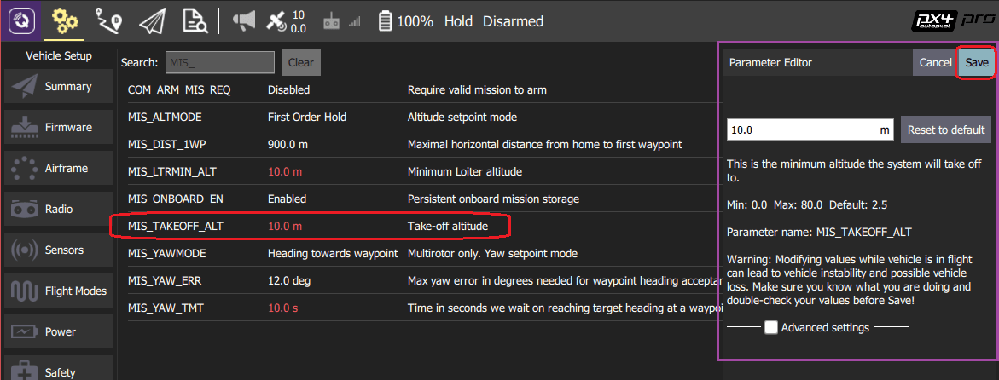

# 매개변수

_매개변수_ 화면은 기체와 관련된 매개변수를 검색하고 수정합니다.

:::info
PX4 Pro와 ArduPilot은 매개변수들은 서로 다르지만, 모두 설정가능합니다.
:::

## 매개변수 검색

매개변수는 그룹화되어 있습니다. 왼쪽에 있는 버튼을 클릭하여 보려는 매개변수 그룹을 선택합니다(위의 이미지에서 _Battery Calibration_ 그룹이 선택됨).

_검색_ 필드에 용어를 입력하여 매개변수를 _검색_합니다. 그러면, 입력된 하위 문자열이 포함된 모든 매개변수 이름 및 설명 목록이 표시됩니다(검색을 재설정하려면 **지우기**를 누르십시오).

## 매개변수 변경

매개변수를 그룹 또는 검색 목록에서 변경할 매개변수를 클릭합니다. 그러면 값을 업데이트할 수 있는 사이드 대화 상자가 열립니다(이 대화 상자는 변경 사항을 적용하기 위해 재부팅이 필요한지 여부를 포함하여 매개변수에 대한 추가 세부 정보도 제공합니다).

:::info
**저장** 버튼을 클릭하면 매개변수는 기체에 업로드됩니다. 매개변수에 따라 변경된 내용을 적용하기 위해서 비행 컨트롤러 재부팅이 필요할 수 있습니다.
:::

## 도구

화면의 오른쪽 상단의 **도구** 메뉴에서 추가 옵션을 선택할 수 있습니다.

**새로 고침**  모든 매개변수를 기체로부터 재로딩합니다.

**기본값으로 재설정**  모든 매개변수를 펌웨어의 기본값으로 재설정합니다.

**파일에서 불러오기 / 파일에 저장**  기존 파일에서 매개변수를 불러오거나 현재 매개변수 설정을 파일에 저장합니다.

**RC를 Param으로 지우기**  이것은 RC 송신기 제어와 매개변수간의 연관성을 모두 삭제합니다. 자세한 내용은 [라디오 설정 > 매개변수 튜닝 채널](../setup_view/Radio.md#param-tuning-channels-px4)를 참고하십시오.

**기체 재부팅**  기체을 재부팅합니다 (일부 매개변수를 변경후에 요구됩니다).
